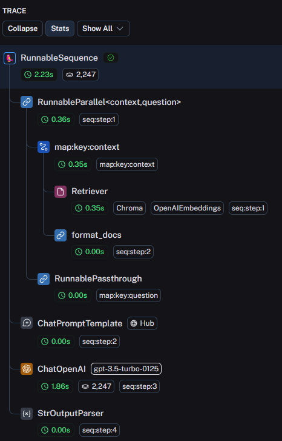

这是我论文中的一段话，请你判断一下内容是否正确。

# LangChain

## Simple LLM Application

When prompting the LLM to generate content, the requests should include the preceding dialogue information. Each dialogue entry has a role, with the first entry designated as "system", which sets the behavior of the LLM. Subsequent entries alternate between "user" and "assistant", reflecting the dialogue history between the user and the LLM.

```python {linenos=true}
from langchain_core.output_parsers import StrOutputParser
from langchain_core.prompts import ChatPromptTemplate
from langchain_openai import ChatOpenAI

prompt_template = ChatPromptTemplate.from_messages(
    [
        ("system", "You are a helpful assistant."),
        ("user", "Hello!"),
        ("assistant", "Hi there! How can I assist you today?"),
        ("user", "{text}"),
    ]
)

model = ChatOpenAI(model="gpt-4o")

parser = StrOutputParser()

chain = prompt_template | model | parser
response = chain.invoke({"text": "Recommend a movie."})
print(response)
```

```text {linenos=true}
Sure! What genre are you interested in? Do you have any favorite movies or directors?
```

## Chatbot

To have a conversation with an LLM, after receiving the response from the LLM, you need to include this response along with the content you are about to say into the chat history for the next API call. The API provided by Langchain can easily achieve this functionality.

```python {linenos=true}
from langchain_community.chat_message_histories import ChatMessageHistory
from langchain_core.chat_history import BaseChatMessageHistory
from langchain_core.messages import HumanMessage
from langchain_core.runnables.history import RunnableWithMessageHistory
from langchain_openai import ChatOpenAI

model = ChatOpenAI(model="gpt-3.5-turbo")

store = {}

def get_session_history(session_id: str) -> BaseChatMessageHistory:
    if session_id not in store:
        store[session_id] = ChatMessageHistory()
    return store[session_id]

with_message_history = RunnableWithMessageHistory(model, get_session_history)

config = {"configurable": {"session_id": "test_id"}}
response = with_message_history.invoke(
    [HumanMessage(content="Hi! I'm Satou Sakura.")],
    config=config,
)

print(response.content)
```

```text {linenos=true}
Hello Satou Sakura! How can I assist you today?
```

```python {linenos=true}
response = with_message_history.invoke(
    [HumanMessage(content="What's my name?")],
    config=config,
)

print(response.content)
```

```text {linenos=true}
Your name is Satou Sakura.
```

## Vector Database

LangChain provides APIs that make interacting with vector databases very convenient and efficient.

```python {linenos=true}
from langchain_chroma import Chroma
from langchain_core.documents import Document
from langchain_openai import OpenAIEmbeddings

documents = [
    Document(
        page_content="The Matrix is a sci-fi film that explores a dystopian future where humanity is unknowingly trapped inside a simulated reality created by intelligent machines.",
        metadata={"source": "test"},
    ),
    Document(
        page_content="The Lord of the Rings is a high-fantasy epic by J.R.R. Tolkien that follows the quest to destroy the One Ring and defeat the dark lord Sauron in the richly detailed world of Middle-earth.",
        metadata={"source": "test"},
    ),
    Document(
        page_content="Harry Potter is a fantasy series by J.K. Rowling that follows the adventures of a young wizard, Harry Potter, as he attends Hogwarts School of Witchcraft and Wizardry and battles the dark wizard Voldemort.",
        metadata={"source": "test"},
    ),
]

vectorstore = Chroma.from_documents(
    documents,
    embedding=OpenAIEmbeddings(),
)

result = vectorstore.similarity_search("Voldemort", k=1)
print(result[0].page_content)
```

```text {linenos=true}
Harry Potter is a fantasy series by J.K. Rowling that follows the adventures of a young wizard, Harry Potter, as he attends Hogwarts School of Witchcraft and Wizardry and battles the dark wizard Voldemort.
```

## Agent

In OpenAI's Chat Completions API, there is an optional `tool` parameter. This parameter can be used to pass function definitions, along with descriptions of their functionality and parameters. When the user interacts with the model, the model will generate the function parameters and return them to the user when it deems it appropriate, i.e., when it thinks a function should be called. It is important to note that the model only returns the parameters it considers appropriate for the function; the actual decision to call the function and how to call it is up to the API caller.

LangChain can use this feature to build an agent. Language models themselves cannot take actions—they only output text. A significant use case for LangChain is creating agents. Agents are systems that use LLMs (large language models) as reasoning engines to determine which actions to take and the inputs to pass to them. After executing actions, the results can be fed back into the LLM to determine whether more actions are needed or whether it is okay to finish.

```python {linenos=true}
from langchain_community.tools.tavily_search import TavilySearchResults
from langchain_core.messages import HumanMessage
from langchain_openai import ChatOpenAI
from langgraph.prebuilt import create_react_agent

search = TavilySearchResults(max_results=2)
tools = [search]

model = ChatOpenAI(model="gpt-4")

agent_executor = create_react_agent(model, tools)

response = agent_executor.invoke(
    {
        "messages": [
            HumanMessage(
                content="How is the weather in Pyongyang, North Korea currently?"
            )
        ]
    }
)

print(response['messages'][-1].content)
```

```text {linenos=true}
The current weather in Pyongyang, North Korea is sunny with a temperature of 30.7°C (87.3°F). The wind is coming from the west at a speed of 16.6 kph (10.3 mph). The humidity level is at 36%. The visibility is approximately 10 kilometers (6 miles). The UV index is at 8.0.
```

## Retrieval-Augmented Generation (RAG)

The training data for Large Language Models (LLMs) is typically up to a specific cut-off date and consists of publicly available content from the internet. This means that when interacting with an LLM, it cannot provide answers to the latest public information or questions related to the user's private information. A straightforward solution is to include all relevant information in the prompt before asking the question. However, due to the design of LLMs, the length of tokens is limited, and overly long contextual information can cause the LLM to forget earlier information. Retrieval-Augmented Generation (RAG) technology is designed to address this issue. First, users can store all information in a database and then, when posing a question, only the relevant information from the database is retrieved and sent to the LLM. This allows the LLM to process the text and generate answers based solely on the relevant information.

The specific process of RAG (Retrieval-Augmented Generation) is as follows: First, the user organizes the external information that they want the LLM (Large Language Model) to know into plain text form and then splits this text into multiple chunks. Each chunk is then embedded to generate a corresponding vector. These chunks, along with their vectors, are stored in a vector database. When a user asks the LLM a question related to this external information, the question is first converted into a vector. This vector is then used to search the vector database for similar vectors, and the original texts corresponding to these similar vectors are retrieved. Finally, these original texts and the user's question are combined into a prompt, which is sent to the LLM to generate a response to the user's question.


Here is an example of a RAG (Retrieval-Augmented Generation) code. The training data for GPT-3.5-turbo is up to September 2021. The user provided the 2024 letter to shareholders from Buffett as additional data and asked about the date of the 2024 Berkshire Hathaway shareholders' meeting mentioned in the letter. As can be seen, the model correctly answered this question.

```python {linenos=true}
from langchain import hub
from langchain_chroma import Chroma
from langchain_community.document_loaders import PyPDFLoader
from langchain_core.output_parsers import StrOutputParser
from langchain_core.runnables import RunnablePassthrough
from langchain_openai import ChatOpenAI, OpenAIEmbeddings

file_path = "https://www.berkshirehathaway.com/letters/2023ltr.pdf"
loader = PyPDFLoader(file_path)
pages = loader.load_and_split()

vectorstore = Chroma.from_documents(
    documents=pages, embedding=OpenAIEmbeddings()
)

llm = ChatOpenAI(model="gpt-3.5-turbo-0125")

retriever = vectorstore.as_retriever()
prompt = hub.pull("rlm/rag-prompt")


def format_docs(docs):
    return "\n\n".join(doc.page_content for doc in docs)


rag_chain = (
    {"context": retriever | format_docs, "question": RunnablePassthrough()}
    | prompt
    | llm
    | StrOutputParser()
)

result = rag_chain.invoke(
    "When will the 2024 Berkshire Hathaway Annual Shareholders Meeting be held?"
)
print(result)
```

```text {linenos=true}
The 2024 Berkshire Hathaway Annual Shareholders Meeting will be held on May 4, 2024. Warren E. Buffett, the Chairman of the Board, will be making presentations on the company's performance and outlook for the year. Shareholders are encouraged to attend and hear directly from the CEO.
```

In the code above, a complex chain is constructed: `{"context": retriever | format_docs, "question": RunnablePassthrough()} | prompt | llm | StrOutputParser()`. Detailed information about this chain can be viewed at this [link](https://smith.langchain.com/public/e99f961d-87ab-44d8-a62a-8c0643f9d9f6/r).




# References

[Overview - OpenAI API](https://platform.openai.com/docs/overview)

[Introduction | 🦜️🔗 LangChain](https://python.langchain.com/v0.2/docs/tutorials/)

[What Is Retrieval-Augmented Generation aka RAG | NVIDIA Blogs](https://blogs.nvidia.com/blog/what-is-retrieval-augmented-generation/)

[Prompt engineering - Wikipedia](https://en.wikipedia.org/wiki/Prompt_engineering)

[LangChain Hub](https://smith.langchain.com/hub)

[How to call functions with chat models | OpenAI Cookbook](https://cookbook.openai.com/examples/how_to_call_functions_with_chat_models)

[LangChain Expression Language Explained | Pinecone](https://www.pinecone.io/learn/series/langchain/langchain-expression-language/)