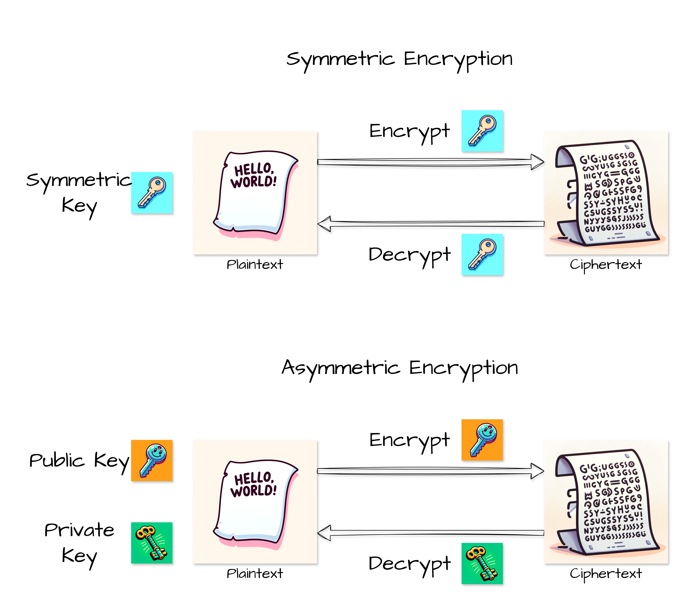
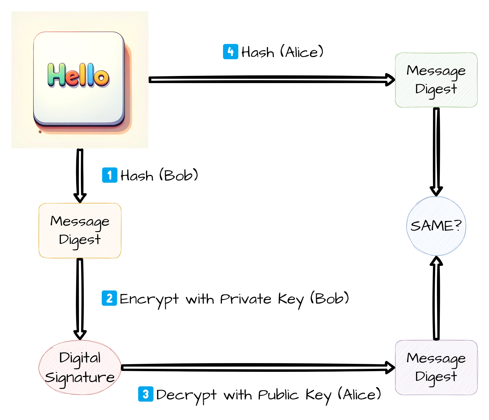

# Communication protocol

## Shadowsocks

## VMess

# Cryptography

## Symmetric-key algorithm

Symmetric encryption refers to using the same key for both encryption and decryption.

AES is a common symmetric encryption algorithm, which belongs to block cipher. Common encryption modes include ECB, CBC, PCBC, CTR, and common padding schemes include NoPadding, PKCS5Padding, PKCS7Padding.

The following code is an example of AES encryption in Python, using ECB encryption mode and PKCS7 padding scheme:

```python {linenos=true}
from cryptography.hazmat.primitives.ciphers import Cipher, algorithms, modes
from cryptography.hazmat.backends import default_backend
from cryptography.hazmat.primitives import padding


def encrypt(plaintext, key):
    cipher = Cipher(algorithms.AES(key), modes.ECB(), backend=default_backend())
    encryptor = cipher.encryptor()
    padder = padding.PKCS7(algorithms.AES.block_size).padder()
    padded_data = padder.update(plaintext) + padder.finalize()
    ciphertext = encryptor.update(padded_data) + encryptor.finalize()
    return ciphertext


def decrypt(ciphertext, key):
    cipher = Cipher(algorithms.AES(key), modes.ECB(), backend=default_backend())
    decryptor = cipher.decryptor()
    decrypted_padded_data = decryptor.update(ciphertext) + decryptor.finalize()
    unpadder = padding.PKCS7(algorithms.AES.block_size).unpadder()
    plaintext = unpadder.update(decrypted_padded_data) + unpadder.finalize()
    return plaintext


key = "😊😁😎👍🌟🎉"
key = key.encode("utf-8")

plaintext = "Hello, AES encryption!"

ciphertext = encrypt(plaintext.encode("utf-8"), key)
print("Encrypted data:", ciphertext)

decrypted_plaintext = decrypt(ciphertext, key)
print("Decrypted data:", decrypted_plaintext.decode("utf-8"))
```


## Public-key cryptography

Asymmetric encryption differs from symmetric encryption in that it employs two keys: a public key and a private key. The private key is kept secret, while the public key can be freely distributed. Information encrypted with the public key cannot be decrypted with the same key; only the corresponding private key can decrypt it.



## Digital Signature

A digital signature is a mathematical technique used to confirm the genuineness of digital messages or documents. When a message bears a legitimate digital signature, the recipient can trust that it originated from a sender recognized by the recipient.

Suppose Bob wants to send a message to Alice and ensure that Alice can confirm the message was indeed sent by Bob. To do this, Bob first hashes the message to get the message digest. Then, he uses his private key to encrypt the digest, generating a digital signature. He sends both the original message and the digital signature to Alice. Upon receiving them, Alice uses Bob's public key to decrypt the digital signature to obtain the hash value. She then uses the same hash function to compute the hash of the original message. If the computed hash value matches the decrypted hash value, she can confirm that the message was indeed sent by Bob.



## Public key certificate

Suppose Alice wants to communicate securely with Bob, but she doesn't have Bob's public key. Alice can request Bob's public key over the network by sending a request to Bob. However, the problem is that Alice cannot be sure that the public key she receives is actually Bob's, because a malicious third party could impersonate Bob and send their own public key to Alice, then pretend to be Bob in communication with Alice. At this point, Alice needs to authenticate Bob's public key to confirm the true owner of the key. The specific process is as follows:

1. Bob generates his own public and private keys.
1. Bob submits his identity proof documents and public key to the CA (Certificate Authority).
1. The CA verifies Bob's identity.
1. Upon successful verification, the CA generates a digital certificate for Bob, which includes Bob's relevant information and his public key, and signs it digitally.
1. Bob securely stores his digital certificate.
1. When Alice wants to communicate with Bob, Bob sends the CA-issued digital certificate to Alice.
1. Alice uses the CA's public key to verify the digital signature on Bob's certificate.
1. Upon successful verification of the digital signature, Alice confirms that the public key belongs to Bob and can use this public key for encrypted communication.

# References

[Symmetric-key algorithm - Wikipedia](https://en.wikipedia.org/wiki/Symmetric-key_algorithm)

[Public-key cryptography - Wikipedia](https://en.wikipedia.org/wiki/Public-key_cryptography)

[Digital signature - Wikipedia](https://en.wikipedia.org/wiki/Digital_signature)

[What is a Digital Signature?](http://www.youdzone.com/signature.html)

[pyca/cryptography: cryptography is a package designed to expose cryptographic primitives and recipes to Python developers.](https://github.com/pyca/cryptography)

[Public key certificate - Wikipedia](https://en.wikipedia.org/wiki/Public_key_certificate)