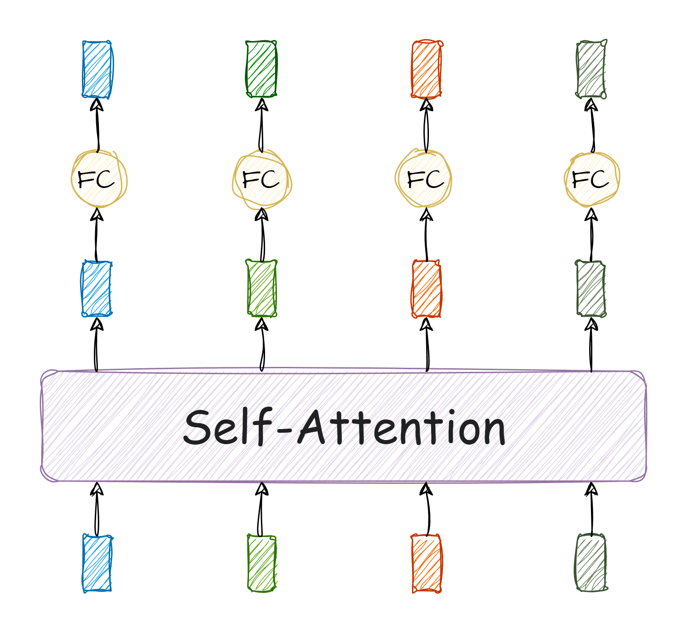
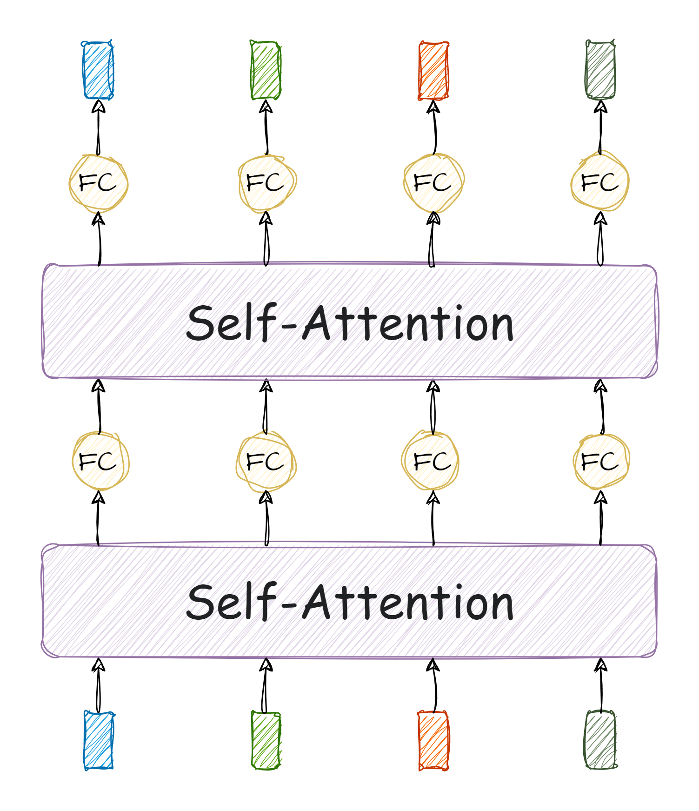
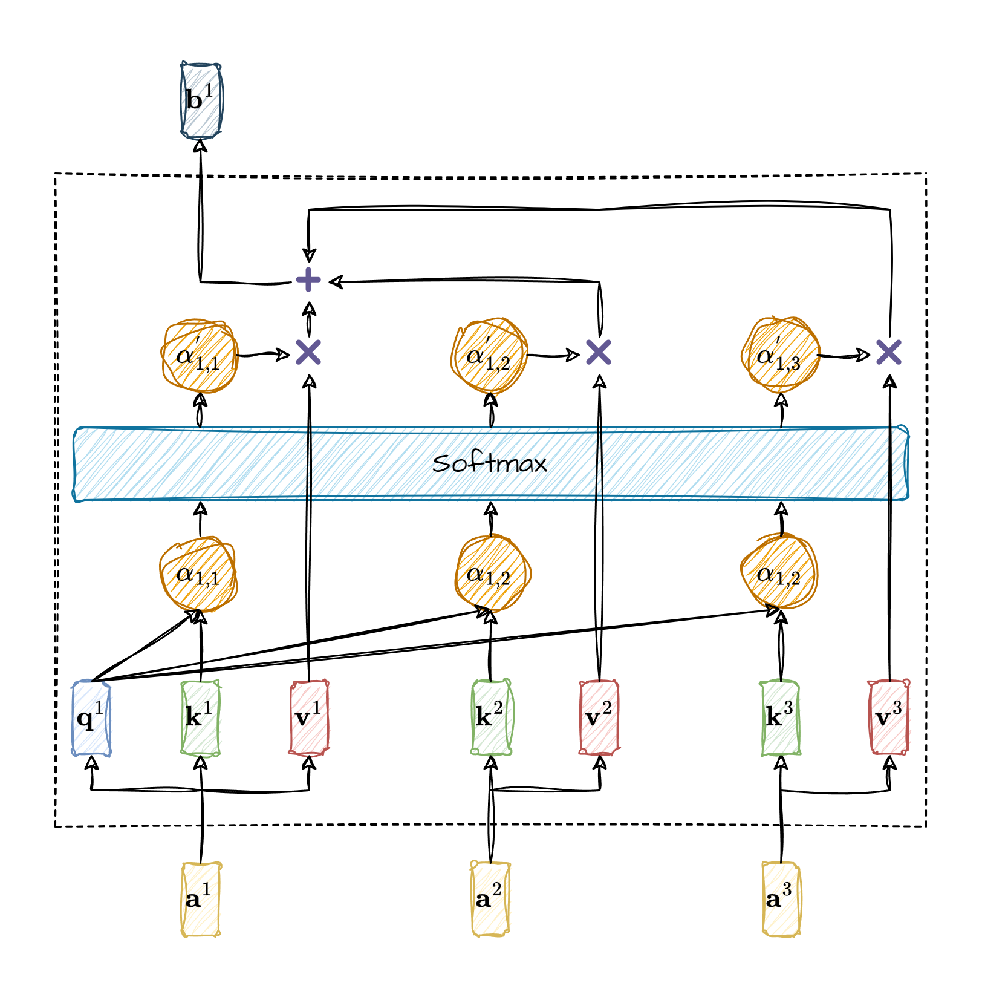

# Self-attention

Self-attention is a powerful neural network technique where the input consists of a sequence of vectors, and the output is also a sequence of vectors with the same size.

Multiple self-attention layers can be used in series.

The parameters of a self-attention layer can be represented by three matrices: $ W^{q} $, $ W^{k} $, and $W^{v}$. Suppose the input of a certain self-attention layer is a set of vectors $a^1$, $a^2$, $a^3$, and the output is a set of vectors $b^1$, $b^2$, $b^3$. The calculation process of $ b^1 $ is as follows:

$$
q^1 = W^{q}a^1
$$

$$
k^i = W^{k}a^i
$$

$$
v^i = W^{k}v^i
$$

$$
\alpha_{1,i} = q^1 k^i
$$

The term $\alpha_{1,i}$ is transformed into $\alpha^{'}_{1,i}$ through softmax.

$$
\alpha^{'}_{1,i} = \frac{e^{\alpha_{1,i}}}{\sum_{j=1}^{3}e^{\alpha_{1,j}}}
$$

$$
b^1 = \sum_{i=1}^{3}\alpha^{'}\_{1,i}v^{i}
$$

