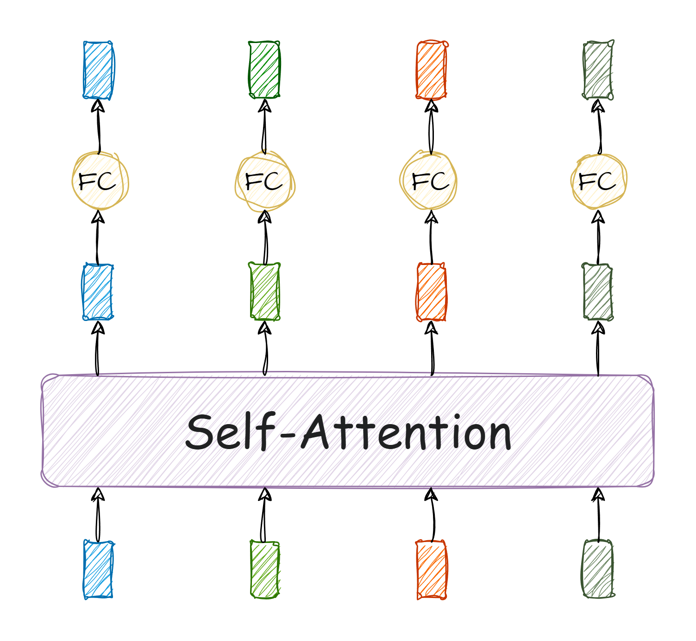
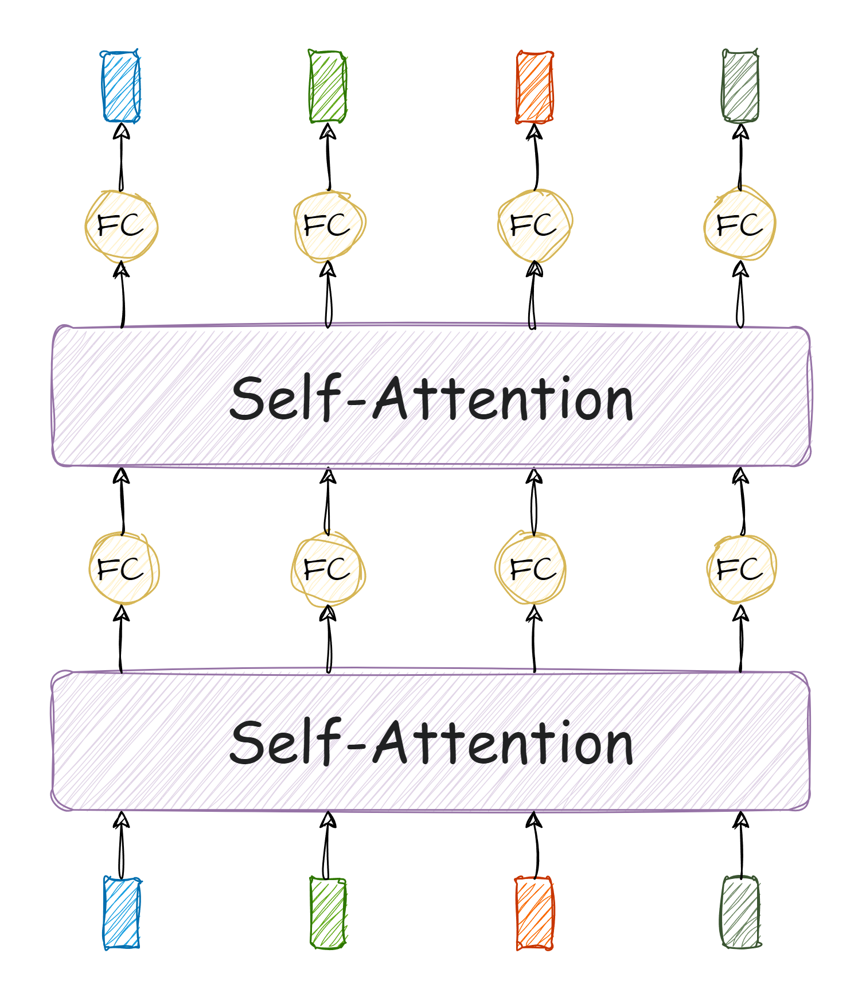
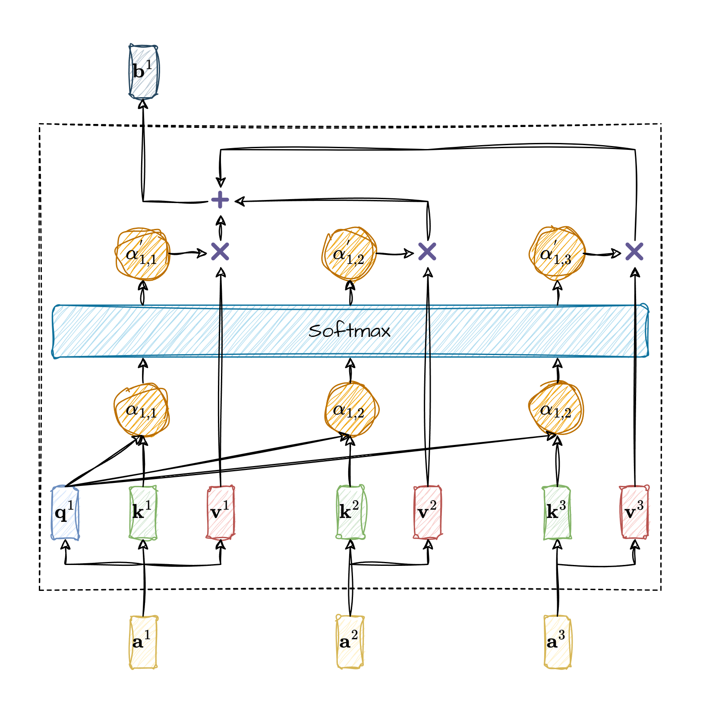
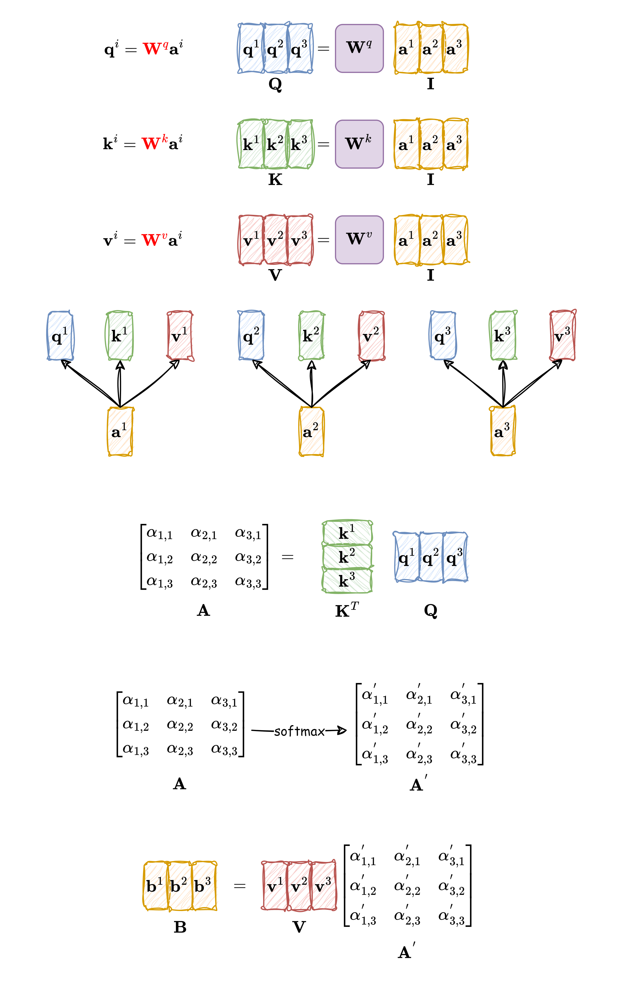

# Self-attention

Self-attention is a powerful neural network technique where the input consists of a sequence of vectors, and the output is also a sequence of vectors with the same size.

Multiple self-attention layers can be used in series.

The parameters of a self-attention layer can be represented by three matrices: $\mathbf{W}^{q}$, $\mathbf{W}^{k}$, and $\mathbf{W}^{v}$. Suppose the input of a certain self-attention layer is a set of vectors $\mathbf{a}^1$, $\mathbf{a}^2$, $\mathbf{a}^3$, and the output is a set of vectors $\mathbf{b}^1$, $\mathbf{b}^2$, $\mathbf{b}^3$. The calculation process of $\mathbf{b}^1$ is as follows:

$$
\mathbf{q}^1 = \mathbf{W}^{q}\mathbf{a}^1
$$

$$
\mathbf{k}^i = \mathbf{W}^{k}\mathbf{a}^i
$$

$$
\mathbf{v}^i = \mathbf{W}^{k}\mathbf{v}^i
$$

$$
\alpha_{1,i} = \mathbf{q}^1\mathbf{k}^i
$$

The term $\alpha_{1,i}$ is transformed into $\alpha^{'}_{1,i}$ through softmax.

$$
\alpha^{'}_{1,i} = \frac{e^{\alpha_{1,i}}}{\sum_{j=1}^{3}e^{\alpha_{1,j}}}
$$

$$
\mathbf{b}^1 = \sum_{i=1}^{3}\alpha^{'}_{1,i}\mathbf{v}^{i}
$$

The calculation process of the output matrix $\mathbf{B}$ of self-attention is shown in the following diagram:

$$
\mathbf{Q} = \mathbf{W}^q \mathbf{I}
$$

$$
\mathbf{K} = \mathbf{W}^k \mathbf{I}
$$

$$
\mathbf{V} = \mathbf{W}^v \mathbf{I}
$$

$$
\mathbf{A} = \mathbf{K}^T \mathbf{Q}
$$

$$
\mathbf{A}^{'} = \mathbf{A}
$$

$$
\mathbf{B} = \mathbf{V} \mathbf{A}^{'}
$$