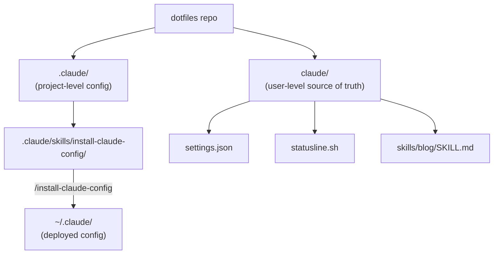

## The Problem

Claude Code stores user-level configuration under `~/.claude/` — settings, status line scripts, custom skills, rules, and more. If you work across multiple machines or just want your config version-controlled, the natural instinct is to manage it through a **dotfiles repo**.

For most tools (tmux, vim, zsh), the standard approach is simple: keep the source of truth in your dotfiles repo and symlink it into place. But Claude Code and symlinks don't mix well.

## Claude Code's Configuration Scopes

Claude Code has **four configuration scopes**, each with its own location and purpose:

| Scope | Location | Shared? | Who it affects |
|-------|----------|---------|----------------|
| **Managed** | System-level (deployed by IT) | Yes | All users on the machine |
| **User** | `~/.claude/` | No | You, across all projects |
| **Project** | `.claude/` in repo | Yes | All collaborators |
| **Local** | `.claude/settings.local.json` | No | You, in this repo only |

Precedence flows from highest to lowest: managed > local > project > user. Array settings **merge** across scopes rather than replace, so permissions defined at multiple levels combine.

The user-level scope is the one we want in our dotfiles — it includes:

- `~/.claude/settings.json` — model, permissions, hooks, status line
- `~/.claude/CLAUDE.md` — global instructions for every session
- `~/.claude/keybindings.json` — keyboard shortcuts
- `~/.claude/skills/` — custom skills available in all projects
- `~/.claude/rules/` — personal rules
- `~/.claude/agents/` — custom subagent definitions

## Why Symlinks Don't Work

The obvious dotfiles approach — `ln -sf ~/dotfiles/claude ~/.claude` — runs into multiple known issues:

- ⚠️ [**Symlinked `settings.json`**][issue-3575] causes permission failures and severe performance degradation
- ⚠️ [**Symlinked `~/.claude` directory**][issue-764] makes Claude Code unable to detect files
- ⚠️ [**Symlinked `skills/`**][issue-25367] fails validation (though execution works)
- ⚠️ [**Symlinked hooks**][issue-5433] silently fail or hang

The **only** place symlinks are officially supported is `.claude/rules/`, which explicitly documents symlink resolution and circular symlink detection.

[issue-3575]: https://github.com/anthropics/claude-code/issues/3575
[issue-764]: https://github.com/anthropics/claude-code/issues/764
[issue-25367]: https://github.com/anthropics/claude-code/issues/25367
[issue-5433]: https://github.com/anthropics/claude-code/issues/5433

## How the Community Copes

Without reliable symlink support, people have landed on several workarounds:

1. **Copy-based install scripts** — most common. Keep source of truth in dotfiles, `cp` to `~/.claude/`. Simple but manual.
2. **Chezmoi** — templates and applies configs without symlinks. Growing in popularity for AI tool configs.
3. **Dedicated config repos** — projects like [claude-config][claude-config] centralize config with init scripts.
4. **Per-project copy-paste** — not elegant, but works. Many people just copy configs into each new project.

[claude-config]: https://news.ycombinator.com/item?id=46653896

## The Design: A Self-Installing Dotfiles Skill

Instead of fighting symlinks or maintaining external scripts, we can use Claude Code's own skill system to solve the problem. Here's the architecture:



### Directory Layout

The dotfiles repo has two separate Claude Code directories:

```
dotfiles/
├── .claude/                          # Project-level (for this repo only)
│   └── skills/
│       └── install-claude-config/    # The deployment skill
│           └── SKILL.md
├── claude/                           # User-level source of truth
│   ├── settings.json
│   ├── statusline.sh
│   └── skills/
│       └── blog/
│           └── SKILL.md
├── tmux/
└── install.sh
```

- **`.claude/`** — project-level config for the dotfiles repo itself. Contains only the install skill.
- **`claude/`** — the source of truth for user-level config. This is what gets deployed to `~/.claude/`.

### The Merge Skill

The `/install-claude-config` skill handles deployment with strict safety rules:

**Additive only** — it never changes or deletes anything already in `~/.claude/`:

| Scenario | Action |
|----------|--------|
| File/key doesn't exist in target | ✅ **ADD** — copy it |
| File/key exists with identical content | ⏭️ **SKIP** — nothing to do |
| File/key exists with different content | 🛑 **CONFLICT** — stop and report |

**Dry-run first** — the skill follows a four-step procedure:

1. **Discover** — scan `claude/` and compare each file against `~/.claude/`
2. **Plan** — present exactly what will happen (ADD/SKIP/CONFLICT) for every file
3. **Execute** — only after explicit user approval
4. **Report** — summarize what was done

For **JSON files** like `settings.json`, the merge is key-by-key and recursive. New keys are added, identical keys are skipped, and conflicting keys halt the process. For **all other files**, it's whole-file comparison: copy if new, skip if identical, conflict if different.

### Example Run

```
> /install-claude-config

## Merge Plan

| File                  | Action   | Details                              |
|-----------------------|----------|--------------------------------------|
| settings.json         | SKIP     | statusLine key already identical     |
| statusline.sh         | SKIP     | Already identical                    |
| skills/blog/SKILL.md  | COPY     | Target does not exist                |

Do you want to proceed with this plan?

> yes

## Report
| File                  | Action   | Result |
|-----------------------|----------|--------|
| settings.json         | SKIP     | Already identical |
| statusline.sh         | SKIP     | Already identical |
| skills/blog/SKILL.md  | COPY     | Done |
```

## Why This Approach Works

- ✅ **No symlinks** — avoids all known Claude Code symlink bugs
- ✅ **Non-destructive** — never overwrites existing config, so it's safe to run repeatedly
- ✅ **User-controlled** — requires explicit approval before any changes
- ✅ **Self-contained** — uses Claude Code's own skill system, no external tools needed
- ✅ **Extensible** — adding new config files means just dropping them in `claude/` and re-running the skill
- ✅ **Portable skills** — skills like `/blog` can be moved from project-level to user-level, making them available everywhere

## Trade-offs and Limitations

- **One-way sync** — changes made directly to `~/.claude/` don't flow back to the dotfiles repo. You need to manually copy changes back if you want to keep the source of truth updated.
- **Conflict resolution is manual** — the skill stops on conflicts but doesn't resolve them. You decide what to do.
- **Not fully automated** — you still need to invoke `/install-claude-config` after pulling dotfiles changes. This is intentional: explicit is safer than magic.[^1]

[^1]: An automated approach using Claude Code hooks (e.g., on `SessionStart`) is possible but adds complexity and risk. The manual invocation is a deliberate design choice favoring safety over convenience.

## Future Possibilities

As Claude Code matures, some of these pain points may resolve naturally:

- **Better symlink support** — if Anthropic fixes the known issues, the standard symlink approach becomes viable
- **Built-in config sync** — Claude Code could offer native dotfiles integration
- **Bidirectional sync** — a reverse skill that copies `~/.claude/` changes back to the dotfiles repo

Until then, the additive merge skill provides a pragmatic, safe solution that works within Claude Code's current constraints.
