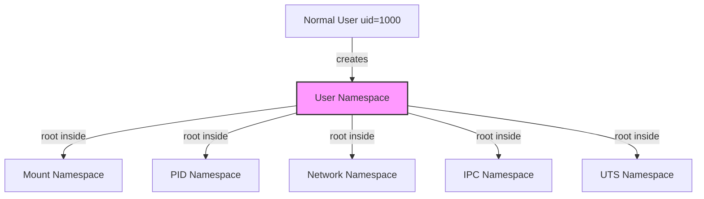

# Bubblewrap: Linux Sandboxing with Namespaces and sysctl

## 🧭 What is Bubblewrap?

Bubblewrap (`bwrap`) is a lightweight, unprivileged sandboxing tool for Linux. It creates isolated environments using Linux kernel namespaces — no root required. It is the core sandboxing mechanism behind [Flatpak][flatpak] and is used by AI coding agents like OpenAI's Codex to run untrusted code safely.

Key characteristics:

- **Minimal** — a single binary (`/usr/bin/bwrap`), ~4000 lines of C
- **No config files, no daemon, no state** — all configuration is passed as CLI arguments
- **No root required** — works through unprivileged user namespaces
- **Kernel-enforced isolation** — not userspace tricks, but actual kernel boundaries

---

## 📜 History

Bubblewrap grew out of work on GNOME/Flatpak. Before bubblewrap, Flatpak relied on a **setuid helper binary** for sandboxing — a security concern since running setuid code is inherently risky.

Around **2016**, bubblewrap was extracted as a standalone project by Alexander Larsson and Colin Walters (both Red Hat). The key insight was using **unprivileged user namespaces** (available since Linux kernel 3.8+), which allowed sandboxing without root or setuid binaries.

The design philosophy was intentionally minimal — just a small C program that sets up namespaces and execs a process. This simplicity was a direct reaction to the complexity of other sandboxing/container tools at the time.

Today bubblewrap is maintained under the [containers GitHub org][bwrap-repo] and remains true to its original minimal design.

---

## 🔧 The Tech: Linux Namespaces

### What is a Namespace?

A namespace is a **"view" or "lens"** that a process uses to see system resources. Normally all processes share the same view — the same filesystem, process list, and network interfaces. A namespace gives a process its own **private copy** of one of these views.

**Analogy**: Imagine an office building. Without namespaces, everyone works in one big open room — you can see everyone, access every filing cabinet, use every phone line. With namespaces, each team gets their own room with its own filing cabinets, phone system, and directory of people. They don't know the other rooms exist.

Namespaces don't *block* access through rules or permissions. They **remove the resource from existence** for that process. You can't access what doesn't exist in your view.

### Namespace Types

Linux provides several namespace types, each isolating a different resource:

| Namespace | Flag | What it Isolates |
|-----------|------|-----------------|
| **User** | `CLONE_NEWUSER` | UID/GID mapping — lets unprivileged users "become root" inside |
| **Mount** | `CLONE_NEWNS` | Filesystem mount points — the process gets its own mount table |
| **PID** | `CLONE_NEWPID` | Process IDs — PID 1 inside is not PID 1 on the host |
| **Network** | `CLONE_NEWNET` | Network stack — no access to host interfaces |
| **IPC** | `CLONE_NEWIPC` | System V IPC, POSIX message queues |
| **UTS** | `CLONE_NEWUTS` | Hostname |

### Concrete Example: PID Namespace

On the host:
```
PID 1   - systemd
PID 42  - sshd
PID 100 - your-app       ← sandboxed process
PID 101 - child-of-app
```

What the sandboxed process sees inside its PID namespace:
```
PID 1 - your-app          ← thinks it's PID 1
PID 2 - child-of-app
```

It literally **cannot see** systemd or sshd. They don't exist in its world.

### User Namespace: The Gateway

User namespace is the namespace that isolates **UID/GID** — who you "are." A process inside a user namespace can have a different identity than on the host.

This is the critical piece because creating other namespaces (mount, PID, network) are **privileged operations** — normally only root can create them. User namespace solves this:

```
Normal user (uid=1000)
  → creates user namespace
  → becomes "root" inside (uid=0)
  → can now create mount/PID/network namespaces
  → but has zero extra privilege on the host
```



Without user namespaces, an unprivileged user can't create any of the others. That's why it's the foundation of bubblewrap.

---

## ⚙️ How Bubblewrap Works

### The Execution Flow

```
1. Parse arguments (what to mount, what to unshare)
2. clone() with CLONE_NEWUSER (+ other namespace flags)
3. In child:
   a. Set up UID/GID mappings (write to /proc/self/uid_map)
   b. Create mount namespace
   c. Build new root filesystem (bind mounts, tmpfs, proc, dev)
   d. pivot_root() to the new root
   e. Optionally apply seccomp filters
   f. Drop any remaining capabilities
   g. exec() the target program
4. Parent: optionally holds a reference to namespaces, then exits
```

Most of the actual work is done by the **kernel**. Bubblewrap is just a thin wrapper that calls the right syscalls in the right order:

```c
// Simplified version of what bwrap does
unshare(CLONE_NEWUSER | CLONE_NEWNS | CLONE_NEWPID | ...);  // one syscall
mount("/usr", "/usr", NULL, MS_BIND | MS_RDONLY, NULL);       // one syscall per mount
pivot_root(new_root, old_root);                                // one syscall
execvp(argv[0], argv);                                         // one syscall
```

### Where the 4000 Lines Go

| Area | ~% | Purpose |
|------|-----|---------|
| Argument parsing | 30% | All those `--ro-bind`, `--tmpfs`, `--unshare-*` flags |
| Setup logic | 30% | Ordering mounts, pivot_root, UID mapping |
| Error handling | 20% | What if a mount fails? No user namespace support? |
| Edge cases & portability | 20% | Different kernel versions, different distros |

The complexity lives where it belongs — the kernel does the isolation (millions of lines of code), bubblewrap provides a thin auditable interface, and higher-level tools (Flatpak, Codex) handle policy and configuration.

---

## 🧪 Practical Example

### Running `git status` in a Sandbox

```bash
bwrap \
  --ro-bind /usr /usr \
  --ro-bind /lib /lib \
  --ro-bind /lib64 /lib64 \
  --ro-bind /bin /bin \
  --proc /proc \
  --dev /dev \
  --ro-bind /path/to/repo /path/to/repo \
  --unshare-all \
  --share-net \
  -- git -C /path/to/repo status
```

Breaking down the arguments:

| Argument | Purpose |
|----------|---------|
| `--ro-bind /usr /usr` | Mount host `/usr` into sandbox, read-only (binaries) |
| `--ro-bind /lib /lib` | Mount shared libraries, read-only |
| `--ro-bind /lib64 /lib64` | Mount 64-bit shared libraries, read-only |
| `--ro-bind /bin /bin` | Mount binaries, read-only |
| `--proc /proc` | Mount a fresh `/proc` filesystem |
| `--dev /dev` | Mount minimal `/dev` (`/dev/null`, `/dev/zero`, etc.) |
| `--ro-bind /path/to/repo ...` | Mount the repo, read-only (git status only reads) |
| `--unshare-all` | Create new namespaces for everything (user, mount, PID, net, IPC, UTS) |
| `--share-net` | Re-enable network (undoes the network part of `--unshare-all`) |
| `--` | Separator: everything after is the command to run |

The sandbox sees **only** these mounted paths. Everything else — `/home`, `/etc`, `/var`, `/tmp` — doesn't exist inside.

### Figuring Out What a Process Needs

The main practical challenge: you need to know your process's dependencies upfront because anything you don't provide won't exist.

- **`ldd /path/to/binary`** — shows shared library dependencies
- **`strace -f -e trace=open,openat,connect,access`** — shows every file/connection the process tries to access
- **Trial and error** — start minimal, see what breaks, add what's missing

---

## 🔒 Limitations: What Bubblewrap Cannot Do

Bubblewrap controls what resources are **visible**, not **how** they're used. If a process needs write access to a resource, bubblewrap can't protect that resource from the process.

```
Process needs read/write to /project
  → bubblewrap gives it read/write to /project
  → a bug does "rm -rf /project"
  → bubblewrap can't stop this
```

It's all-or-nothing per resource: visible or not, read-only or read-write. There's no way to say "you can write to this directory, but not delete files."

For finer-grained control, you need additional tools:

| Protection | Tool |
|-----------|------|
| Limit which syscalls can be made | **seccomp-BPF** (e.g., block `unlink`) |
| Fine-grained file access rules | **AppArmor** or **SELinux** |
| Filesystem-level protection | **Snapshots / copy-on-write** (btrfs, ZFS) |
| Immutable files | **`chattr +i`** |
| Recovery from damage | **Backups**, **git** (re-clone) |

Real sandboxing solutions **layer** these together. Flatpak uses bubblewrap + seccomp + portals. Defense-in-depth is the standard approach.

---

## 🤖 Bubblewrap in AI Agents: Codex vs Claude Code

AI coding agents generate and execute code — essentially running untrusted code. This makes sandboxing critical.

### OpenAI Codex: Sandbox-First

Codex runs commands through bubblewrap with a pre-defined sandbox configuration:

```
┌─────────────────────────────────┐
│ Codex infrastructure (OpenAI)   │
│                                 │
│  Hardcoded bwrap config:        │
│  ├─ --ro-bind /usr /usr         │
│  ├─ --ro-bind /lib /lib         │
│  ├─ --bind /workspace /workspace│
│  ├─ --unshare-net               │
│  └─ etc.                        │
│                                 │
│  Model only controls:           │
│  └─ the command after "--"      │
└─────────────────────────────────┘
```

The bwrap arguments are **hardcoded by engineers**, not generated by the AI — letting the model define its own constraints would defeat the purpose. The model just generates the command to run; the infrastructure wraps it.

### Claude Code: Direct Execution with Permission Gates

Claude Code runs commands directly on the host, with the user approving or denying each action.

### Comparison

| | Codex (bwrap) | Claude Code (direct) |
|--|---------------|---------------------|
| Trust model | Trust the **sandbox** | Trust the **user** |
| Safety mechanism | Technical constraint | Human judgment |
| Default posture | Safe but limited | Powerful but risky |
| Failure mode | "I can't do that" | "I shouldn't have done that" |
| Environment mismatch | Possible | None |
| Engineering burden | Maintain sandbox config | Maintain permission UX |

**Codex's tradeoff**: Engineers must build and maintain complex bwrap argument logic for every possible user task. Too tight and legitimate operations fail; too loose and the sandbox is meaningless. Every "works on my machine but not in Codex" bug could be a sandbox misconfiguration.

**Claude Code's tradeoff**: Safety depends on users paying attention. After approving 50 commands, fatigue sets in and users start clicking "yes" without reading — at which point you have no sandbox AND no real human review.

Neither is strictly better. They optimize for different things — containment vs capability.

---

## 🛠️ Setup: Enabling Unprivileged User Namespaces

### The Irony of Unprivileged User Namespaces

A feature designed to **improve security** (sandboxing without root) also **weakens security** (exposes more kernel attack surface). When a normal user creates a user namespace and becomes "root" inside, they can reach kernel code paths previously only reachable by actual root — more code paths means more potential vulnerabilities[^1].

Some distros disable this feature by default. Ubuntu uses an AppArmor-based middle ground: allow it for specific trusted programs (like Flatpak) but block it for everything else.

### Checking and Enabling

Check if AppArmor restricts unprivileged user namespaces:

```bash
cat /proc/sys/kernel/apparmor_restrict_unprivileged_userns
# 1 = restricted (bwrap will fail)
# 0 = allowed
```

Enable temporarily (resets on reboot):

```bash
sudo sysctl -w kernel.apparmor_restrict_unprivileged_userns=0
```

Enable permanently:

```bash
echo "kernel.apparmor_restrict_unprivileged_userns=0" | sudo tee /etc/sysctl.d/99-userns.conf
```

### Understanding sysctl

`sysctl` reads and writes **kernel parameters** at runtime. These parameters live under `/proc/sys/`. The `sysctl` command is just a nicer interface:

```bash
# These are equivalent:
cat /proc/sys/kernel/apparmor_restrict_unprivileged_userns
sysctl kernel.apparmor_restrict_unprivileged_userns
```

Changes via `sysctl -w` are **temporary** — they reset on reboot. For persistence, place config files in `/etc/sysctl.d/`.

### The `/etc/sysctl.d/` Drop-In Pattern

On boot, systemd loads sysctl settings in order:

```
/usr/lib/sysctl.d/*.conf    ← distro defaults (don't touch)
/etc/sysctl.conf             ← system-wide config (legacy)
/etc/sysctl.d/*.conf         ← your custom overrides (use this)
```

Files load in alphabetical order; higher numbers win. The `99-` prefix ensures your settings override everything else. This drop-in directory pattern is common across Linux (`/etc/sudoers.d/`, `/etc/apt/sources.list.d/`, etc.) — clean, reversible, and survives package updates.

---

[^1]: There have been real kernel privilege escalation CVEs that were only exploitable because unprivileged user namespaces were enabled.

[flatpak]: https://flatpak.org/
[bwrap-repo]: https://github.com/containers/bubblewrap
