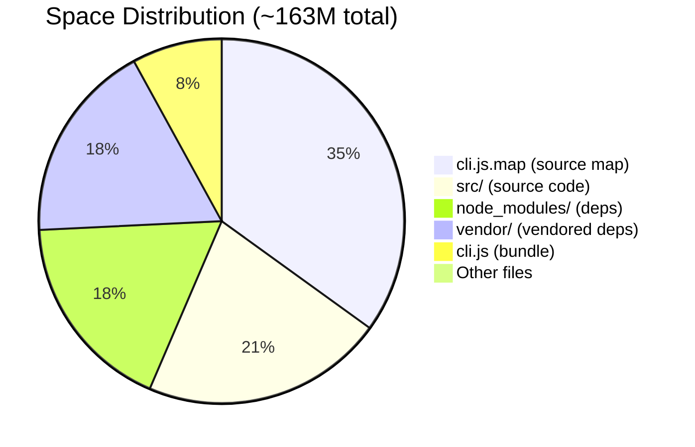
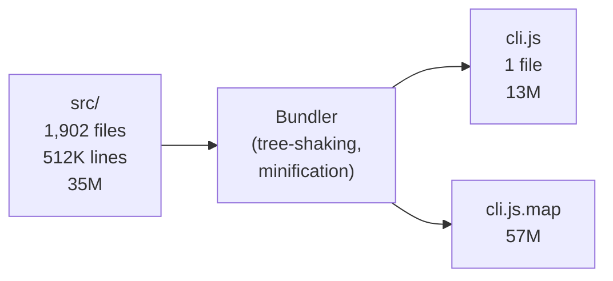

## Overview

Claude Code is Anthropic's CLI tool for interacting with Claude. Its source distribution weighs in at **~163M** across 3 folders and 7 files, with **1,902 source files** totaling over **512K lines of code**. This post breaks down the structure, toolchain, and technology choices behind it.

## Project Structure

At the top level, the distribution is minimal:

```
claude-code-source/
├── cli.js          # 13M  — bundled application entry point
├── cli.js.map      # 57M  — source map for debugging
├── sdk-tools.d.ts  # 116K — TypeScript type definitions
├── package.json    # 4K   — npm package manifest
├── bun.lock        # 4K   — Bun package manager lockfile
├── LICENSE.md      # 4K
├── README.md       # 4K
├── node_modules/   # 29M  — npm dependencies
├── src/            # 35M  — original TypeScript source
└── vendor/         # 29M  — vendored third-party code
```

### Size Distribution



## The Source Code: `src/`

The `src/` directory contains **1,902 files** organized into logical modules:

| Module | Directory | Purpose |
|--------|-----------|---------|
| Core | `Tool.ts`, `Task.ts`, `QueryEngine.ts`, `context.ts` | Core abstractions and engine |
| UI | `components/`, `screens/`, `ink/` | Terminal UI with Ink |
| CLI | `cli/`, `commands/`, `entrypoints/`, `main.tsx` | Command-line interface |
| Features | `skills/`, `hooks/`, `keybindings/`, `voice/`, `vim/` | User-facing features |
| Infrastructure | `services/`, `server/`, `remote/`, `state/`, `migrations/` | Backend services |
| Agent/AI | `assistant/`, `coordinator/`, `query/`, `bridge/`, `buddy/` | AI agent orchestration |
| Memory | `memdir/` | Persistent memory system |

### Lines of Code by File Type

| Extension | Files | Lines | % | Purpose |
|-----------|-------|-------|---|---------|
| `.ts` | 1,332 | 379,997 | 74.1% | TypeScript — logic, services, utilities |
| `.tsx` | 552 | 132,667 | 25.9% | TypeScript + JSX — Ink UI components |
| `.js` | 18 | 21 | ~0% | JavaScript — shims/config |
| **Total** | **1,902** | **512,685** | **100%** | |

The codebase is essentially **100% TypeScript**. The 18 `.js` files with only 21 lines are negligible.

## The Build: From 1,902 Files to One

The entire `src/` directory (35M, 512K lines) gets compiled and bundled into a single `cli.js` file (13M). This is the standard Node.js distribution pattern:



1. **Write** source in TypeScript across many files
2. **Bundle** into a single JS file using a tool like esbuild, webpack, or rollup — resolving imports, tree-shaking unused code
3. **Publish** the bundle to npm

The source (35M) is larger than the bundle (13M), indicating significant **tree-shaking** and dead code elimination during the build.

## The Toolchain

### 🏗️ Bun — The Package Manager

The presence of `bun.lock` reveals that Claude Code uses **Bun** for package management. Bun is a fast JavaScript/TypeScript runtime and toolkit that combines:

- **Package manager** — installs npm packages (replaces npm/yarn/pnpm)
- **Runtime** — runs JS/TS files (alternative to Node.js)
- **Bundler** — bundles code into a single file
- **Test runner** — runs tests

Bun is written in **Zig**, a low-level systems programming language created by Andrew Kelley in 2015. Zig targets the same space as C/C++ but with better safety, no hidden control flow, and excellent cross-compilation support. Bun chose Zig for its near-C performance and seamless C interop (needed to wrap JavaScriptCore, Safari's JS engine).

### 🖥️ Ink — The Terminal UI

The 552 `.tsx` files use **Ink**, a React renderer for the terminal. Instead of rendering to a browser DOM, Ink renders React components as terminal output:

```tsx
import { Box, Text } from "ink";

const StatusBar = ({ message }: { message: string }) => (
  <Box borderStyle="round" padding={1}>
    <Text color="green">{message}</Text>
  </Box>
);
```

This powers all of Claude Code's interactive UI — spinners, status bars, colored text, input prompts, and scrollable output. Ink uses **Yoga** (Facebook's flexbox engine) for terminal layout, so components can use familiar flexbox concepts.

### 📦 Source Maps — `cli.js.map`

The largest file in the distribution (57M) is the **source map** — a JSON file that maps positions in the bundled `cli.js` back to the original TypeScript source files. It's **4.4× the bundle size**, which is typical. Source maps enable:

- Stack traces showing original `.ts` file paths and line numbers
- Setting breakpoints in original source during debugging

It's purely a **development artifact** — not needed at runtime. Without it, the distribution drops from ~163M to ~106M.

## Key Takeaways

- ✅ **512K lines** of TypeScript power Claude Code's CLI
- ✅ The entire codebase bundles down to a **single 13M file** — lean for a full-featured AI agent
- ✅ **Ink + React** patterns make the terminal UI maintainable at scale (552 components)
- ✅ **Bun** (built on Zig) handles package management for fast installs
- ✅ The source map alone accounts for **35% of distribution size** — a debugging artifact, not runtime code
