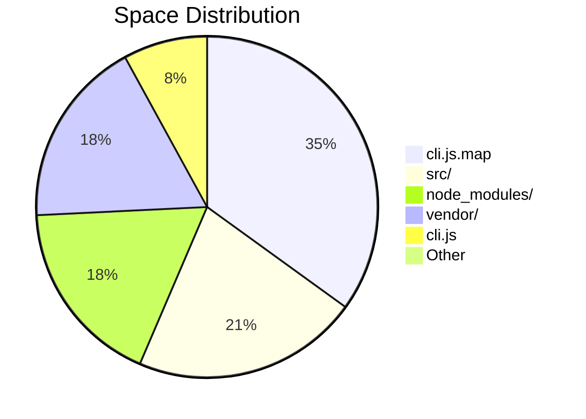

## Overview

The Claude Code source distribution (`claude-code-source`) contains **3 folders** and **7 files** at its top level. Here's what's inside and how much space each item takes up.

## Size Breakdown

| Item | Type | Size |
|------|------|------|
| `cli.js.map` | File | 57M |
| `src/` | Folder | 35M |
| `node_modules/` | Folder | 29M |
| `vendor/` | Folder | 29M |
| `cli.js` | File | 13M |
| `sdk-tools.d.ts` | File | 116K |
| `LICENSE.md` | File | 4.0K |
| `README.md` | File | 4.0K |
| `bun.lock` | File | 4.0K |
| `package.json` | File | 4.0K |

**Total: ~163M**

## Where the Weight Lives

### 📦 The Bundle: `cli.js` + `cli.js.map` (70M combined)

The single bundled entry point `cli.js` weighs **13M** — the entire application compiled into one JavaScript file. Its companion source map `cli.js.map` is the largest item at **57M**, roughly 4.4× the bundle itself. This is typical for source maps, which store full mapping data back to the original TypeScript sources.

### 🗂️ Source Code: `src/` (35M)

The `src/` directory holds the original TypeScript source, organized into modules:

- **Core** — `Tool.ts`, `Task.ts`, `QueryEngine.ts`, `context.ts`
- **UI** — `components/`, `screens/`, `ink/` (Ink-based terminal UI)
- **CLI** — `cli/`, `commands/`, `entrypoints/`, `main.tsx`
- **Features** — `skills/`, `hooks/`, `keybindings/`, `voice/`, `vim/`
- **Infrastructure** — `services/`, `server/`, `remote/`, `state/`, `migrations/`
- **Agent/AI** — `assistant/`, `coordinator/`, `query/`, `bridge/`, `buddy/`
- **Memory** — `memdir/`

### 📚 Dependencies: `node_modules/` + `vendor/` (58M combined)

The two dependency directories account for about **36%** of total size. `node_modules/` holds npm packages while `vendor/` contains vendored third-party code.

### 📄 Small Files (< 1M)

The remaining files — `LICENSE.md`, `README.md`, `bun.lock`, `package.json`, and `sdk-tools.d.ts` — are all under 120K. The `sdk-tools.d.ts` type definition file at 116K is the notable one, providing TypeScript type definitions for SDK tooling.

## Key Takeaways

- ✅ The source map alone (`cli.js.map`) accounts for **35%** of total size — it's a development/debugging artifact, not needed at runtime
- ✅ Without the source map, the distribution drops to ~106M
- ✅ The actual application bundle (`cli.js`) is a single 13M file — relatively lean for a full-featured CLI agent
- ✅ Source code (`src/`) is larger than the bundle, suggesting significant tree-shaking or dead code elimination during build
