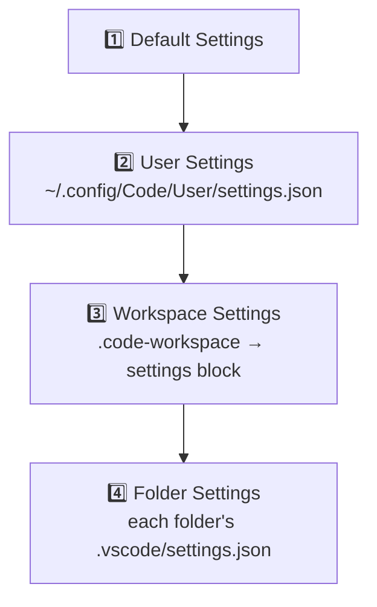

## What Is a VS Code Workspace?

A **workspace** in VS Code is the collection of folders and settings that define your working environment. There are two main types:

- **Single-folder workspace** — You open a folder (`File > Open Folder`) and that folder *is* your workspace. Settings live in `.vscode/settings.json` inside that folder.
- **Multi-root workspace** — Multiple unrelated folders grouped into one workspace via a `.code-workspace` file. Useful when working across several repos or projects simultaneously.

## The `.code-workspace` File

The `.code-workspace` file is what makes a multi-root workspace. It's a JSON file that contains:

| Section | Purpose |
|---|---|
| `folders` | List of root folders in the workspace |
| `settings` | Workspace-level settings |
| `extensions` | Recommended or unwanted extensions |
| `launch` / `tasks` | Shared debug and task configurations |

Example:

```json
{
  "folders": [
    { "path": "project-a" },
    { "path": "../other-repo" }
  ],
  "settings": {
    "editor.tabSize": 2
  }
}
```

### Naming

The workspace name comes from the filename. If your file is `myproject.code-workspace`, VS Code displays **myproject (Workspace)** in the title bar. To rename the workspace, rename the file.

### Location

The file can live anywhere. Common choices:

- **In the project root** — convenient for single-project workspaces
- **In a parent directory** — common for multi-root workspaces grouping several repos
- **In a dedicated folder** (e.g. `~/workspaces/`) — if you manage many workspaces

Folder paths inside the file are relative to the `.code-workspace` file's location, so placement affects path cleanliness.

### ⚠️ You Must Save It Explicitly

When you create a workspace in VS Code (e.g. by adding folders), **no config file is created automatically**. You must run:

> `File > Save Workspace As...`

Without this step, VS Code treats it as an untitled workspace and may lose the setup — folder list, workspace-level settings, and all — when you close the window.

## Settings Hierarchy

In a multi-root workspace, settings are resolved in layers, each overriding the previous:



This means you can set a workspace-wide rule like `"editor.tabSize": 4` but override it to `2` in a specific folder that follows a different convention.

## Configuring a Workspace

You can edit the `.code-workspace` file directly, or use the VS Code UI:

| Action | How |
|---|---|
| Edit workspace settings | `Ctrl+Shift+P` → **Preferences: Open Workspace Settings** |
| Add folders | `File > Add Folder to Workspace` |
| Configure recommended extensions | `Ctrl+Shift+P` → **Extensions: Configure Recommended Extensions (Workspace)** |

All of these modify the `.code-workspace` file under the hood.

## Remote SSH: Where to Save the Workspace File

When using **VS Code Remote SSH**, save the `.code-workspace` file on the **remote machine**.

VS Code Remote SSH runs a server on the remote side and reads the workspace file from the remote filesystem. A locally saved workspace file would not be able to resolve folder paths on the remote machine.
