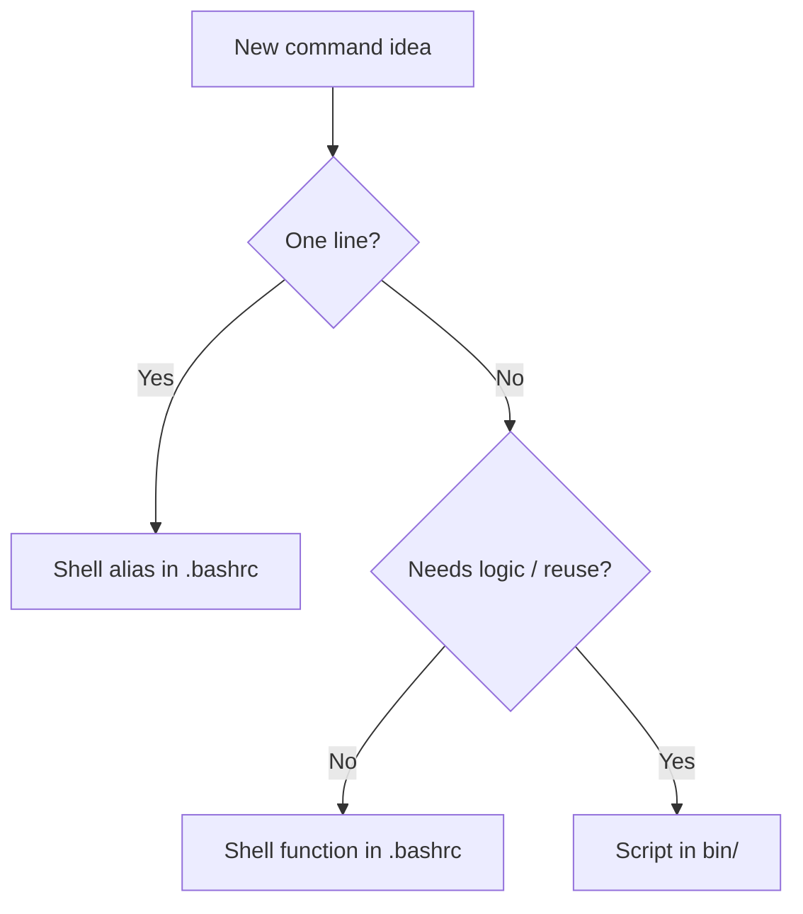

Managing personal scripts is a common friction point for developers. You accumulate useful one-offs — a backup helper, a git cleanup tool, a deploy shortcut — and suddenly they're scattered across your home directory with no structure or version history. The dotfiles repo pattern solves this neatly.

## The Problem

Scripts tend to pile up without a system:

- Saved in ad-hoc locations (`~/scripts/`, `~/tools/`, desktop)
- Not version-controlled — lost when you switch machines
- Hard to recall by name without a consistent naming scheme
- Disconnected from your shell config (aliases, functions)

## The Standard Solution: `bin/` in Your Dotfiles Repo

The most widely-used approach is a `bin/` folder inside your dotfiles repo, added to `PATH`:

```
~/.dotfiles/
├── bin/          ← scripts live here
│   ├── weather
│   ├── git-cleanup
│   └── backup
├── .vimrc
├── .tmux.conf
└── .bashrc
```

Add it to your shell config:

```bash
# ~/.bashrc or ~/.zshrc
export PATH="$HOME/.dotfiles/bin:$PATH"
```

Now `weather`, `git-cleanup`, and `backup` are available anywhere, versioned alongside your other configs.

### With GNU Stow

If you use [`stow`](https://www.gnu.org/software/stow/) to manage symlinks, it will link `~/.dotfiles/bin/` → `~/bin/` automatically, and `~/bin` is already in `PATH` on most Linux systems.

## Naming Conventions

Following Unix conventions keeps scripts discoverable and composable:

| Convention | Example | Why |
|---|---|---|
| No `.sh` extension | `backup` not `backup.sh` | Run as `backup`, not `backup.sh` |
| Category prefix | `git-cleanup`, `git-prune` | Groups related commands; mirrors git sub-commands |
| Lowercase kebab-case | `docker-nuke` | Consistent with Unix tooling |

## Scripts vs. Aliases vs. Functions

The right place for a command depends on its complexity:



- **Alias** — `alias gs='git status'`
- **Function** — `function mkcd() { mkdir -p "$1" && cd "$1"; }`
- **bin/ script** — anything longer, with arguments, flags, or shared across projects

## Other Approaches People Use

### Script Managers
- [basher](https://github.com/basherpm/basher) — install shell scripts from GitHub like packages
- [bpkg](https://github.com/bpkg/bpkg) — bash package manager

Useful if you want to pull in scripts from the community, but overkill for personal scripts.

### Gists
Some developers store individual scripts as GitHub Gists. Easy to share publicly, but hard to organize and not directly executable.

### TIL / Personal Wiki
A repo of short notes + scripts (e.g. `til/bash/resize-images.md`). Searchable and version-controlled, but scripts need to be copied out to use them.

### Note-taking Apps
Storing snippets in Obsidian, Notion, or similar. Searchable, but not executable in place.

## Recommended Setup

For most developers, this is enough:

```
dotfiles repo (on GitHub)
├── bin/        ← standalone scripts, in PATH, no .sh extension
├── .bashrc     ← aliases and one-liner functions
├── .vimrc
└── .tmux.conf
```

✅ Version-controlled
✅ Synced across machines via git
✅ Scripts run directly by name
✅ Lives alongside your other config

Search GitHub for "dotfiles" to see thousands of real-world examples and get inspiration.
