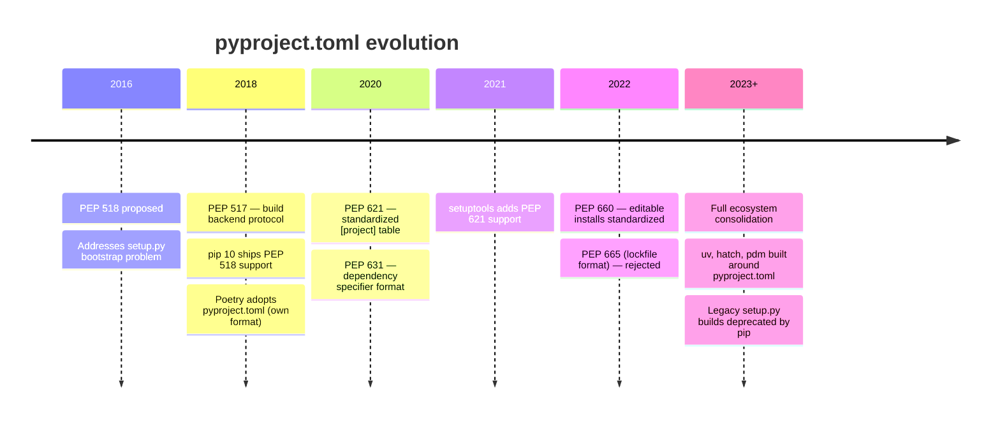

`pyproject.toml` is the single configuration file for a modern Python project. From the developer's perspective, it is the one file you write and maintain — everything else is either generated by tools or outside the scope of project config.

## What It Is

`pyproject.toml` is a [TOML][toml]-formatted file that serves as the central place to configure a Python project: its build system, metadata, dependencies, and the settings for any tools (linters, type checkers, test runners) the project uses.

Before it existed, Python projects scattered configuration across multiple files:

| Old file | Purpose |
|---|---|
| `setup.py` | Build script and metadata |
| `setup.cfg` | Declarative metadata |
| `requirements.txt` | Dependencies |
| `tox.ini` | Test automation |
| `.flake8` / `mypy.ini` | Tool config |

`pyproject.toml` consolidates all of this into one place.

## Development History



### Key milestones

**PEP 518 (2016)** — The origin. `setup.py` had a chicken-and-egg problem: it couldn't declare its own build dependencies because you needed to run it to find out what was needed to run it. A static file solved this. TOML was chosen over JSON (no comments) and YAML (too complex and ambiguous).

**PEP 517 (2018)** — Defined the standard interface between frontends (pip) and build backends (setuptools, flit, etc.). Backends must implement functions like `build_wheel()` and `build_sdist()`.

**PEP 621 (2020)** — Standardized the `[project]` table for metadata. Before this, each tool (flit, poetry) used its own format under `[tool.*]`.

**PEP 660 (2022)** — Standardized how build backends support `pip install -e .` (editable/development installs) under the new system.

**PEP 665 (rejected)** — Attempted to standardize a lockfile format. Rejected; the problem remains unsolved. Tools like poetry, pdm, and uv each have their own lockfile format.

> ⚠️ **Key tension**: Poetry adopted `pyproject.toml` early (2018) but used its own `[tool.poetry]` metadata format rather than waiting for PEP 621, creating a long-running compatibility split that still exists today.

## File Structure

`pyproject.toml` has three top-level tables:

```toml
[build-system]   # How to build the package (PEP 517/518)
[project]        # Project metadata (PEP 621)
[tool.*]         # Tool-specific configuration
```

`[build-system]` and `[project]` are **standardized** — any compliant tool reads them the same way. `[tool.*]` is a **free namespace** — each tool defines its own schema under its own key.

### `[build-system]`

Tells pip which backend to use to build the package:

```toml
[build-system]
requires = ["hatchling"]
build-backend = "hatchling.build"
```

> 💡 For applications (not libraries meant to be published to PyPI), `[build-system]` is often omitted entirely.

### `[project]`

The standardized metadata table, defined by PEP 621:

```toml
[project]
name = "my-app"
version = "1.0.0"
description = "A short description"
requires-python = ">=3.12"

authors = [
    { name = "Alice", email = "alice@example.com" }
]

dependencies = [
    "requests>=2.28",
    "click~=8.0",
]

[project.optional-dependencies]
dev = ["pytest", "ruff"]
docs = ["mkdocs"]

[project.scripts]
my-cli = "my_app.cli:main"   # creates a `my-cli` command pointing to main()

[project.urls]
Homepage = "https://github.com/me/my-app"
```

Key distinction between dependency types:

| Type | Key | When installed |
|---|---|---|
| Runtime | `dependencies` | Always |
| Optional/extras | `[project.optional-dependencies]` | On demand (`uv sync --extra dev`) |
| Dev (uv-specific) | `[tool.uv.dev-dependencies]` | Dev environments only |

### `[tool.*]`

Each tool owns its own namespace:

```toml
[tool.uv]
dev-dependencies = ["pytest", "ruff"]

[tool.ruff]
line-length = 88

[tool.pytest.ini_options]
testpaths = ["tests"]

[tool.mypy]
strict = true
```

## The Developer's Mental Model

In a modern project using uv, there are three categories of files:

| Category | Examples | Who manages it |
|---|---|---|
| Developer-owned | `pyproject.toml` | You write and maintain this |
| Tool-generated, git-tracked | `uv.lock`, `.python-version` | Committed for reproducibility; never hand-edited |
| Tool-generated, gitignored | `.venv/`, `__pycache__/`, `dist/` | Ephemeral; not committed |

From the developer's perspective, there is **one config file**. The generated files exist for reproducibility across machines and CI — you influence them indirectly:

- Edit `pyproject.toml` → run `uv sync` → regenerates `uv.lock`
- Run `uv python pin 3.12` → updates `.python-version`
- Run `uv add requests` → updates both `pyproject.toml` and `uv.lock` atomically

The developer's intent flows through commands or `pyproject.toml`; the tools propagate that intent into the generated files. You never need to understand the internal format of `uv.lock` or `.python-version`.

This is the same mental model as JavaScript: you own `package.json`, and `package-lock.json` is generated state.

[toml]: https://toml.io/
