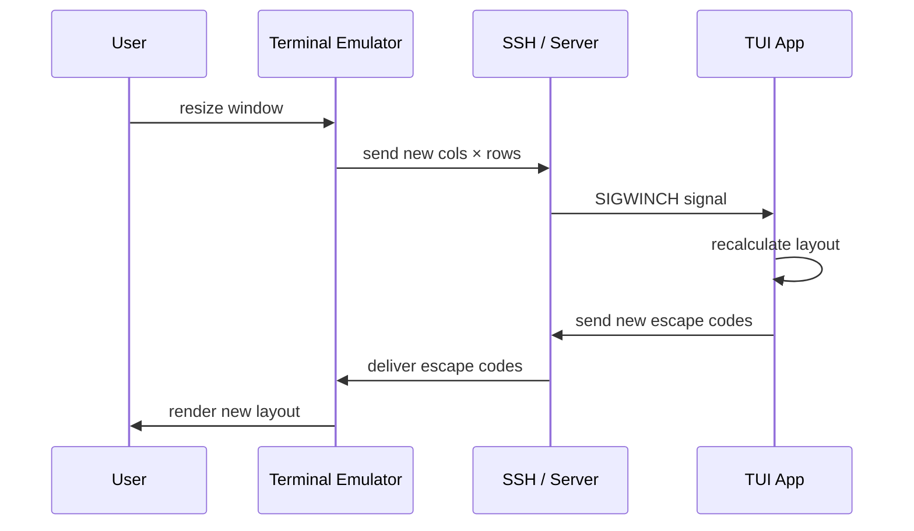

## What Is a Terminal? 🖥️

A terminal is historically a **dumb hardware device** — a screen and keyboard with no application logic. It could only:

- Display characters it received over a serial cable
- Send keystrokes back to the host computer
- Execute basic **ANSI/VT100 escape codes** (move cursor, set color, clear screen)

All logic lived on the mainframe. The terminal was just a renderer.

```
1970s physical setup:

┌─────────────┐   serial cable   ┌─────────────┐
│   terminal  │ ←──────────────→ │  mainframe  │
│  (dumb box) │  chars + escape  │  all logic  │
│  keyboard   │      codes       │  lives here │
└─────────────┘                  └─────────────┘
```

Modern terminal emulators — **Windows Terminal, iTerm2, Alacritty** — are software that faithfully pretends to be that same dumb hardware box. They stay dumb deliberately to stay compatible with 50 years of terminal software.

---

## The Screen: A Grid of Colored Characters

The terminal screen is a 2D grid of cells. Each cell has:

- **A character** — the glyph to display
- **A foreground color** — color of the character
- **A background color** — color behind the character
- **Attributes** — bold, italic, underline, dim

That's it. No pixels, no images (natively), no layout engine.

Everything visual in a TUI is an illusion made from characters. Unicode provides block and box-drawing characters specifically for this:

```
█ ▓ ▒ ░       block fill levels
─ │ ┌ ┐ └ ┘   box drawing
┼ ┬ ┴ ├ ┤     box intersections
▲ ▼ ◆ ●       shapes
```

A "panel with a border" is literally:

```
┌─── Title ───┐
│             │
│   content   │
│             │
└─────────────┘
```

---

## ANSI Escape Codes: Content and Style in One Stream

The terminal receives a **single byte stream** — a mix of regular characters and special escape sequences starting with `\x1b[` (ESC + `[`).

```
\x1b[31m        → set text color to red
\x1b[1m         → bold on
\x1b[0m         → reset all styling
\x1b[2J         → clear the entire screen
\x1b[5;10H      → move cursor to row 5, column 10
```

When `rich` prints bold red text, it actually sends:

```
\x1b[1m\x1b[31mHello\x1b[0m
```

The terminal interprets the escape codes and renders accordingly. TUI libraries wrap all of this — you never write escape codes yourself.

---

## Terminal vs Browser: A Fundamental Difference

The browser and terminal have opposite architectures.

| | Browser | Terminal over SSH |
|---|---|---|
| Layout engine | Client (browser) | Server (TUI app) |
| Resize handling | Local reflow, no server | Round trip to server |
| Mouse hover | CSS `:hover`, local | Sent to server, redrawn |
| Scroll | Local | Sent to server |
| Key press | Often local (JS) | Always sent to server |
| Image display | Native | Extensions only |
| Touch/audio/video | Native | Not supported |

**Browser sends structure; client renders it.**
**Terminal sends the already-rendered result; client executes it blindly.**

This is why terminal apps over slow SSH feel laggy — even typing a single character requires a full round trip:

```
keypress → SSH → server → app redraws → SSH → terminal renders
```

One round trip per keystroke. At 200ms latency, typing becomes painful.

---

## Terminal Is Not Like a Web Page

A web page is sent once and the browser handles resize locally. A terminal app must redraw on every resize:



The terminal grid is sized in **character cells**, not pixels. When the user resizes the window, the row × column count changes and the server redraws.

---

## Mouse Support: Bolted On Later

The original VT100 (1978) had no mouse. Mouse support was added in the VT200 series in the 1980s as an optional extension.

The TUI app must first **opt in** by sending escape codes:

```
\x1b[?1000h    enable mouse click reporting
\x1b[?1006h    enable extended coordinates
```

After that, clicks are reported back as escape codes:

```
\x1b[<0;10;5M    left click at col 10, row 5
\x1b[<0;10;5m    mouse release at col 10, row 5
```

Mouse support is inconsistent across terminal emulators because it was never part of the original design. TUI frameworks abstract this away.

---

## Full-Screen vs Inline TUI

Not every TUI app takes over the whole terminal.

| Mode | Description | Example |
|---|---|---|
| **Full-screen** | Clears and owns the entire terminal | `vim`, `htop`, `textual` apps |
| **Inline** | Prints styled output in the normal flow | `rich` output, `ls --color` |

For a chat agent, **full-screen is better** — you control the whole space, keep the input box fixed at the bottom, and can stream text into the history pane without mixing with shell output.

One tradeoff: when you exit a full-screen app the screen clears, so conversation history is lost unless saved to a file.

---

## TUI Widgets: Same Concepts as HTML

TUI frameworks provide widgets that map to familiar web concepts:

| HTML/GUI | Textual equivalent |
|---|---|
| `div` | `Widget`, `Container` |
| scrollable div | `ScrollableContainer` |
| `p` / text | `Static` |
| `input` | `Input` |
| `textarea` | `TextArea` |
| `button` | `Button` |
| `checkbox` | `Checkbox` |
| `table` | `DataTable` |
| progress bar | `ProgressBar` |
| tabs | `TabbedContent` |

But at the low level, **none of these exist**. A button is just:

1. Characters drawn at a position: `[ OK ]`
2. A bounding box the framework tracks
3. An event fired when the mouse clicks inside it or Enter is pressed on it

Everything is characters + coordinate math.

---

## No Standard Like HTML5 ⚠️

The only de facto standard is **ANSI/VT100 escape codes** — the low-level communication protocol. Above that level, nothing is standardized:

- No standard component model (no DOM equivalent)
- No standard layout system (no CSS equivalent)
- No standard event model
- Every TUI framework invents its own abstractions

This is why there are many incompatible TUI libraries and why TUI apps never reached the richness of web apps. The web broke from the past and invented a smart client model. The terminal ecosystem kept the dumb terminal model from 1978.

---

## Python TUI Libraries

| Library | Style | Best for |
|---|---|---|
| `textual` | Full-screen, CSS-like layout, async | Modern apps, chat interfaces |
| `rich` | Inline, styled output | Pretty printing, tables, progress bars |
| `prompt_toolkit` | Inline + full-screen, low-level | REPLs, autocomplete, custom input |
| `urwid` | Full-screen, low-level | Full control |
| `curses` | Full-screen, stdlib built-in | No dependencies |
| `blessed` | Full-screen, thin curses wrapper | Simpler than curses |

### For an Agent Chat UI

**`textual`** is the right choice:

- Built on top of `rich` — markdown rendering and syntax highlighting come free
- Handles async natively — essential for streaming LLM responses
- CSS-like layout — scrollable history pane + fixed input box is a few lines
- Actively maintained

A minimal layout:

```python
class ChatApp(App):
    def compose(self):
        yield ScrollableContainer(id="history")
        yield Input(placeholder="Type a message...")
```

`compose()` is like writing HTML. `textual` handles sizing, positioning, and resize reflow.

---

## Why TUI Is Having a Revival

TUI was the mainstream before GUI (1970s–80s). Windows killed it for desktop apps in the 1990s. But:

- **Servers never got GUIs** — every developer still lives in the terminal
- **SSH works perfectly with text** — a GUI over SSH is painful, a TUI is fine
- **Keyboard-driven is fast** — power users prefer staying in the terminal
- **`textual` lowered the bar** — building a good-looking TUI is now easy

Tools like `htop`, `lazygit`, `k9s`, and Claude Code itself show that developers actively prefer terminal-native tools. The terminal never died — it just stopped being mainstream for normal users.
