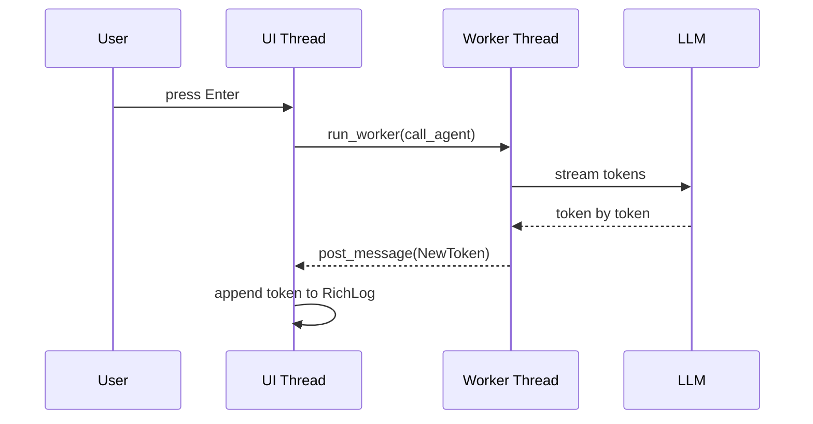

## The Mental Model 🧠

A Textual app follows four steps, in this order:

1. **Create widgets** — declare what appears on screen (`compose()`)
2. **CSS adds layout** — size and position widgets
3. **Initialize in `on_mount()`** — run setup code after first render
4. **Write event listeners** — respond to user input

This maps directly to web frontend development:

| Textual | Web |
|---|---|
| `compose()` | HTML — declare elements |
| `CSS` | CSS — layout and style |
| `on_mount()` | `DOMContentLoaded` |
| `on_<widget>_<event>()` | `addEventListener()` |

---

## The Widget Tree

Every element on screen is a **widget**. Widgets form a tree — parents contain children, exactly like the DOM.

```python
def compose(self) -> ComposeResult:
    yield Header()
    yield RichLog()
    yield Input()
    yield Footer()
```

This is equivalent to:

```html
<body>
  <header></header>
  <div class="richlog"></div>
  <input type="text" />
  <footer></footer>
</body>
```

For nested layouts, wrap widgets in containers:

```python
def compose(self) -> ComposeResult:
    yield Header()
    with Horizontal():        # like <div style="display:flex">
        yield Sidebar()
        yield RichLog()
    yield Input()
    yield Footer()
```

`query_one(RichLog)` is the textual equivalent of `document.querySelector` — walks the tree and returns the first matching widget.

---

## Built-in Widgets

Textual ships with pre-built widgets with default appearance and behavior:

| Widget | Purpose |
|---|---|
| `Header` | Title bar with app name and optional clock |
| `Footer` | Bottom bar, auto-displays keybindings |
| `RichLog` | Scrollable append-only text area, supports rich markup |
| `Input` | Single-line text input, fires `Submitted` on Enter |
| `TextArea` | Multi-line editor |
| `Button` | Clickable button |
| `Checkbox` | Toggle |
| `DataTable` | Tabular data |
| `ProgressBar` | Progress indicator |
| `Markdown` | Renders markdown |
| `Tree` | Collapsible tree view |

Layout containers:

| Container | Purpose |
|---|---|
| `Horizontal` | Side-by-side layout |
| `Vertical` | Stacked layout |
| `Grid` | Grid layout |
| `ScrollableContainer` | Scrollable region |

> At the low level, **none of these widgets exist** in the terminal. They are all illusions made from Unicode box-drawing characters, block characters, and ANSI color codes. `[ OK ]` with a colored background is a button. `█` and `░` make a progress bar. Textual handles all of this for you.

---

## CSS Layout

Textual CSS is a subset of real CSS. You embed it as a class attribute:

```python
class ChatApp(App):
    CSS = """
    RichLog {
        height: 1fr;
        border: solid $primary;
        padding: 0 1;
    }

    Input {
        dock: bottom;
    }
    """
```

Key properties:

- `height: 1fr` — take all remaining vertical space (like `flex: 1` in CSS)
- `dock: bottom` — pin to the bottom edge of the screen
- `border: solid $primary` — border using the theme's primary color
- `$primary`, `$surface`, `$accent` — theme variables, like CSS custom properties

The terminal grid is measured in **character cells**, not pixels. Everything snaps to character boundaries. `width: 50%` means 50% of the terminal columns.

---

## Keybindings and Footer

`BINDINGS` declares keyboard shortcuts. `Footer` reads them automatically and displays labels:

```python
from textual.binding import Binding

class ChatApp(App):
    BINDINGS = [
        Binding("ctrl+c", "quit", "Quit", show=True, priority=True),
        Binding("ctrl+l", "clear", "Clear", show=True),
    ]

    def action_clear(self) -> None:
        self.query_one(RichLog).clear()
```

Three parts to each binding:
- Key — `"ctrl+c"`
- Action — `"quit"` maps to `action_quit()` (built-in), or your own `action_<name>()`
- Description — shown in the footer

`priority=True` tells textual to handle the binding before its own internal handling — needed for `ctrl+c` since textual treats it as a system key.

**Use `ctrl+c` not `ctrl+q`** for quit. It's the universal Unix "stop this program" signal. Every terminal user knows it. `ctrl+q` is less known and conflicts with XON flow control in some terminals.

---

## Initialization with `on_mount()`

`on_mount()` runs once after the first render — the right place for setup:

```python
def on_mount(self) -> None:
    log = self.query_one(RichLog)
    log.write("[bold green]Assistant:[/] Hello! How can I help you?")
    self.query_one(Input).focus()
```

- Write a welcome message to the log
- Move keyboard focus to the input box — without this, keypresses go nowhere

---

## Event Listeners

Textual uses a naming convention to route events: `on_<widget_type>_<event_name>()`.

```python
def on_input_submitted(self, event: Input.Submitted) -> None:
    user_input: str = event.value.strip()
    if not user_input:
        return

    log = self.query_one(RichLog)
    log.write(f"[bold blue]You:[/] {user_input}")
    log.write("[bold green]Assistant:[/] ...")

    event.input.clear()
```

No manual `.addEventListener()` needed. Textual inspects method names and wires them automatically.

---

## A Complete Chat Layout

```python
from textual.app import App, ComposeResult
from textual.binding import Binding
from textual.widgets import Footer, Header, Input, RichLog


class ChatApp(App):
    CSS = """
    RichLog {
        height: 1fr;
        border: solid $primary;
        padding: 0 1;
    }

    Input {
        dock: bottom;
    }
    """

    BINDINGS = [Binding("ctrl+c", "quit", "Quit", show=True, priority=True)]

    def compose(self) -> ComposeResult:
        yield Header(show_clock=True)
        yield RichLog(wrap=True, markup=True)
        yield Input(placeholder="Type a message and press Enter...")
        yield Footer()

    def on_mount(self) -> None:
        self.query_one(RichLog).write(
            "[bold green]Assistant:[/] Hello! How can I help you?"
        )
        self.query_one(Input).focus()

    def on_input_submitted(self, event: Input.Submitted) -> None:
        user_input: str = event.value.strip()
        if not user_input:
            return
        log = self.query_one(RichLog)
        log.write(f"[bold blue]You:[/] {user_input}")
        log.write("[bold green]Assistant:[/] (not yet wired)")
        event.input.clear()


def main() -> None:
    ChatApp().run()
```

---

## Why RichLog and Footer Fit AI Agents So Well

`RichLog` was designed for log output — build traces, system logs, debug output. A chat history has exactly the same shape: append-only, scrollable, growing over time.

`Footer` was designed for keyboard-driven apps with a small fixed set of shortcuts — exactly what an agent TUI needs.

Neither was designed with AI agents in mind. They fit so well because **a chat interface and a log viewer have the same structure**. Good abstractions outlive their original use case.

---

## Wiring in Background Logic

The LLM call blocks for seconds. If it runs on the UI thread, the whole app freezes. The correct pattern:



```python
def on_input_submitted(self, event: Input.Submitted) -> None:
    self.run_worker(self.call_agent(event.value))

async def call_agent(self, user_input: str) -> None:
    async for token in stream_llm(user_input):
        self.post_message(NewToken(token))

def on_new_token(self, event: NewToken) -> None:
    self.query_one(RichLog).write(event.token)
```

The UI layer knows nothing about the LLM. The agent logic knows nothing about Textual. They communicate only through messages — same separation as a web frontend and backend.
