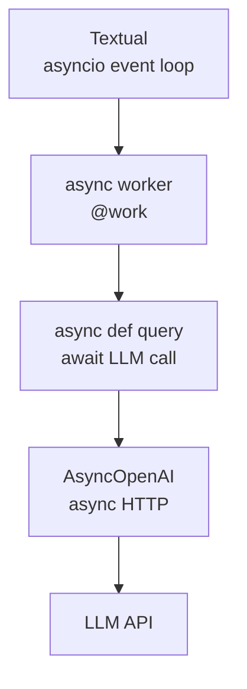

## Two Ways to Handle Concurrency

When building an AI agent TUI, the LLM call blocks for several seconds. If it runs on the UI thread, the whole app freezes. You need a way to run the LLM call in the background while the UI stays responsive.

Python offers two approaches:

| Approach | How it works |
|---|---|
| **Threading** | Real OS threads; GIL limits to one running at a time |
| **Async (asyncio)** | Single-threaded event loop; switches at `await` points |

---

## Python Threads and the GIL

Python's `threading` module creates real OS threads — the OS scheduler sees them, assigns them to cores. But the **GIL (Global Interpreter Lock)** ensures only one thread executes Python bytecode at any moment.

```
OS view:      thread 1 ──────────────────────────→  (real OS thread)
              thread 2 ──────────────────────────→  (real OS thread)

Python GIL:   thread 1 ██░░██░░██░░██░░██░░██→  (has GIL → runs)
              thread 2 ░░██░░██░░██░░██░░██░░→  (waiting for GIL)
```

From the OS and CPU perspective, a Python process with threads still behaves like a single-threaded process for CPU work. Two threads can never truly run Python code in parallel.

### The GIL Exception: I/O

The GIL is **released during I/O operations** — network calls, file reads, database queries. While one thread waits for a network response, the GIL is free and another thread can run.

```
worker thread:  ██[GIL released]░░░░░░░░░░░░░░[GIL back]██→
                  ↑              waiting for network      ↑
                  hits I/O                                I/O done

UI thread:      ░░[grab GIL]████████████████████[GIL taken]░░→
                             runs freely during wait
```

For an LLM API call — which is pure network waiting — threading works fine. The worker thread holds the GIL for almost no time; the UI thread runs freely.

---

## Async / asyncio

Asyncio runs on a **single OS thread** with an event loop. Tasks switch cooperatively at `await` points — when a task hits `await`, it yields control and the event loop runs another task.

```
OS view:    one thread ──────────────────────────────→

Event loop: task 1 ██░░░░░░░░░░░░░░░░██→  (awaits network, yields)
            task 2 ░░████████████████░░→  (runs while task 1 waits)
```

No GIL concerns — there is only one thread. Switching is explicit and predictable: it only happens at `await`.

### Async is like Node.js

Python asyncio and Node.js share the same mental model — a single-threaded event loop, cooperative switching at I/O points, async/await syntax:

```python
# Python
async def fetch():
    response = await client.get(url)
    return response
```

```javascript
// Node.js
async function fetch() {
    const response = await client.get(url)
    return response
}
```

Python adopted async/await in 3.5 (2015), inspired by the pattern Node.js popularized. The key difference: Node.js is async-first by design — the entire ecosystem assumes async. Python grew up with blocking code, so many libraries still need thread wrappers.

---

## Comparing the Two for I/O-Bound Work

For I/O-bound programs like LLM API calls, both threading and async achieve the same outcome: the UI stays responsive while waiting for the network.

| | Threading | Asyncio |
|---|---|---|
| OS threads | Yes (real OS threads) | No (one OS thread) |
| Switching | Automatic at I/O | Explicit at `await` |
| Memory per task | High (~1–8 MB stack per thread) | Low (coroutines are ~100 bytes) |
| Race condition risk | Higher (switching can happen anywhere) | Lower (only at `await` points) |
| Blocking library support | Easy (just call it) | Needs async version |
| Streaming LLM output | Messy (needs `call_from_thread` per token) | Clean (`async for token in stream`) |

---

## Why Async Is the Right Choice for AI Agents 🤖

Three things align:

**1. Textual is async-native.**
Textual's event loop runs on asyncio. Using `@work(thread=True)` forces textual to bridge the blocking thread back into the async event loop via `call_from_thread`. With `@work` (async), you are already on the same event loop — no bridging needed.

**2. LLM APIs are pure I/O waiting.**
You send a request, wait seconds for tokens. That is exactly what async was designed for.

**3. Streaming is natural with async.**

```python
# async + streaming — clean
@work
async def _run_agent(self, user_input: str) -> None:
    async for chunk in await client.chat.completions.create(stream=True, ...):
        token = chunk.choices[0].delta.content or ""
        self.query_one(RichLog).write(token)
```

With threads and streaming, every token update requires `call_from_thread` — messy and error-prone.

---

## The Stack Aligned 🎯



Everything on one event loop. No thread bridging. Streaming is clean when we add it.

---

## The Code Change

Switching from threading to async requires minimal changes.

**agent.py — before (sync)**

```python
from openai import OpenAI
client = OpenAI()

def query(user_input, messages) -> str:
    response = client.chat.completions.create(...)
    ...
```

**agent.py — after (async)**

```python
from openai import AsyncOpenAI
client = AsyncOpenAI()

async def query(user_input, messages) -> str:
    response = await client.chat.completions.create(...)
    ...
```

**main.py — before (thread worker)**

```python
@work(thread=True)
def _run_agent(self, user_input: str) -> None:
    response = query(user_input, self.messages)
    self.call_from_thread(self._show_response, response)  # bridge needed
```

**main.py — after (async worker)**

```python
@work
async def _run_agent(self, user_input: str) -> None:
    response = await query(user_input, self.messages)
    self._show_response(response)  # no bridge needed
```

Two files, a handful of lines each. The payoff: clean foundation for streaming, no thread bridges, aligned with the natural design of both Textual and the OpenAI SDK.

---

## When Threads Are Still the Right Choice

Async is preferred for new I/O-bound code, but threads remain useful:

- **Existing blocking libraries** that have no async version
- **CPU-bound work** — async doesn't help; use `multiprocessing` instead
- **Simple scripts** where async complexity isn't worth it

For an AI agent that calls a modern LLM API inside a Textual TUI — async is the right choice from the start.
