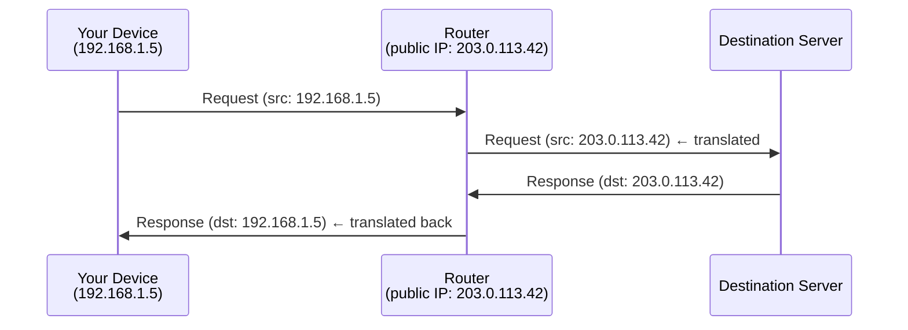

## 🌐 Public vs Private IP

When you access the internet, you may not have a **public IP address** directly assigned to your device. Instead, your device gets a **private IP**, and traffic is routed through a device (your router or your ISP's equipment) that holds the actual public IP.

Private IP ranges:

| Range | Usage |
|---|---|
| `192.168.x.x` | Home/office LAN |
| `10.x.x.x` | Enterprise networks |
| `172.16–31.x.x` | Various private use |
| `100.64.x.x` | CGNAT (ISP-assigned) |

---

## 🔄 NAT — Network Address Translation

NAT allows many devices to share a single public IP. When you send a request outbound:



The router **replaces your private IP** with its public IP (masquerading), then remembers the mapping to route the response back to you.

**Key limitation:** You can initiate outbound connections freely, but the outside world cannot reach you directly — there is no public IP targeting your device.

---

## 🪆 CGNAT — Carrier-Grade NAT (Double NAT)

CGNAT adds a second layer of NAT at the ISP level:

```
Your device        →  Your router        →  ISP's CGNAT device  →  Internet
(192.168.x.x)         (100.64.x.x)          (public IP)
```

Even your **router doesn't have a public IP** — the ISP's equipment does. Outbound access still works identically, but:

- Port forwarding doesn't work
- Peer-to-peer connections are harder
- Hosting a public server is not possible

CGNAT is common with mobile carriers and some ISPs facing IPv4 address exhaustion.

---

## 👥 Users Behind NAT Are Indistinguishable by IP

From the outside world, all users behind the same NAT share one public IP — they look identical. This has consequences:

- **IP bans** can accidentally affect many innocent users sharing the same public IP
- **Rate limiting** per IP can unfairly punish multiple users at once
- **Geolocation** shows the same location for everyone behind the NAT
- **Server logs** only record the public IP, not the individual user

This is why services that need to identify users rely on **cookies, accounts, or device fingerprinting** rather than IP addresses alone.

---

## 📍 IP Geolocation

Even without a public IP on your device, the public IP used by your router or ISP is **traceable to a geographic region**. Geolocation databases (like MaxMind, ipinfo.io) map IP ranges to locations using:

- **RIR records** — Regional Internet Registries publish IP block allocations publicly
- **BGP routing data** — routing announcements reveal where IP blocks originate
- **User-submitted data** — voluntary location reports
- **WiFi/GPS correlation** — mobile devices sometimes contribute location data

### IP Address Allocation Hierarchy

```
IANA
 └── RIRs (by region)
      ├── APNIC      (Asia-Pacific)
      ├── ARIN       (North America)
      ├── RIPE NCC   (Europe / Middle East)
      ├── LACNIC     (Latin America)
      └── AFRINIC    (Africa)
           └── ISPs → end users
```

Every IP address is traceable up this chain. RIR databases are public, so anyone can look up the region and ISP for any IP.

### Check Your Public IP and Region

```bash
curl -s ipinfo.io
```

Example output:

```json
{
  "ip": "203.0.113.42",
  "city": "Singapore",
  "region": "Singapore",
  "country": "SG",
  "org": "AS12345 Example ISP",
  "timezone": "Asia/Singapore"
}
```

To get just the IP:

```bash
curl -s ipinfo.io/ip
# or
curl ifconfig.me
```

> ⚠️ `ipinfo.io` has a free tier limit of **50,000 requests/month**. If you use this in a status bar, cache the result to a file and read from it — don't query live on every refresh.

```bash
# Refresh via cron every hour
curl -s ipinfo.io/ip > /tmp/my_public_ip

# Status bar reads from file
cat /tmp/my_public_ip
```

---

## 🚧 Geo-Blocking

Services use IP geolocation to restrict access by country — known as **geo-blocking** or **geo-restriction**:

| Service | Restriction |
|---|---|
| Netflix | Different content libraries per country |
| BBC iPlayer | UK residents only |
| Spotify | Some music licensed per region |
| Government sites | Citizens of specific countries only |

**Why services do it:**
- Licensing agreements (content rights sold per region)
- Legal compliance (GDPR, local laws)
- International sanctions
- Regional pricing differences

---

## 🛡️ VPN and Bypassing Geo-Restrictions

A **VPN** (Virtual Private Network) routes your traffic through a server in another country. The destination service sees the VPN server's IP instead of yours — effectively making you appear to be in a different location.

```
You (SG) → VPN server (UK) → BBC iPlayer
                ↑
    BBC sees a UK IP — access granted
```

### VPN Usage in Western Europe & North America

VPN adoption is high in the West, driven by different motivations than in censorship-heavy regions:

| Motivation | Notes |
|---|---|
| 🔒 Privacy | Distrust of ISPs selling browsing data (US Congress allowed this in 2017) |
| 📺 Content access | Unlocking other countries' Netflix libraries |
| ☕ Public WiFi security | Encrypting traffic on untrusted networks |
| 📥 Torrenting / P2P | Masking download activity from ISP |
| 🏢 Corporate VPN | Accessing internal company networks remotely |

In countries with heavy censorship (China, Iran, Russia), VPN is more of a **necessity** for basic internet access. In the West, it's largely a **choice** for privacy or content.

Major commercial VPN providers (NordVPN, ExpressVPN, Surfshark) advertise heavily in Western markets — commonly sponsoring YouTube channels and podcasts.
