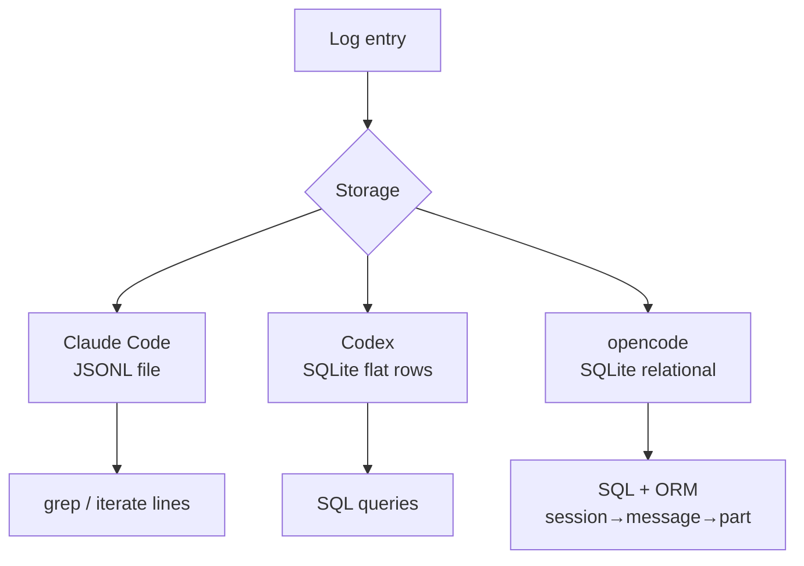

## The Problem 🗂️

An AI agent is not a simple request-response app. A single user turn can involve multiple LLM calls, tool executions, and intermediate results. To understand what the agent actually did — and to debug it — you need structured logs.

Three production AI agent projects solve this differently: Claude Code, Codex, and opencode.

---

## What Is JSONL?

Before comparing, it helps to understand JSONL — the format Claude Code uses.

**JSONL = JSON Lines.** Each line in the file is a valid, complete JSON object. The file as a whole is not valid JSON.

```jsonl
{"type": "user", "ts": "2026-04-14T10:00:00Z", "content": "what time is it?"}
{"type": "tool_call", "ts": "2026-04-14T10:00:01Z", "name": "get_current_time"}
{"type": "assistant", "ts": "2026-04-14T10:00:02Z", "content": "It is 10:00 UTC."}
```

Compare to a regular JSON array:

```json
[
  {"type": "user", "content": "..."},
  {"type": "assistant", "content": "..."}
]
```

To append to a JSON array, you must read the whole file, parse it, add the entry, serialize it, write it all back. With JSONL you just:

```python
file.write(json.dumps(entry) + "\n")
```

JSONL advantages:
- **Append** — one line write, no read-modify-write cycle
- **Stream** — process line by line without loading everything into memory
- **Crash safe** — a crash mid-write corrupts at most one line, not the whole file

This is why log files almost always use JSONL rather than JSON.

---

## Claude Code — JSONL Files 📄

Claude Code stores everything in JSONL files under `~/.claude/projects/`.

### Directory structure

```
~/.claude/projects/
└── -home-user-my-project/        ← one dir per working directory
    ├── abc-uuid-1.jsonl           ← session 1
    ← session 2
    └── ghi-uuid-3.jsonl           ← session 3
```

The working directory path is **sanitized** into a safe directory name by replacing every non-alphanumeric character with `-`:

```
/home/user/my-project  →  -home-user-my-project
```

If the sanitized name is too long, it is truncated and a short hash is appended to keep it unique.

### One file per session

Each invocation of Claude Code generates a `randomUUID()` as the session ID. All events for that session — user messages, assistant responses, tool calls, tool results — are appended to `<session-id>.jsonl` as one JSON line per entry, each with a `type` field.

Sub-agents (background workers launched by the agent) get their own files:

```
~/.claude/projects/-home-user-my-project/
└── <session-id>/
    └── subagents/
        └── agent-<id>.jsonl
```

### Key design choices

- No database — plain files, readable with any text editor or `grep`
- Async batched writes with a filelock to prevent corruption from concurrent writes
- Each entry has a `type` field — filter by type to get only LLM calls, or only the conversation

---

## Codex — SQLite 🗄️

Codex uses SQLite with two databases:

- `logs.db` — one row per log event (LLM calls, tool calls, errors)
- `state.db` — session metadata (session ID, cwd, start time, status)

Session identity comes from a `process_uuid` generated at startup. Writes are async and batched via channels.

### Trade-off vs JSONL

SQLite enables structured queries — list all sessions in a project, filter events by type or date, search content. JSONL forces you to scan every line for that. The cost is higher setup complexity and a dependency on a SQLite client to inspect logs.

---

## opencode — Relational SQLite + ORM 🏗️

opencode also uses SQLite, but with a proper relational schema via **Drizzle ORM**. The schema has four tables:

```
session
  └── message (one per user/assistant turn)
        └── part (one per chunk: text, tool_call, tool_result)
todo (agent task list, per session)
```

A single assistant response that calls two tools becomes:
- 1 row in `message`
- 3 rows in `part`: text part + tool_call part + tool_result part

The three-level hierarchy — session → message → part — allows querying at any granularity. You can list all sessions, list all messages in a session, or drill into the individual parts of a specific message.

This is the most structured approach of the three, but also the most complex.

---

## Comparison



| | Claude Code | Codex | opencode |
|---|---|---|---|
| Storage | JSONL files | SQLite (flat) | SQLite (relational) |
| Session identity | `randomUUID()` per invocation | `process_uuid` | UUID per session row |
| Schema | type field per line | flat log rows | session → message → part |
| Query | `grep` | SQL | SQL + Drizzle ORM |
| Append | trivially simple | async batch writes | async batch writes |
| Complexity | low | medium | high |
| Best for | inspect with text tools | structured queries | full relational access |

---

## Which to Use

**JSONL** is the right starting point for a new agent project:

- No dependencies, no setup
- `grep` and text editors work immediately
- Append is a one-liner
- Crash safe by design

**SQLite** becomes attractive when you want a `history` command, session search, or any query that would require scanning every line of JSONL.

**Relational SQLite** (opencode's approach) makes sense when the agent has complex internal structure — sub-messages, streaming parts, task lists — that benefits from normalized storage and joins.

For a simple TUI agent, start with JSONL. The structure Claude Code uses — one file per session, one JSON line per event, `type` field for filtering — is proven, simple, and inspectable without any tooling.
