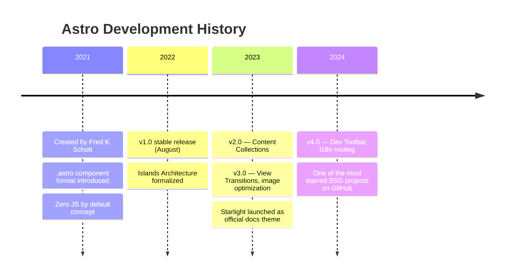

## What Is a Static Site Generator?

A **static site generator (SSG)** does one core thing:

```
Markdown files  ─┐
Templates       ─┤─► SSG build ─► HTML + CSS + JS files
Config/data     ─┘
```

At build time, it converts content (Markdown, data files) and templates into plain static files — HTML, CSS, and JS. Those files are served directly with no server-side processing.

**Benefits:**
- ⚡ Fast — pre-built HTML serves instantly
- 💸 Cheap to host — GitHub Pages, Netlify, etc. are free
- 🔒 Secure — no database or server-side code to exploit
- 🧩 Simple — fewer moving parts

---

## Three Ways to Use an SSG

There's a clear spectrum from full control to out-of-the-box convenience:

```
Plain SSG          SSG + UI Framework      SSG + Theme
(write everything) (utility classes)       (drop & done)

Most control  ◄────────────────────────► Least control
Most effort   ◄────────────────────────► Least effort
```

### Plain SSG

You write all CSS and JS yourself. Full control, but time-consuming and requires frontend skills.

### SSG + UI Framework (e.g. Tailwind)

The middle ground. Tailwind gives you utility classes so you build layouts without writing raw CSS:

```html
<article class="max-w-2xl mx-auto prose dark:prose-invert">
  <h1 class="text-3xl font-bold">{{ title }}</h1>
</article>
```

You still design the UI — Tailwind gives you tools, not decisions.

### SSG + Theme

The real out-of-the-box experience. Drop Markdown into a folder and you're done:

```
my-site/
└── posts/
    └── my-post.md   ← just drop it here, done
```

The theme handles navigation, post listing, styling, mobile responsiveness, and sometimes search. Zero CSS, zero JS, zero config — just write and publish.

> ⚠️ Picking the right theme upfront matters. Migrating content to a different theme later is painful.

---

## Popular SSGs

| SSG | Language | Known For |
|-----|----------|-----------|
| **Astro** | JavaScript | Islands architecture, zero JS by default |
| **Next.js** | JavaScript | React-based, hybrid static/dynamic |
| **Hugo** | Go | Unmatched build speed |
| **Jekyll** | Ruby | Oldest, powers GitHub Pages |
| **Gatsby** | JavaScript | React + GraphQL data layer |
| **Nuxt** | JavaScript | Vue-based |
| **Pelican** | Python | Markdown / reStructuredText |
| **MkDocs** | Python | Documentation focused |
| **Zola** | Rust | Fast, single binary |

---

## Popular Themes

| SSG | Theme | Best For |
|-----|-------|----------|
| Jekyll | Chirpy, Minimal Mistakes | Blog |
| Jekyll | Just the Docs | Documentation |
| Hugo | PaperMod, Stack | Blog |
| Astro | AstroPaper | Blog |
| Astro | Starlight | Documentation |
| MkDocs | Material for MkDocs | Documentation |

---

## Popular SSG + UI Framework Combos

Tailwind dominates modern SSG projects. Bootstrap was the go-to before Tailwind, still common with Jekyll and older projects.

| SSG | UI Framework |
|-----|-------------|
| Astro | Tailwind CSS |
| Next.js | Tailwind CSS |
| Nuxt | Tailwind CSS |
| Hugo | Tailwind CSS |
| Jekyll | Bootstrap |

**Less common but used:** DaisyUI (Tailwind component library), Bulma (CSS-only), Pico CSS (minimal, classless).

---

## Why Astro Is Trending

Astro hit a sweet spot that explains its rapid rise:

- **Islands architecture** — only ships JS where needed, rest is pure HTML
- **Framework agnostic** — use React, Vue, Svelte, or none
- **First-class Tailwind support**
- **Fast by default** — zero JS shipped unless you opt in
- **Great DX** — modern tooling, excellent docs



### AstroPaper — the go-to Astro blog theme

Created in 2022 by **Sat Naing** (indie developer), AstroPaper became the most popular Astro blog theme because:
- Clean, minimal design with good taste
- Well documented
- Kept up with Astro versions consistently
- Dark mode, SEO, RSS, and search out of the box
- MIT licensed, open source

It's maintained by a single person as a side project — community contributes but core decisions stay with the creator.

### Blog vs Docs themes — why they differ

The difference comes down to **how readers behave**:

| | Blog | Docs |
|--|------|------|
| Reader goal | Browse, discover casually | Find specific info fast |
| Navigation | Chronological, tags | Hierarchical sidebar |
| Search | Nice to have | Critical |
| Content structure | Flat posts | Nested sections |

**AstroPaper** is optimized for blogging — post lists, tags, pagination, RSS, author-centric layout.

**Starlight** (official Astro docs theme) is optimized for documentation — sidebar navigation, versioning, built-in search (Pagefind), i18n, previous/next navigation, per-page table of contents.

---

## Markdown Portability Between SSGs

Markdown itself is portable — plain `.md` files work anywhere. But migration is rarely zero-effort.

**What travels easily:**
- Actual content (paragraphs, headings, lists, code blocks)
- Basic frontmatter (`title`, `date`, `tags`)

**What causes friction:**

| Issue | Impact |
|-------|--------|
| Frontmatter schema differences | Medium — scriptable |
| MDX / SSG-specific shortcodes | High — manual rewrite |
| Folder structure conventions | Low — scriptable |
| Filename conventions | Medium — tedious at scale |
| Image paths | Medium |

### Folder and filename conventions differ per SSG

```
# Jekyll — date in filename, required
_posts/2024-01-01-my-post.md

# Hugo — date in frontmatter, not filename
content/posts/my-post.md

# Astro — flexible, defined by you
src/content/blog/my-post.md
```

**Jekyll's date-in-filename** is the biggest migration pain point — renaming hundreds of files requires scripting.

**Frontmatter example differences:**

```yaml
# Jekyll
---
layout: post
title: My Post
date: 2024-01-01
---

# Astro Content Collections
---
title: My Post
pubDate: 2024-01-01
description: required field
---
```

**Rule of thumb:**
- Pure Markdown content → easy to migrate
- Shortcodes / MDX components → hard, need rewriting
- Frontmatter fields → medium, a script can help
- The more SSG-specific syntax in your content, the harder migration becomes

> Keep content as plain as possible to stay portable.
