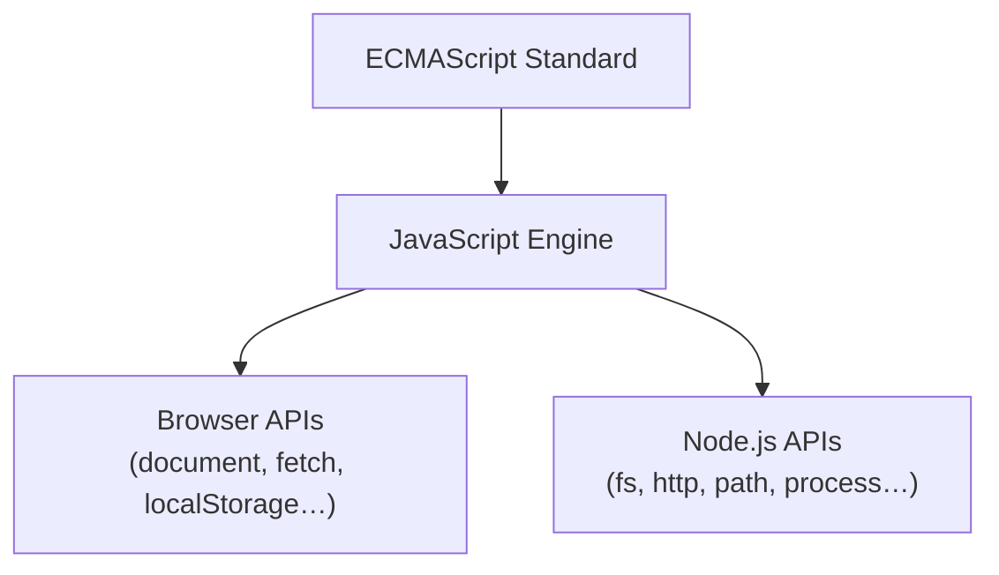

## ECMAScript and JavaScript

**ECMAScript** is the official language specification, maintained by ECMA International via the TC39 committee. **JavaScript** is the most popular *implementation* of that specification.

The names diverged for a historical reason: when Netscape submitted JavaScript for standardization in 1997, the name "JavaScript" was trademarked by Sun Microsystems, so the standard was named ECMAScript instead.

```
ECMAScript (standard)
    └── JavaScript (implementation)  ← what browsers and Node.js run
```

Versions are released yearly since ES2015: ES5, ES6/ES2015, ES2016, … ES2025.

## How Runtimes Implement ECMAScript

Both browsers and Node.js follow the same two-layer pattern:



### Browser

1. **ECMAScript** — the language engine (V8, SpiderMonkey, JavaScriptCore)
2. **Web APIs** — added on top to interact with the webpage (`document`, `window`, `fetch`, `setTimeout`, etc.)

Web APIs are standardized separately by W3C/WHATWG, not by ECMAScript. That's why `document.querySelector()` doesn't exist in Node.js.

### Node.js

1. **ECMAScript** — same V8 engine as Chrome
2. **Node.js APIs** — added on top to interact with the OS (`fs`, `http`, `path`, `process`, `os`, etc.)

## The npm Ecosystem

### What npm Created

npm (Node Package Manager) introduced three things that became universal standards:

| What | Description |
|---|---|
| **`package.json` format** | Project manifest: name, version, dependencies, scripts |
| **CLI tool** | The `npm` command for installing and managing packages |
| **Central registry** | `registry.npmjs.org` — the public package repository |

`package.json` is **not part of JavaScript or ECMAScript** — it's a convention defined by npm that the entire ecosystem adopted.

npm ships bundled with Node.js (since v0.6.3 in 2011) as a convenience, but it is a **separate project** with its own versioning and release cycle.

### Other Package Managers

yarn, pnpm, and bun each created only a **new CLI tool** — they still use npm's `package.json` format and pull packages from the npm registry:

```
npm created:   package.json format  +  CLI  +  registry
yarn created:                           CLI
pnpm created:                           CLI
bun created:                            CLI  (+ also a runtime)
```

This means **no vendor lock-in**: switching package managers is low-friction because the format and registry are shared.

## Comparison

| | npm | yarn | pnpm | bun |
|---|---|---|---|---|
| **Lockfile** | `package-lock.json` | `yarn.lock` | `pnpm-lock.yaml` | `bun.lockb` |
| **Speed** | slowest | faster | fast | fastest ⚡ |
| **Disk usage** | duplicates packages | duplicates packages | shared store (hard links) | shared store |
| **node_modules** | flat | flat | symlinked | flat |
| **Workspaces** | ✅ | ✅ | ✅ | ✅ |
| **Also a runtime** | ❌ | ❌ | ❌ | ✅ |

- **npm** — default, always available, slowest
- **yarn** — introduced parallel installs and deterministic lockfiles; yarn v2+ (Berry) is a major rewrite with Plug'n'Play (no `node_modules`)
- **pnpm** — stores each package version once globally and hard-links into projects, saving significant disk space; popular in monorepos
- **bun** — written in Zig, extremely fast, replaces Node.js itself as the runtime

## Switching Package Managers

Switching is easy and low-risk:

1. Delete `node_modules` and the old lockfile
2. Run the new package manager's install command
3. A new lockfile is generated

**Minor friction points:**
- Lockfile format changes — exact pinned versions are regenerated (slight dependency version drift possible)
- Package-manager-specific `package.json` fields need manual migration (e.g. pnpm's `pnpm` field, yarn's `resolutions`)
- CI pipelines or scripts that call `npm run` directly need updating

For most projects, this is a one-time, low-effort operation. The lockfile regeneration is the only real concern in production.
