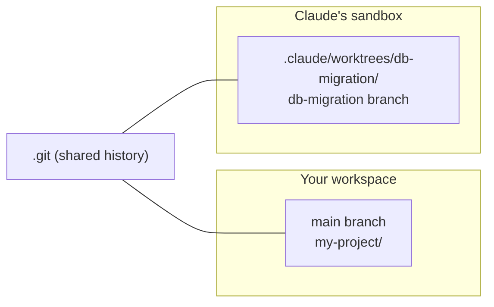

## The Problem: One Working Directory, One Branch

In a standard Git setup you have one `.git` folder and one working directory — the actual files on disk. Because there is only one working directory, only one branch can be checked out at a time.

The classic pain scenario:

> You are deep in a complex feature on `feature-login`. Your boss messages: *"Critical bug on `main`. Fix it now."*

Without worktrees your workflow is:

1. `git stash` — hide your half-finished code.
2. `git checkout main` — all your files get swapped out.
3. Fix the bug and commit.
4. `git checkout feature-login` — swap all your files back.
5. `git stash pop` — and hope for no conflicts with your own uncommitted work.

This is the **context-switching tax**: your focus breaks, your IDE jumps to a different state, and stash amnesia is always one distraction away.

---

## The Solution: `git worktree`

A Git worktree lets you attach **multiple working directories** to a single `.git` repository simultaneously. Each directory has its own branch checked out, but they all share the same underlying commit history and local branches.

```bash
# Create a worktree for a hotfix branch
git worktree add ../hotfix main

# You now have:
#   my-project/   ← still on feature-login, untouched
#   hotfix/       ← checked out to main, separate physical folder
```

Fix the bug in `hotfix/`, commit, then delete the folder. Your original workspace was never touched.

### Core commands

| Command | Purpose |
|---|---|
| `git worktree add <path> <branch>` | Create a new linked working directory |
| `git worktree list` | Show all active worktrees |
| `git worktree remove <path>` | Remove a worktree when done |

### Why not just `git clone` twice?

You could clone the repo into a second folder, but:

- **Cloning re-downloads the full history** from the remote — slow.
- **Local (unpushed) commits are invisible** to the clone; only pushed refs are shared.
- `git worktree` is instant and both directories share the exact same `.git` data.

---

## Three Ways to Handle a Branch Interruption

| | `git clone` | `git stash` | `git worktree` |
|---|---|---|---|
| Needs internet? | ✅ Yes | ❌ No | ❌ No |
| Touches current files? | ❌ No | ✅ Hides them | ❌ No |
| Setup speed | 🐢 Slow | ⚡ Instant | 🚀 Fast |
| Both branches open simultaneously? | ✅ Yes | ❌ No | ✅ Yes |
| Shares local (unpushed) history? | ❌ No | ✅ Yes | ✅ Yes |

**Rule of thumb:** `git stash` is fine for a two-minute interruption. For anything longer, or when your uncommitted work is complex, `git worktree` is almost always the better tool.

---

## Git Worktrees Meet Claude Code

Starting around version 2.1.49, Claude Code added **native Git worktree support** built directly on top of `git worktree`. The idea is simple:

> In standard Git, a worktree lets *you* work on two branches at once.  
> In Claude Code, a worktree lets *you and the AI* work on the same repository at the exact same time — without stepping on each other's toes.

### The "elbow bump" problem

If you run Claude Code in your main working directory while also coding, conflicts happen:

- You format a file while Claude is reading it.
- Claude overwrites a file you haven't saved yet.
- Claude's half-finished code breaks your running dev server.

It's like sharing a single keyboard with a coworker.

### How Claude Code worktrees work

```bash
# Start a Claude Code session in an isolated worktree
claude --worktree db-migration
# or the short flag
claude -w db-migration
```

Under the hood, Claude Code:

1. Runs `git worktree add .claude/worktrees/db-migration db-migration` — creates a linked directory on a new branch.
2. Scopes its entire session (environment, file paths, context window) to that directory.
3. Your main working tree remains completely untouched.



> ⚙️ **Pro tip:** Add `.claude/worktrees/` to your `.gitignore` so the worktree directories don't appear as untracked files in your main repo.

---

## A Real-World Worktree Workflow

**Step 1 — You are coding on `main`.**  
Writing HTML and CSS for a new dashboard. Your dev server is running.

**Step 2 — Delegate a background task.**  
You open a second terminal tab:

```bash
claude -w db-migration
```

You give Claude a prompt:  
*"Write a migration script to add `user_id` to the `dashboard` table."*

**Step 3 — True parallel work.**  
You go back to your main folder and keep writing HTML. Claude is in its hidden worktree, exploring the schema, writing the migration, running tests, and committing — all without touching your files.

**Step 4 — Review and merge.**  
Claude finishes. Because the worktrees share the same `.git` history, Claude's commits are instantly visible from your main folder:

```bash
git merge db-migration
# or open a Pull Request on GitHub
```

---

## Swarm Coding: Multiple Agents in Parallel

Because worktrees are lightweight, you can spawn several Claude instances at once:

```bash
# Terminal 1
claude -w fix-login
# Prompt: "Hunt down the bug in the auth controller."

# Terminal 2
claude -w write-docs
# Prompt: "Generate JSDoc comments for the utils folder."

# Terminal 3
claude -w update-deps
# Prompt: "Update React to v19 and fix breaking changes."
```

All three agents operate in their own isolated branches. You can review PRs or drink coffee while they work. This pattern is often called **"parallel vibe coding"** or **swarm coding** in the community.

---

## The "Fire-and-Forget" Reality

The dream is to kick off a task and walk away. In practice, Claude Code may pause occasionally for:

- **Permission checks** — *"I need to run `npm install axios`. Approve? (y/n)"*
- **Clarification requests** — *"Found two approaches for auth. Method A or B?"*

The real-world loop looks like:

1. Give Claude a big task in a worktree.
2. Return to your main branch and do your own work.
3. Glance at Claude's terminal every few minutes to answer any `y/n` prompts.
4. When Claude finishes, review the branch.

Some teams pass an `--auto-approve` flag to eliminate the prompts and make the workflow truly fire-and-forget — though that trades safety for convenience.

---

## Review Workflow: Worktrees Are Actually Better for Code Reviewers 🔍

A common concern: *"If Claude codes in the background, I won't review it."*

The opposite is true. Compare the two models:

| Without worktrees | With worktrees |
|---|---|
| Claude modifies your files **live** | Claude works in a **separate branch** |
| Hard to tell your edits from Claude's | 100% of changes on that branch are Claude's |
| If Claude breaks the build, your work stops | Claude's sandbox breaks; your dev server keeps running |
| Review is accidental (you see it as it happens) | Review is intentional (you review the finished PR) |

Worktrees enforce a **Pull Request model** on the AI — like a junior developer submitting code for your approval rather than editing your files directly.

### Three ways to review Claude's work

1. **Pull Request (recommended):** Ask Claude to push and open a PR on GitHub. Review every line in a clean diff view.
2. **IDE diff:** In VS Code, use *Compare Branch with Working Tree* to see a side-by-side view of every change.
3. **Open the folder:** Since the worktree is a real directory, open `.claude/worktrees/feature-x/` in a second VS Code window and run the code directly.

---

## The Two-Window Technique

Because a worktree is a real folder on disk, you can open two VS Code instances simultaneously:

```bash
# Window A — your main project on main branch
code ~/my-project

# Window B — Claude's sandbox
code ~/my-project/.claude/worktrees/feature-x
```

**Why this solves the "code dump" review problem:**

- **Live watching** — Files in Window B update in real-time as Claude writes them. You watch the code being built, not a finished pile.
- **Incremental feedback** — If Claude starts a function in a way you dislike after 5 lines, you can jump in immediately: *"Use our internal `utils` helper instead."*
- **Isolated testing** — Run the dev server inside Window B without stopping Window A's dev server.

Window B's Source Control tab shows only Claude's changes on its branch, cleanly separated from your own uncommitted work in Window A.

---

## Step-by-Step Mode: Worktree Isolation + Pair-Programming Control

You don't have to choose between fire-and-forget and full manual control. A middle path:

1. `claude -w feature-branch`
2. Give a small task: *"Outline the functions we need for this feature."*
3. Review the outline, then: *"Implement just the first function and explain it."*
4. Repeat.

You get the **isolation** of a worktree (your main folder stays clean) combined with the **control** of pair programming. You are the pilot; Claude is the co-pilot in a separate cockpit.

---

## Summary

Git worktrees solve the branch-switching problem by giving you multiple physical working directories backed by a single shared `.git` history. Claude Code builds on this primitive to give AI agents their own isolated "desk" — a separate directory and branch where they can write, test, and commit code without ever conflicting with the developer's main workspace. The result is a clean Pull Request workflow where you stay in control: you review the finished branch on your own terms, accept the good parts, and discard the rest.
