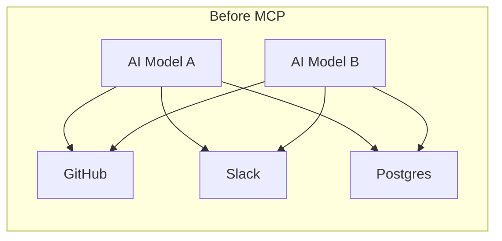
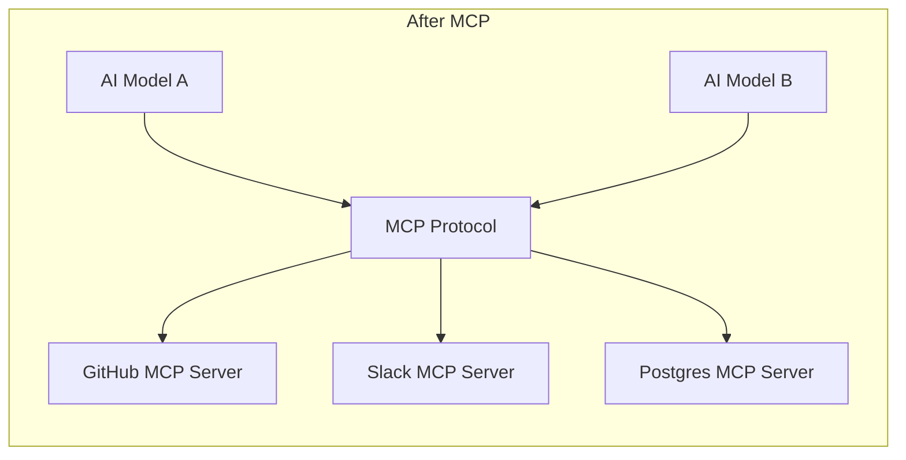

## What Does MCP Stand For?

"MCP" is an overloaded acronym. Depending on context it can mean:

| Abbreviation | Full Name | Domain |
|---|---|---|
| MCP | **Model Context Protocol** | AI / Software |
| MCP | Microsoft Certified Professional | IT Certification |
| MCP | Minecraft Coder Pack | Gaming / Modding |
| MCP | Master Control Program | Pop Culture (*Tron*) / Mainframe History |

In the AI developer space today, MCP almost always refers to the **Model Context Protocol**.

---

## What Is Model Context Protocol?

Introduced by Anthropic in late 2024 and quickly adopted by major players like OpenAI and Google DeepMind, **Model Context Protocol (MCP)** is an open standard that enables AI applications to securely connect to external data sources, tools, and systems.

The simplest mental model: **MCP is the "USB-C port for AI."** Just as USB-C is a universal connector that lets any device plug into any peripheral, MCP is a universal connector that lets any AI agent plug into any external tool or data source — without custom integration code.

Official website: [modelcontextprotocol.io](https://modelcontextprotocol.io/)

---

## The Problem MCP Solves

Before MCP, every AI-to-tool integration was bespoke. If a developer wanted an AI model to read Google Drive, write to GitHub, or query a private SQL database, they had to build a custom connector for *each* pairing.

This is the **N×M integration problem**:

```
5 AI models × 50 enterprise tools = 250 custom integrations to write and maintain
```

This made it slow and expensive to give AI agents access to real-world, siloed data.





MCP collapses the N×M problem into **N + M**: each AI implements the client once, each tool implements the server once, and they all interoperate automatically.

---

## How MCP Works

MCP uses a standardized **client-server architecture**:

| Role | Who | What it does |
|---|---|---|
| **MCP Host / Client** | The AI application (Claude Desktop, ChatGPT, Cursor, Windsurf…) | Speaks the MCP protocol on the AI side |
| **MCP Server** | A lightweight program wrapping a specific external system | Translates that system's data/actions into the MCP format |

Because both sides speak the same "MCP language," any MCP server plugs into any MCP client — no new integration code needed.

### What an MCP Server Exposes

When an MCP server connects to an AI client, it can expose three types of capabilities:

- 📄 **Resources** — Read access to data (e.g., pull a customer record from Salesforce, read local log files)
- 🔧 **Tools** — Action capabilities (e.g., execute a Python script, send a Slack message, create a Jira ticket)
- 💬 **Prompts** — Reusable templates that tell the AI exactly how to use the server it just connected to

---

## Division of Responsibility

MCP cleanly separates concerns across three parties:

### 1. Service Providers — Build the MCP Server

If you are GitHub or Gmail, you build and maintain one MCP server:

- **Write once:** Instead of building a ChatGPT plugin, a Claude extension, *and* a Google Workspace add-on, you ship one MCP server.
- **Control:** You decide exactly which Resources and Tools to expose (e.g., a Gmail server might expose `send_email` as a Tool and `read_inbox` as a Resource).
- **Security:** You handle authentication — your server requires the user's API key or OAuth token to access their data.

### 2. AI Developers — Integrate the MCP Client SDK

Developers building AI agents integrate the MCP Client SDK into their app:

- **Zero custom code:** They do not need to read the Gmail API or GitHub API docs.
- **Universal discovery:** Their AI simply asks any connected MCP server: *"What tools do you have, and how do I use them?"*

### 3. End Users — Make the Connection

The user connects their AI agent to the services they want:

1. Open the AI agent's settings.
2. Add the desired MCP server (usually a pointer to an executable or Docker container, plus a personal API key).
3. The AI agent immediately "learns" how to use that service — no further setup needed.

---

## The Official SDKs

The official SDKs live at [github.com/modelcontextprotocol](https://github.com/modelcontextprotocol) and are available in **TypeScript, Python, and Java/Kotlin**.

They abstract away everything so developers focus only on their tool's logic:

| What the SDK handles | Detail |
|---|---|
| **Transport Layer** | MCP communicates over `stdio` (local processes) or SSE (remote network). The SDK handles both automatically. |
| **JSON-RPC Messaging** | MCP uses JSON-RPC 2.0 under the hood. The SDK formats, parses, and routes all messages. |
| **Handshake & Lifecycle** | Client and server negotiate capabilities on connect. The SDK manages this initialization phase. |

**Example:** To build an MCP server that queries a local database, you don't write any networking code. You import the SDK, write a Python function that runs your SQL query, and register it with `server.add_tool()`. Done.

---

## The SQLite MCP Server Ecosystem

SQLite was one of the very first tools to receive an MCP server, making it a useful window into how the ecosystem matured.

### The Original Official Server (Now Archived)

Anthropic shipped an official SQLite reference server (Python) in the `modelcontextprotocol/servers` monorepo. It supported read/write queries, table listing, and a unique "business intelligence memo" feature.

**Current status:** Archived at [github.com/modelcontextprotocol/servers-archived](https://github.com/modelcontextprotocol/servers-archived/tree/main/src/sqlite). It will not receive security updates or bug fixes — not recommended for production.

### Community Alternatives

| Server | Language | Standout Feature |
|---|---|---|
| [mekanixms/sqlite-mcp-server](https://github.com/mekanixms/sqlite-mcp-server) | Python | Built-in statistical Data Analysis tools (null counts, distributions, etc.) |
| [rvarun11/sqlite-mcp](https://github.com/rvarun11/sqlite-mcp) | Go | Performant, standardized schema introspection + full read/write; Docker-ready |
| [santos-404/mcp-server.sqlite](https://github.com/santos-404/mcp-server.sqlite) | TypeScript | Lightweight, runnable via `npx` or Docker |
| [panasenco/mcp-sqlite](https://github.com/panasenco/mcp-sqlite) | Python | Datasette-compatible YAML metadata → "canned queries" become native MCP tools |
| [liliang-cn/mcp-sqlite-server](https://github.com/liliang-cn/mcp-sqlite-server) | Go | Path traversal protection, multi-database management, query execution plans |

---

## How the MCP Ecosystem Evolved

When Anthropic launched MCP, they had to prove the protocol worked. To do that, they built both the "pipes" (SDKs) and the "water" (reference servers for SQLite, GitHub, Slack, Postgres, etc.) so early adopters had something tangible to use immediately.

As adoption exploded, maintaining those reference servers became a bottleneck. The core team couldn't realistically be the world's IT department — maintaining every integration while also evolving the core protocol.

**The strategic shift:**

1. 🎯 **Laser focus on the core** — All resources now go toward improving the specification, expanding the SDKs to more languages (Rust, Go, C# in progress), and building infrastructure like the new **MCP Registry**.
2. 🌍 **Passing the torch** — Actual server development was handed to the open-source community and service providers themselves. Anthropic even donated the protocol to the **Linux Foundation's Agentic AI Foundation** to ensure it remains a neutral, open standard.

This is the classic open-source playbook: *build the foundation, prove the concept, and get out of the way so the community can scale it.*

---

## Why MCP Matters for Agentic AI

MCP is the backbone of the current push toward **Agentic AI** — where AI stops being a chatbot and becomes an active agent that can do real work across your desktop and enterprise apps.

Without a standard like MCP, every AI agent is an island. With MCP, any agent can reach any tool, any data source, and any service — on day one, without custom code. The protocol turns isolated AI models into composable, capable agents that can act in the world.

> **Key insight:** Service providers write once, AI developers integrate once, and users connect once. Everyone benefits from the network effect as the ecosystem of MCP servers grows.
