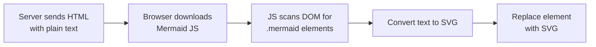
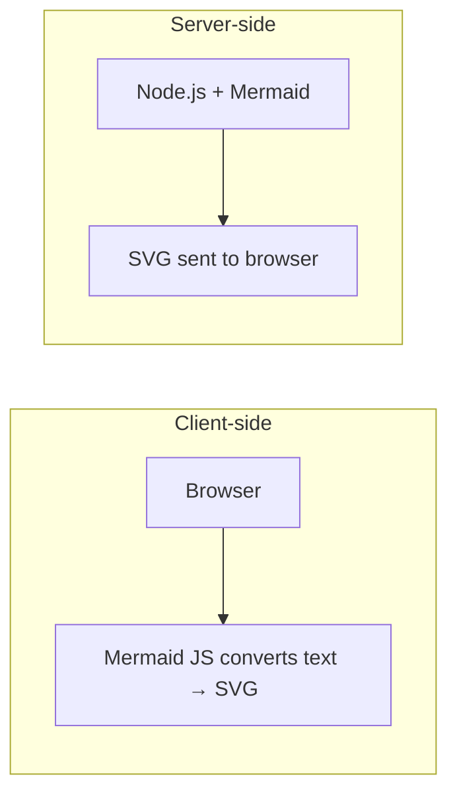
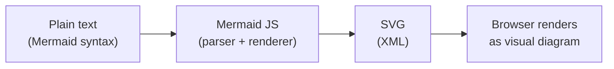

## What is SVG?

SVG (Scalable Vector Graphics) is an **XML-based format** for describing 2D vector graphics. At its core, an SVG file is just an XML file with a `.svg` extension — it follows all standard XML rules: elements, attributes, nested structure, and well-formedness requirements.

```xml
<svg xmlns="http://www.w3.org/2000/svg" width="100" height="100">
  <circle cx="50" cy="50" r="40" fill="blue" />
</svg>
```

Because SVG is vector-based (defined by mathematical equations rather than pixels), it scales to any size without quality loss — making it ideal for icons, diagrams, and UI elements.

## The Problem: XML is Verbose and Error-Prone

SVG is powerful, but writing it by hand is impractical. A simple diagram can require hundreds of lines of raw XML with precise coordinates, path calculations, and styling. One misplaced tag or attribute breaks everything.

This is the same problem that motivated other abstraction layers in the web ecosystem:

| Tool | Abstracts over |
|------|----------------|
| Mermaid | SVG/XML |
| Markdown | HTML |
| SASS/SCSS | CSS |
| TypeScript | JavaScript |

All follow the same idea: the underlying format is too verbose or error-prone to write directly, so a simpler syntax compiles down to it.

## What is Mermaid?

Mermaid is a JavaScript-based diagramming tool that lets you write diagrams in a simple text syntax, which it converts to SVG.

```
flowchart LR
    A[Start] --> B{Decision}
    B --> |Yes| C[Do thing]
    B --> |No| D[Skip]
```

The core value proposition: **people could write SVG/XML directly, but Mermaid makes it practical**.

Mermaid supports many diagram types: flowcharts, sequence diagrams, class diagrams, ER diagrams, Gantt charts, state diagrams, pie charts, and git graphs.

### Diagrams as Text

Because Mermaid source is plain text, diagrams can live alongside code in a repository. They are easy to diff, review in PRs, and maintain — unlike binary image files or proprietary diagram tool formats. GitHub renders Mermaid natively in Markdown.

## How Mermaid Renders: Client-Side

The full pipeline for client-side rendering:



The HTML page contains something like:

```html
<div class="mermaid">
flowchart LR
    A --> B
</div>

<script src="mermaid.min.js"></script>
```

Mermaid JS runs in the browser, scans the DOM using `querySelectorAll('.mermaid')`, and replaces each matching element's content with generated SVG:

```js
// roughly what Mermaid does internally
document.querySelectorAll('.mermaid').forEach(el => {
    const text = el.textContent      // grab the plain text
    const svg = convertToSVG(text)   // parse and generate SVG
    el.innerHTML = svg               // replace with SVG
})
```

It only touches elements it recognizes by that class — the thousands of other tags on the page are completely ignored.

## Framework-Agnostic by Design

Because Mermaid operates at the DOM level, it works regardless of how the rest of the page is built:

- Plain HTML written by hand
- Vue components
- React/JSX
- Angular templates
- Any other framework

As long as the final rendered DOM contains a `class="mermaid"` element with Mermaid text inside it, the library does its job. Every framework, no matter how different, ultimately produces DOM elements — that's the common ground Mermaid relies on.

## Server-Side Rendering

Some frameworks also support rendering Mermaid on the server in Node.js, so the browser receives ready-made SVG instead of plain text:



Benefits of server-side rendering:
- ✅ No JS required in the browser — works even with JS disabled
- ✅ Faster render — browser gets SVG directly
- ✅ Better for static sites — SVG baked into HTML at build time

Examples: **Next.js** (SSR/static generation), **Gatsby** (build-time plugins), **Astro**, **Hugo**, **Jekyll** — all support Mermaid at build time. The Node.js side uses the same Mermaid core library, often combined with a headless browser like **Puppeteer** or a virtual DOM to handle browser APIs that SVG generation may depend on.

## Summary



- SVG is XML — powerful but verbose
- Mermaid is a text-based abstraction that compiles to SVG
- Client-side: browser receives plain text, JS converts it to SVG in the DOM
- Server-side: Node.js converts to SVG before sending to the browser
- Framework-agnostic: works with any stack because it targets the DOM, not a specific framework
