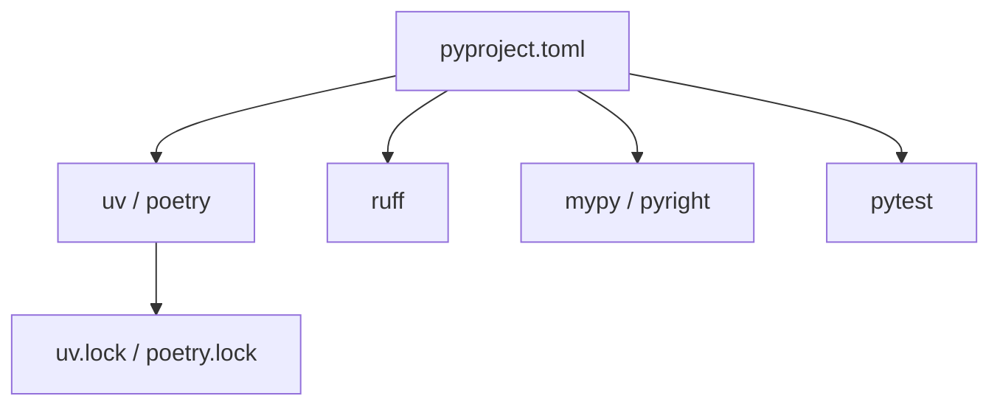

Modern Python projects follow a well-established layout that balances import safety, installability, and tooling support. This note covers the standard structure for applications and explains the reasoning behind each layer.

## The Structure at a Glance

```
my-app/
├── src/
│   └── my_app/
│       ├── __init__.py
│       ├── main.py
│       ├── api/
│       ├── models/
│       └── services/
├── tests/
│   └── conftest.py
├── pyproject.toml
└── README.md
```

## Naming Convention: Hyphens vs Underscores

The project root directory uses `my-app` (hyphens), while the Python package folder uses `my_app` (underscores). This is intentional:

- Hyphens are conventional for repository and directory names
- Python identifiers cannot contain hyphens — imports like `import my-app` are a syntax error
- The package name (`my_app`) is what Python and `pyproject.toml` care about

## Why `src/my_app/` and Not Just `src/`?

This is the most common question. The answer is about **namespacing**.

If code lives directly in `src/`:

```
src/
├── main.py
└── utils.py
```

Imports are flat and ambiguous:

```python
import main
import utils
```

These names can clash with any other installed library that exports `main` or `utils`.

With `src/my_app/`:

```
src/
└── my_app/
    ├── main.py
    └── utils.py
```

Every import is namespaced under the package:

```python
from my_app import main
from my_app.utils import something
```

There is no ambiguity about which package `my_app.utils` belongs to.

### Benefits Summary

| Concern | Why it matters |
|---|---|
| **No name clashes** | `my_app.utils` won't conflict with another library's `utils` |
| **Clear ownership** | Any import reveals which package it comes from |
| **Installable as a package** | `pyproject.toml` maps to `src/my_app` and installs cleanly |
| **Multiple packages** | `src/` can hold `my_app/` and `my_app_cli/` side by side |

## Why the `src/` Layer at All?

`src/` is a container that keeps packages out of the project root. Without it, Python can accidentally import code directly from the project root during development — before it is installed — which can mask packaging bugs and import errors.

The `src/` layout forces the package to be installed (even in editable mode via `pip install -e .`) before it can be imported in tests and scripts. This means your test environment matches what users of the package actually get.

## Package vs Application Layout

The `src/my_app/` convention applies to both libraries and applications, but the internal structure differs:

**Library** — exposes a public API, keeps internals flat:

```
src/my_lib/
├── __init__.py    ← public API re-exports
├── core.py
└── utils.py
```

**Application** — groups by feature or layer:

```
src/my_app/
├── __init__.py
├── main.py        ← entry point
├── api/           ← HTTP handlers or CLI commands
├── models/        ← data models
└── services/      ← business logic
```

## Modern Tooling



| Tool | Role |
|---|---|
| `pyproject.toml` | Single config file for metadata, deps, and tool settings |
| `uv` | Fast package manager and project scaffolder |
| `ruff` | Formatter + linter (replaces black, flake8, isort) |
| `mypy` / `pyright` | Static type checking |
| `pytest` | Test runner with `tests/conftest.py` for shared fixtures |

Running `uv init --app` scaffolds exactly this layout automatically — the `src/my_app/` pattern is baked into the tool.

## Quick Reference

```
my-app/               ← repo root (hyphens OK)
├── src/              ← isolates packages from project root
│   └── my_app/       ← the actual Python package (underscores)
│       └── __init__.py
├── tests/            ← sits at project root, not inside src/
├── pyproject.toml    ← replaces setup.py; all config lives here
└── .python-version   ← pins Python version for pyenv/uv
```

The `src/` layer provides import isolation. The named package folder provides namespacing. Together they form the de facto standard for new Python projects in 2024 and beyond.
