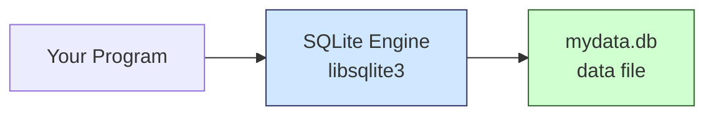

## What Is SQLite?

SQLite is a lightweight, serverless, self-contained relational database engine. Unlike PostgreSQL or MySQL, it has no background server process — the entire database lives in a single file on disk, and the engine is a C library that reads and writes that file directly.

It is the most widely deployed database in the world, running on every smartphone, every browser, and most operating systems.

---

## Development History

### Origins (2000)

SQLite was created by **D. Richard Hipp** while working as a contractor for the US Navy. The goal was a database that could run on guided missile destroyers where installing a full database server was impractical. The first public release was in August 2000.

### Early Growth (2001–2004)

- **Version 2.0 (2001):** Rewrote the storage layer with a proper B-tree engine.
- **Version 3.0 (2004):** Major overhaul — added UTF-16 support, manifest typing, user-defined collations, and a new file format that is still in use today.

### Adoption Explosion (2005–2010)

- Firefox adopted it in 2005 for browser storage.
- Google adopted it for Android in 2008.
- Apple adopted it for iOS in 2008.

SQLite became the de facto standard for mobile and embedded app storage.

### Maturity (2010–present)

- **WAL (Write-Ahead Logging)** added in 2010 — a major concurrency improvement.
- **JSON1 extension** added in 2015.
- **Window functions** added in 2018 (SQLite 3.25).
- Version 3.x has maintained full backward compatibility since 2004.

### Governance

Hipp formed the company **Hwaci**. Ongoing development is funded by a small consortium of companies (including Mozilla, Bloomberg, and Expensify). SQLite is not open source in the traditional sense — it is **public domain**, requiring no license. The core team is very small; Hipp does most development himself.

There are an estimated **1+ trillion** SQLite databases in active use.

---

## Architecture: Two Separate Things

The most important concept in SQLite is the clean separation between the engine and the data:



| Component | What it is | Where it lives |
|---|---|---|
| SQLite engine | C library with B-tree logic, SQL parser, query planner | `libsqlite3.so` or compiled into the app |
| Database file | Pages of raw data — tables, indexes, schema | `mydata.db` (or any path you choose) |

The engine reads and writes the file. The file stores nothing but data. They are completely independent.

---

## What Is Inside the `.db` File

The file is divided into fixed-size **pages** (default 4096 bytes each). The first page starts with the ASCII magic bytes `SQLite format 3`.

```
mydata.db
[page 1][page 2][page 3]...

Page 1:  file header (100 bytes) + root of the schema table
Each table:  its own B-tree spread across pages
Each index:  its own B-tree
Free pages:  tracked in a freelist, reused on next write
```

Everything inside:

- All tables, rows, and columns
- All indexes
- Views and triggers
- Schema (the `CREATE TABLE` definitions)
- Internal metadata

What is **not** inside:

- Connection state (no server, so no sessions)
- User accounts or passwords
- Server configuration

---

## Two Databases = Two Files

Each `.db` file is a completely independent database:

```
/home/user/
├── users.db      ← database 1
└── products.db   ← database 2
```

One SQLite engine on your machine can work with both. There is no registration, no server config — just open the file.

---

## Security Model: Protect the File

SQLite has **no authentication layer** — no usernames, no passwords. The security model is entirely at the OS file level.

```
PostgreSQL:
  user → username/password → server → data

SQLite:
  user → file permissions → data
```

If someone gets the `.db` file, they can read everything, modify anything, and delete tables. No password will stop them.

**How to protect a SQLite file:**

```bash
chmod 600 mydata.db       # only owner can read/write
chown appuser mydata.db   # assign to specific user
```

For data-at-rest encryption, the standard extension is **SQLCipher**, which encrypts the entire `.db` file. SQLite itself has no built-in encryption.

The security question is never "what is the SQLite password" — it is always **"who can access this file"**.

---

## Concurrency

SQLite uses file-level locking: only one writer at a time. This is fine for the vast majority of use cases.

| Use case | Concurrent writers? | SQLite ok? |
|---|---|---|
| Mobile app | no, one user | ✅ yes |
| Desktop app | no, one user | ✅ yes |
| Browser storage | no | ✅ yes |
| Personal project / CLI tool | no | ✅ yes |
| Small website, low traffic | rarely | ✅ usually |
| High-traffic web server | yes, many users | ❌ use Postgres |

If there is only one user or one process writing, concurrency is not a problem at all.

---

## How Programs Use SQLite: The C API

SQLite is written in C and exposes a **C API**. This is the real interface — everything else is a wrapper around it.

```c
// The actual C API
sqlite3_open("mydata.db", &db);
sqlite3_exec(db, "SELECT * FROM users", callback, 0, &err);
sqlite3_close(db);
```

Every language has a **binding** — a thin wrapper that calls these C functions:

```
Your Python code
      ↓
sqlite3 module (Python C extension)
      ↓
calls sqlite3_open(), sqlite3_exec(), etc.
      ↓
libsqlite3.so (the C library)
      ↓
mydata.db
```

| Language | Binding |
|---|---|
| Python | built-in `sqlite3` module (C extension) |
| Go | `go-sqlite3` (CGo bindings) |
| Java | JDBC driver (JNI calls into C) |
| Node.js | `better-sqlite3` (N-API C++ addon) |
| Rust | `rusqlite` (FFI bindings) |

The C API is the **universal interface**. Every language, every tool, every framework that uses SQLite — all of them eventually call the same C functions.

**Python example:**

```python
import sqlite3

conn = sqlite3.connect("mydata.db")
cursor = conn.cursor()

cursor.execute("CREATE TABLE users (id INTEGER, name TEXT)")
cursor.execute("INSERT INTO users VALUES (1, 'alice')")
conn.commit()

cursor.execute("SELECT * FROM users")
print(cursor.fetchall())

conn.close()
```

No TCP connection. No server. Just open a file and call functions.

---

## The Amalgamation: Dev Source vs. Shipped Distribution

SQLite's actual source is a complex folder structure of ~100 files:

```
src/
├── btree.c       ← B-tree implementation
├── pager.c       ← page cache
├── vdbe.c        ← virtual machine that executes SQL
├── parse.y       ← SQL grammar (Lemon parser generator)
├── os_unix.c     ← Unix file I/O
├── os_win.c      ← Windows file I/O
└── ... (~100 files total)
```

But SQLite ships a pre-built version called the **amalgamation**:

```
sqlite3.c    ← all ~100 files merged into one, ~230,000 lines
sqlite3.h    ← the public API header
```

```
Development (SQLite team):        Shipped to end users:
~100 .c source files      →       sqlite3.c + sqlite3.h
        ↑ build process merges everything
```

The two-file format exists so any application can drop SQLite in with zero build system complexity. The compiler also benefits — it can optimize across the entire codebase in one pass.

This pattern appears across the software world:

| Project | Dev source | Shipped format |
|---|---|---|
| SQLite | ~100 .c files | 2-file amalgamation |
| JavaScript libs | many .js modules | one minified bundle.js |
| React | thousands of files | one compiled build |

---

## Bundling: Every App Ships Its Own SQLite

Modern applications do not rely on the OS having SQLite. They bundle their own copy:

```
Chrome   → sqlite3.c compiled in  (Chrome's own copy)
Firefox  → sqlite3.c compiled in  (Firefox's own copy)
Android  → sqlite3.c compiled in  (Google's own copy)
iOS app  → sqlite3.c compiled in  (app's own copy)
```

**Why apps bundle instead of using the OS copy:**

- **Version control** — the OS SQLite may be old; the app needs a specific version
- **Stability** — OS SQLite can change when the user upgrades their distro
- **No dependency** — works the same everywhere
- **Security** — the app patches its own SQLite on its own schedule, not waiting for the OS

The amalgamation was designed exactly for this use case. SQLite's documentation explicitly encourages bundling. It is a feature, not an accident.

---

## Is SQLite Already on Your Machine?

Almost certainly yes:

- Every Mac (ships with macOS)
- Every Android and iOS device (built into the OS)
- Python standard library (`import sqlite3` — no install needed)
- Most Linux distros include it

Even if it is not, installing it is trivial:

```bash
# Ubuntu/Debian
sudo apt install sqlite3

# macOS (already installed, but via Homebrew if needed)
brew install sqlite

# Windows
# download sqlite3.exe — a single binary, no installer
```

No server to start. No port to open. No user to configure.
