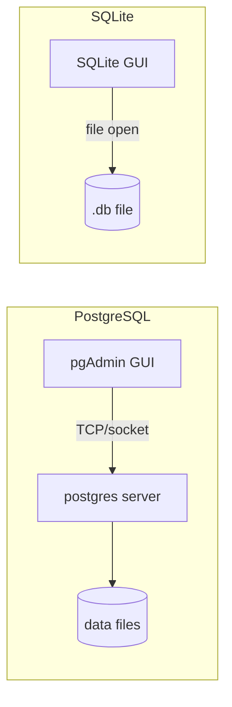

## Database Client GUIs

Tools like pgAdmin and Navicat belong to the same category of software: **database client GUIs** (also called database management tools or database administration tools). Their job is to connect to a database and let you interact with it visually — browsing schemas, running queries, managing data — rather than through a terminal.

The category is broad. It includes pgAdmin, Navicat, DBeaver, TablePlus, DataGrip, HeidiSQL, Beekeeper Studio, and many others.

## Two Architectures: File-Based vs. Client-Server

Not all database GUIs work the same way under the hood. The difference comes from the database itself.

**pgAdmin** connects to a running PostgreSQL server process over TCP or a Unix socket. The database engine (`postgres`) runs separately, and pgAdmin is purely a client. pgAdmin can even run in server mode itself — as a web app behind nginx — making it a true client-server system with multi-user access.

**SQLite GUI tools** work differently. SQLite has no server process. The entire engine is a library that reads and writes a single file on disk. So a SQLite GUI tool opens the `.sqlite` or `.db` file directly — the app is both the client and the engine in one process.



## SQLite GUI Tools Compared

### Purpose-Built

| Tool | Cost | Platform | Notes |
|---|---|---|---|
| DB Browser for SQLite | Free | Win/Mac/Linux | Most SQLite-native; exposes `PRAGMA` settings, WAL, page size, encoding directly |

DB Browser for SQLite is the go-to recommendation for most people working with SQLite specifically. It surfaces SQLite internals that general-purpose tools hide.

### General Tools with SQLite Support

| Tool | Cost | Platform | Notes |
|---|---|---|---|
| DBeaver Community | Free | Win/Mac/Linux | Heavy (Java-based), but very full-featured; can open SQLite files over SSH |
| Beekeeper Studio | Free (community) / Paid | Win/Mac/Linux | Clean UI, open-source community edition |
| TablePlus | Paid (~$90) | Win/Mac/Linux | Fast, native feel, polished |
| DataGrip | Paid (~$230/yr) | Win/Mac/Linux | Best autocomplete and IDE integration; overkill for SQLite alone |
| Navicat for SQLite | Paid (~$130) | Win/Mac/Linux | Solid but expensive for a single database type |

The paid tools make most sense when you're already using them for PostgreSQL or MySQL and just need SQLite support alongside.

## The Remote Server Problem

All of these GUI tools assume the `.db` file is accessible locally. If SQLite is on a remote server without a GUI environment, the tools can't reach it — there's no server process to connect to over the network, so there's no TCP port to tunnel through either.

In that case, the primary interface is the `sqlite3` CLI:

```bash
sqlite3 /path/to/database.db
```

**Workarounds exist but are clunky:**

- **Copy the file locally** — `scp` or `rsync` the file down, open it in a GUI, copy it back. Error-prone.
- **DBeaver via SSH** — DBeaver can access remote files over SFTP/SSH and open a `.db` file on a server directly. One of the few desktop tools that handles this.
- **SQLiteWeb** — a lightweight web app you run on the server, giving browser-based access. Similar concept to phpMyAdmin for MySQL.
- **Datasette** — read-only data exploration tool that runs on the server and exposes SQLite data over HTTP.

For most people running SQLite on a server without a GUI, the `sqlite3` CLI is the practical reality.

## Why This Is Rarely a Problem

SQLite's design philosophy — serverless, file-based, embedded — naturally aligns with environments that have GUIs:

- **Mobile apps** (Android, iOS) — SQLite is the default embedded database
- **Desktop apps** (browsers, Electron apps) — SQLite for local storage
- **Development environments** — developers run SQLite locally before deploying

These environments all have GUI access, so the desktop tools work fine. The edge cases where you have SQLite but no GUI (IoT devices, minimal Linux servers, some backend apps using SQLite as a lightweight server-side DB) are real but uncommon.

SQLite's tooling ecosystem makes sense once you understand its intended deployment context. The tools match the use case. The "limitation" of requiring local file access rarely matters in practice — because SQLite is almost always local.
