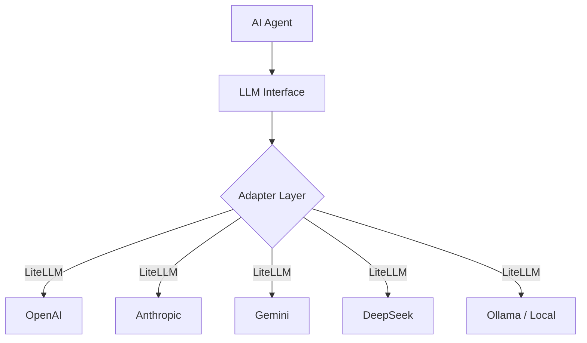

## The LLM Landscape 🗺️

There are dozens of LLMs available via API today. They differ in capability, price, speed, and SDK interface. This post covers the 10 most important ones and how to call each — then explains the standard solution for building AI agents that can switch between them.

---

## Top 10 LLMs and Their APIs

### 1. OpenAI (GPT-4o)

The industry standard. Every other LLM benchmarks against it.

```bash
pip install openai
```

```python
from openai import OpenAI

client = OpenAI(api_key="sk-...")

response = client.chat.completions.create(
    model="gpt-4o",
    messages=[{"role": "user", "content": "Hello!"}]
)
print(response.choices[0].message.content)
```

🔑 API key: [platform.openai.com](https://platform.openai.com)

---

### 2. Anthropic (Claude)

Best for reasoning, long context, and safety-focused applications.

```bash
pip install anthropic
```

```python
import anthropic

client = anthropic.Anthropic(api_key="sk-ant-...")

message = client.messages.create(
    model="claude-sonnet-4-6",
    max_tokens=1024,
    messages=[{"role": "user", "content": "Hello!"}]
)
print(message.content[0].text)
```

> ⚠️ Claude uses its own SDK and response format — not OpenAI-compatible natively.

🔑 API key: [console.anthropic.com](https://console.anthropic.com)

---

### 3. Google (Gemini)

Best multimodal model. Supports up to 1M token context window.

```bash
pip install google-genai
```

```python
from google import genai

client = genai.Client(api_key="AIza...")

response = client.models.generate_content(
    model="gemini-2.0-flash",
    contents="Hello!"
)
print(response.text)
```

🔑 API key: [aistudio.google.com](https://aistudio.google.com)

---

### 4. DeepSeek

Best price/performance ratio. The `deepseek-reasoner` model is especially strong at multi-step reasoning. OpenAI-compatible.

```python
from openai import OpenAI

client = OpenAI(
    api_key="sk-...",
    base_url="https://api.deepseek.com"
)

response = client.chat.completions.create(
    model="deepseek-chat",        # or deepseek-reasoner
    messages=[{"role": "user", "content": "Hello!"}]
)
print(response.choices[0].message.content)
```

🔑 API key: [platform.deepseek.com](https://platform.deepseek.com)

---

### 5. Mistral AI

Best open-weight models. Strong at coding. European provider.

```python
from openai import OpenAI

client = OpenAI(
    api_key="...",
    base_url="https://api.mistral.ai/v1"
)

response = client.chat.completions.create(
    model="mistral-large-latest",
    messages=[{"role": "user", "content": "Hello!"}]
)
print(response.choices[0].message.content)
```

🔑 API key: [console.mistral.ai](https://console.mistral.ai)

---

### 6. Meta Llama (via Groq)

Open-source leader. Groq provides the fastest inference speed available.

```python
from openai import OpenAI

client = OpenAI(
    api_key="gsk_...",
    base_url="https://api.groq.com/openai/v1"
)

response = client.chat.completions.create(
    model="llama-3.3-70b-versatile",
    messages=[{"role": "user", "content": "Hello!"}]
)
print(response.choices[0].message.content)
```

🔑 API key: [console.groq.com](https://console.groq.com)

---

### 7. xAI (Grok)

Built-in real-time web access. Strong reasoning. OpenAI-compatible.

```python
from openai import OpenAI

client = OpenAI(
    api_key="xai-...",
    base_url="https://api.x.ai/v1"
)

response = client.chat.completions.create(
    model="grok-3",
    messages=[{"role": "user", "content": "Hello!"}]
)
print(response.choices[0].message.content)
```

🔑 API key: [console.x.ai](https://console.x.ai)

---

### 8. Qwen (Alibaba)

Best multilingual model, especially for Chinese + English. Wide model range from turbo to max.

```python
from openai import OpenAI

client = OpenAI(
    api_key="sk-...",
    base_url="https://dashscope-intl.aliyuncs.com/compatible-mode/v1"
)

response = client.chat.completions.create(
    model="qwen-plus",
    messages=[{"role": "user", "content": "Hello!"}]
)
print(response.choices[0].message.content)
```

🔑 API key: [dashscope.aliyun.com](https://dashscope.aliyun.com)

---

### 9. Cohere (Command R+)

Best for enterprise RAG and retrieval-augmented generation pipelines.

```python
from openai import OpenAI

client = OpenAI(
    api_key="...",
    base_url="https://api.cohere.com/compatibility/v1"
)

response = client.chat.completions.create(
    model="command-r-plus",
    messages=[{"role": "user", "content": "Hello!"}]
)
print(response.choices[0].message.content)
```

🔑 API key: [dashboard.cohere.com](https://dashboard.cohere.com)

---

### 10. Ollama (Local)

Run any open model locally — no API key, no cost, fully private.

```bash
# Install Ollama, then pull a model
ollama pull llama3.3
```

```python
from openai import OpenAI

client = OpenAI(
    api_key="ollama",             # any string works
    base_url="http://localhost:11434/v1"
)

response = client.chat.completions.create(
    model="llama3.3",
    messages=[{"role": "user", "content": "Hello!"}]
)
print(response.choices[0].message.content)
```

🔑 No key needed. Install at [ollama.com](https://ollama.com)

---

## Summary Table

| # | Provider | Best for | OpenAI-compatible |
|---|---|---|:---:|
| 1 | OpenAI GPT-4o | General standard | ✅ Native |
| 2 | Anthropic Claude | Reasoning, long context | ❌ Own SDK |
| 3 | Google Gemini | Multimodal, 1M context | ❌ Own SDK |
| 4 | DeepSeek | Cheap + strong reasoning | ✅ |
| 5 | Mistral | Open-weight, coding | ✅ |
| 6 | Llama via Groq | Fast inference, open source | ✅ |
| 7 | xAI Grok | Real-time web search | ✅ |
| 8 | Qwen | Multilingual, Chinese | ✅ |
| 9 | Cohere | Enterprise RAG | ✅ |
| 10 | Ollama | Local, private, free | ✅ |

8 out of 10 are OpenAI-compatible — only `base_url` and `model` need to change.

---

## The Multi-LLM Problem 🔄

When building an AI agent that needs to switch between LLMs, the naive approach leads to messy conditional code:

```python
# ❌ Bad — switching LLM means rewriting agent logic
if llm == "openai":
    client = OpenAI(...)
    response = client.chat.completions.create(...)
elif llm == "anthropic":
    client = anthropic.Anthropic(...)
    response = client.messages.create(...)  # different method!
elif llm == "gemini":
    ...  # completely different shape
```

This is a well-known problem. The community has converged on three standard solutions.

---

## Solution 1 — LiteLLM ⭐ (Recommended)

One unified interface for 100+ LLMs. Drop-in OpenAI replacement. All responses are normalized to OpenAI format regardless of the underlying model.

```bash
pip install litellm
```

```python
from litellm import completion

# Switch LLM by changing only the model string
response = completion(
    model="gpt-4o",
    messages=[{"role": "user", "content": "Hello!"}]
)

response = completion(
    model="claude-sonnet-4-6",
    messages=[{"role": "user", "content": "Hello!"}]
)

response = completion(
    model="gemini/gemini-2.0-flash",
    messages=[{"role": "user", "content": "Hello!"}]
)

response = completion(
    model="deepseek/deepseek-chat",
    messages=[{"role": "user", "content": "Hello!"}]
)

response = completion(
    model="ollama/llama3.3",
    messages=[{"role": "user", "content": "Hello!"}]
)

# Always the same response shape
print(response.choices[0].message.content)
```

Your agent becomes LLM-agnostic by changing a single string.

---

## Solution 2 — LangChain

Full agent framework with built-in LLM abstraction. Best for complex pipelines.

```bash
pip install langchain langchain-openai langchain-anthropic
```

```python
from langchain_openai import ChatOpenAI
from langchain_anthropic import ChatAnthropic

# Same interface, swap the class
llm = ChatOpenAI(model="gpt-4o")
llm = ChatAnthropic(model="claude-sonnet-4-6")

response = llm.invoke("Hello!")
print(response.content)  # always same shape
```

---

## Solution 3 — Custom Adapter Pattern

For simple projects that need full control with zero extra dependencies.

```python
from abc import ABC, abstractmethod

class LLMAdapter(ABC):
    @abstractmethod
    def chat(self, messages: list[dict]) -> str:
        pass

class OpenAIAdapter(LLMAdapter):
    def __init__(self, model="gpt-4o"):
        from openai import OpenAI
        self.client = OpenAI()
        self.model = model

    def chat(self, messages: list[dict]) -> str:
        response = self.client.chat.completions.create(
            model=self.model, messages=messages
        )
        return response.choices[0].message.content

class AnthropicAdapter(LLMAdapter):
    def __init__(self, model="claude-sonnet-4-6"):
        import anthropic
        self.client = anthropic.Anthropic()
        self.model = model

    def chat(self, messages: list[dict]) -> str:
        response = self.client.messages.create(
            model=self.model, max_tokens=1024, messages=messages
        )
        return response.content[0].text

# Agent only depends on the abstract interface — never the SDK directly
def run_agent(llm: LLMAdapter):
    response = llm.chat([{"role": "user", "content": "Hello!"}])
    print(response)

run_agent(OpenAIAdapter())     # swap anytime
run_agent(AnthropicAdapter())  # same agent code
```

---

## Architecture Diagram



The agent only talks to the abstraction layer. The underlying LLM is a swappable implementation detail.

---

## Which Approach to Choose?

| Approach | Best for |
|---|---|
| **LiteLLM** | Most projects — minimal code, 100+ models, production-ready |
| **LangChain** | Complex agents with chains, RAG pipelines, tools ecosystem |
| **Custom adapter** | Simple projects wanting full control, no extra dependencies |

For most AI agent projects, **LiteLLM** is the standard answer. It handles auth, retries, rate limits, cost tracking, and response normalization — all out of the box.
