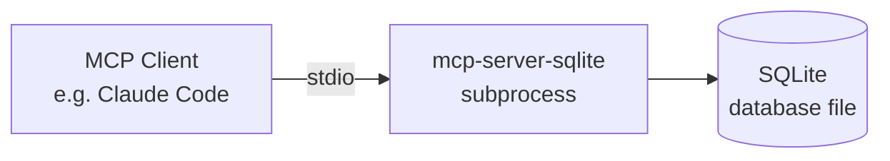

## Background

The official MCP organization published `mcp-server-sqlite` as a reference implementation but is no longer maintaining it. The community has not produced a solid replacement, so this post documents the internals of the forked codebase for teams continuing to use and extend it.

---

## What It Does

`mcp-server-sqlite` is an MCP server that lets an MCP client (e.g. Claude Code, Claude Desktop) interact with a local SQLite database through a set of tools.



---

## How MCP Servers Communicate

MCP servers use **stdio transport** — they read from stdin and write to stdout. There is no HTTP port, no socket, no persistent process to connect to.

This means:

- The server **cannot be launched standalone**
- It must be **spawned as a subprocess** by an MCP client
- The stdio pipes are **private** to the parent process — no other client can attach
- Each client that wants to use the server spawns its own independent instance

```
Client starts  → spawns subprocess  → server starts
Client sends   → writes to stdin    → server reads and responds
Client exits   → closes stdin pipe  → server exits
```

If two clients point at the same server binary, they each get their own subprocess and their own in-memory state. They can, however, share the same `.db` file on disk — SQLite handles concurrent file access at the database level.

---

## MCP Primitives

The MCP spec defines three primitives a server can implement:

| Primitive | Who initiates | Purpose |
|---|---|---|
| **Tools** | Claude (automatically) | Actions Claude calls when needed |
| **Resources** | User (manually) | Read-only data attached to context |
| **Prompts** | User (manually) | Reusable conversation templates |

In practice, **tools** are the only primitive widely used. Resources and prompts are defined in the spec but rarely implemented — similar to how PUT and DELETE exist in HTTP but most APIs only use GET and POST.

For each primitive, the spec defines a discovery handler and an execution handler:

```
list_resources / read_resource
list_prompts   / get_prompt
list_tools     / call_tool
```

The client always calls `list_*` first to discover what's available, then calls the specific handler to use it.

---

## Project Structure

```
mcp-server-sqlite/
├── src/
│   └── mcp_server_sqlite/
│       ├── __init__.py       # CLI entry point
│       └── server.py         # All server logic
├── docs/
├── .vscode/
│   └── settings.json         # Workspace readonly setting
├── .gitignore
├── pyproject.toml
├── uv.lock
├── README.md
└── README.old.md             # Original authors' documentation
```

---

## Python Packaging

The project uses the modern `pyproject.toml` + `hatchling` build setup (PEP 517/518).

**Entry point** is defined in `pyproject.toml`:

```toml
[project.scripts]
mcp-server-sqlite = "mcp_server_sqlite:main"
```

This means: when `mcp-server-sqlite` is run in the terminal, call the `main` function in `src/mcp_server_sqlite/__init__.py`.

`uv` performs an **editable install** — `.venv/site-packages/mcp_server_sqlite` is a pointer back to `src/mcp_server_sqlite/`, so source changes take effect immediately without reinstalling.

The dependency chain:

```
uv run mcp-server-sqlite
  → .venv/bin/mcp-server-sqlite   (generated script)
  → .venv/site-packages/mcp_server_sqlite  (pointer)
  → src/mcp_server_sqlite/__init__.py      (real source)
  → src/mcp_server_sqlite/server.py        (main logic)
```

---

## Server Internals

### Entry Point (`__init__.py`)

```python
def main():
    parser = argparse.ArgumentParser()
    parser.add_argument('--db-path', default="./sqlite_mcp_server.db")
    args = parser.parse_args()
    asyncio.run(server.main(args.db_path))
```

A thin wrapper — parses `--db-path` and hands off to the async `server.main()`.

### `server.main()` Structure

The main function has three parts:

**1. Setup**
```python
db = SqliteDatabase(db_path)
server = Server("sqlite-manager")
```

**2. Register handlers** (decorators bind functions to MCP protocol events)
```python
@server.list_tools()
@server.call_tool()
@server.list_resources()
@server.read_resource()
@server.list_prompts()
@server.get_prompt()
```

All handlers are nested inside `main()` so they can close over `db` and `server` directly.

**3. Start listening**
```python
async with stdio_server() as (read_stream, write_stream):
    await server.run(read_stream, write_stream, InitializationOptions(...))
```

Opens stdio and blocks forever, routing incoming messages to the registered handlers.

---

## Available Tools

| Tool | Description |
|---|---|
| `read_query` | Execute SELECT queries |
| `write_query` | Execute INSERT, UPDATE, DELETE queries |
| `create_table` | Create new tables |
| `list_tables` | List all tables |
| `describe_table` | Show schema for a table |
| `append_insight` | Append a note to the in-memory insights memo |
| `drop_table` | Drop an existing table |
| `modify_table` | Modify a table with an ALTER TABLE statement |

---

## Development

**Run MCP Inspector** (requires a machine with a browser):

```bash
uv run mcp dev src/mcp_server_sqlite/server.py:wrapper
```

This starts two components:
- **Proxy server** (port 6277) — bridges browser HTTP to server stdio
- **Inspector UI** (port 6274) — browser-based tool testing interface

The flow:
```
Browser (Inspector UI :6274)
  → HTTP → Proxy Server (:6277)
  → stdio → mcp-server-sqlite subprocess
  → SQLite database
```

On a headless machine, use Claude Code directly instead:

```bash
claude mcp add sqlite -- uv run --directory /path/to/mcp-server-sqlite mcp-server-sqlite --db-path /path/to/your.db
```

---

## Known Rough Edges

- `describe_table` uses f-string interpolation directly into the SQL query — SQL injection risk if table names come from untrusted input
- The insights memo (`memo://insights`) is **in-memory only** and resets on every server restart
- `ServerWrapper` at the bottom of `server.py` hardcodes `test.db` — dead code leftover from the original repo
- The `mcp-demo` prompt references Claude.ai-specific UI elements (paperclip icon, etc.) — irrelevant for most setups
