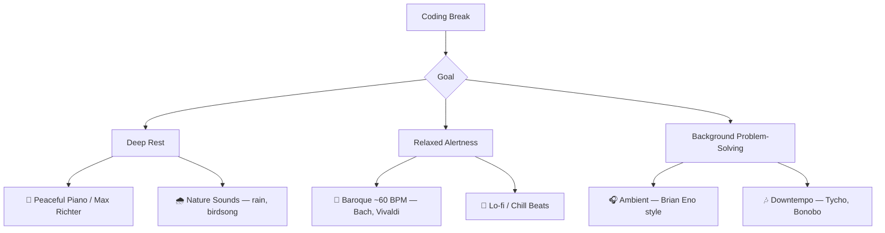

## How Music Affects the Brain

Music is one of the most powerful stimuli for the brain. Neuroscience research has shown that listening to or playing music activates widespread regions simultaneously — the auditory cortex, motor areas, prefrontal cortex, limbic system, and cerebellum all light up. Playing an instrument, in particular, is one of the few activities that engages nearly every area of the brain at once, strengthening the **corpus callosum** (the bridge between the left and right hemispheres).

### Key Neurological Effects

| Effect | Mechanism | Key Research |
|--------|-----------|--------------|
| **Dopamine release** | Pleasurable music triggers dopamine in the nucleus accumbens — the same reward pathway as food | Salimpoor et al. (2011), PET and fMRI scans |
| **Memory encoding** | Music aids encoding and retrieval of memories via the medial prefrontal cortex | Petr Janata, UC Davis |
| **Stress reduction** | Listening to music lowers cortisol, reduces heart rate and blood pressure | Multiple clinical studies |
| **Neuroplasticity** | Musicians show structural brain differences — larger auditory cortex, stronger white matter tracts | Gottfried Schlaug, Harvard/Beth Israel |

### Notable Researchers and Programs

- **Oliver Sacks** — *Musicophilia* popularized many clinical cases of music and the brain
- **Daniel Levitin** — *This Is Your Brain on Music* synthesized cognitive neuroscience research for a general audience
- **Gottfried Schlaug** (Harvard/Beth Israel) — pioneered music therapy for stroke recovery and aphasia
- **Robert Zatorre** (Montreal Neurological Institute) — foundational work on auditory cortex and music perception
- **The MARCS Institute** (Western Sydney University) — ongoing music cognition research

### Therapeutic Applications

Music therapy has demonstrated benefits for:

- Stroke rehabilitation
- Parkinson's disease (rhythmic auditory stimulation for gait)
- PTSD and depression
- Pain management
- Alzheimer's (music-evoked autobiographical memories)

---

## What to Listen to During Coding Breaks

Not all music is created equal when it comes to cognitive rest. The goal during a break is to let the brain shift into **diffuse mode** thinking — a concept described by Barbara Oakley in *A Mind for Numbers*. In diffuse mode, the default mode network (DMN) activates, enabling background problem-solving and those "aha" moments many developers experience away from the keyboard.

### Best Types of Music for Coding Rest

#### 🎻 Classical / Baroque (~60 BPM)

Pieces around 60 beats per minute — such as slow movements by Bach or Vivaldi — promote **alpha brainwaves**, associated with relaxed alertness. This tempo helps the brain consolidate what you were just working on.

#### 🎧 Ambient / Minimal Electronic

Brian Eno-style ambient music (e.g., *Music for Airports*) has low complexity and no lyrics. This allows the default mode network to activate freely, supporting background processing of coding problems.

#### 🌧️ Nature Sounds

Research from Brighton and Sussex Medical School found that natural sounds (birdsong, rain, flowing water) promote outward-focused attention and activate the rest-and-digest nervous system, reducing the fight-or-flight stress response.

#### 🎵 Lo-fi / Chill Beats

The steady, predictable rhythm without vocal demands gives your prefrontal cortex a genuine break from the analytical load of reading and writing code.

### What to Avoid During Rest

- **Lyrics** — They engage Broca's and Wernicke's areas (language processing), the same regions you've been taxing while coding. Not a real break.
- **Complex or unpredictable music** — Progressive rock, jazz fusion — engaging but cognitively demanding.
- **High-energy / fast tempo** — Doesn't let the nervous system downshift.

---

## Recommended Listening

### Spotify Playlists

Well-known Spotify-curated playlists that fit coding breaks:

- **Deep Focus** — ambient and instrumental, popular among programmers
- **Peaceful Piano** — calm solo piano pieces
- **Brain Food** — designed for cognitive rest and focus
- **Nature Sounds** — rain, ocean, forest ambience
- **Ambient Chill** — low-key electronic ambient
- **Classical Focus** — slower classical selections
- **Lo-Fi Beats** — the classic chill beats style

> **Tip:** Search Spotify for "coding chill", "ambient focus", "baroque study", or "post-rock instrumental" to discover more.

### Artists Worth Exploring

| Artist | Style | Good Starting Point |
|--------|-------|-------------------|
| Brian Eno | Ambient | *Music for Airports*, *Ambient 1* |
| Nils Frahm | Neo-classical / ambient | *All Melody* |
| Olafur Arnalds | Modern classical | *re:member* |
| Tycho | Downtempo electronic | *Dive* |
| Bonobo | Downtempo | *Black Sands* |
| Max Richter | Modern classical | *Sleep* (for deep rest) |

---

## The Key Principle

During coding rest, aim for **10-15 minutes of calm, lyric-free music**. This supports the diffuse mode of thinking where your subconscious works on problems in the background. Many developers report solving bugs during breaks precisely because of this mechanism.

The formula is simple:

> Low-stimulation music + genuine rest = better code when you return.
