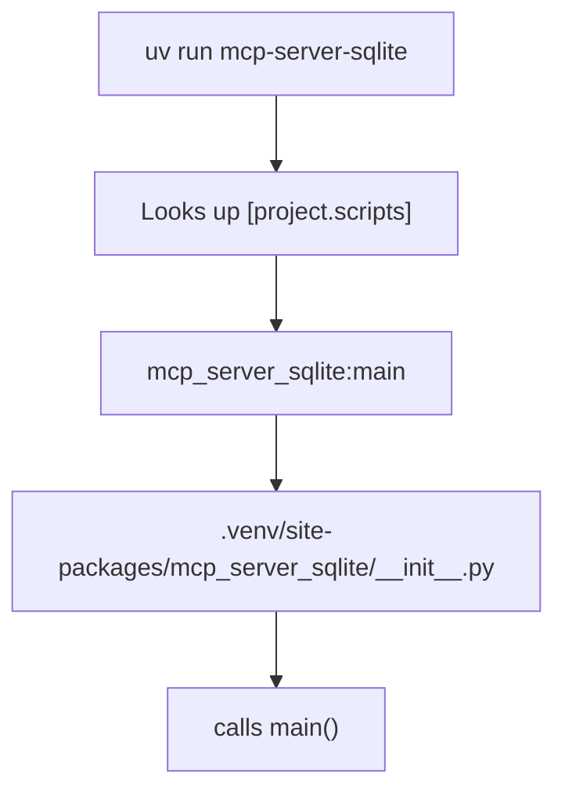

## Overview

When you run a Python CLI tool like `mcp-server-sqlite`, Python needs to know what code to execute. This is defined in `pyproject.toml` via the `[project.scripts]` section — the entry point.

---

## The `[project.scripts]` Entry Point

```toml
[project.scripts]
mcp-server-sqlite = "mcp_server_sqlite:main"
```

This registers a CLI command. The format is:

```
command-name = "package_or_module:function_name"
```

- **`mcp-server-sqlite`** — the command you type in the terminal
- **`mcp_server_sqlite`** — the Python package (folder) to look in
- **`main`** — the function to call inside that package

When you run `mcp-server-sqlite`, Python resolves it to `mcp_server_sqlite/__init__.py` and calls the `main()` function defined there.

---

## The `package:function` Format

The `:` separates the **module path** from the **function name**.

| Format | Resolves to |
|---|---|
| `mcp_server_sqlite:main` | `mcp_server_sqlite/__init__.py` → `main()` |
| `mcp_server_sqlite.server:main` | `mcp_server_sqlite/server.py` → `main()` |

- `.` separates folders/files in the module path
- Python always ends at a `.py` file and looks for the named function inside it
- When no submodule is specified, Python looks in `__init__.py` — the entry file of any package

---

## How uv Finds the Package

When you run `uv sync` or `uv run`, uv installs the project itself as a package into `.venv/`. The build backend (Hatchling in this case) handles the installation:

```toml
[build-system]
requires = ["hatchling"]
build-backend = "hatchling.build"
```

Hatchling looks in `src/` for the package source, finds `src/mcp_server_sqlite/`, and installs it into:

```
.venv/lib/python3.x/site-packages/mcp_server_sqlite/
```

### Resolution chain



---

## The Entry Point File (`__init__.py`)

```python
def main():
    parser = argparse.ArgumentParser(description='SQLite MCP Server')
    parser.add_argument('--db-path', default="./sqlite_mcp_server.db")
    args = parser.parse_args()
    asyncio.run(server.main(args.db_path))
```

The `__init__.py` is intentionally thin — it just:

1. Parses the `--db-path` CLI argument
2. Hands off to the real logic in `server.py` via `asyncio.run()`

**Why async?** MCP servers are async because they need to handle client requests without blocking. While waiting for a SQL query to finish, the server stays responsive to new messages.

---

## Summary

```
pyproject.toml [project.scripts]
    → defines CLI command name + package:function target

uv sync / uv run
    → installs project into .venv via hatchling
    → hatchling finds source in src/ layout

uv run mcp-server-sqlite
    → resolves to __init__.py:main()
    → main() parses args, starts async server
```
