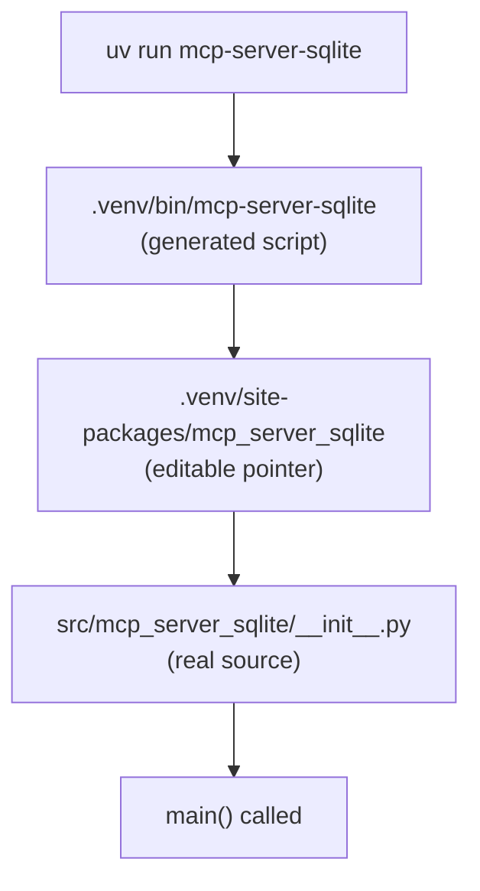

## Overview

When you run `uv sync` or `uv run` on a Python project, several things happen under the hood: a build backend installs the project as an editable package, CLI entry points are wired up, and changes to source code take effect immediately without reinstalling. This post traces the full chain.

---

## pyproject.toml Structure

A minimal `pyproject.toml` for an MCP server project:

```toml
[project]
name = "mcp-server-sqlite"
version = "0.6.2"
requires-python = ">=3.10"
dependencies = [
    "mcp[cli]>=1.6.0",
]

[build-system]
requires = ["hatchling"]
build-backend = "hatchling.build"

[project.scripts]
mcp-server-sqlite = "mcp_server_sqlite:main"
```

There are three key sections:

| Section | Purpose |
|---|---|
| `[project]` | Package metadata and runtime dependencies |
| `[build-system]` | Which build tool to use |
| `[project.scripts]` | CLI entry points |

---

## Build System

```toml
[build-system]
requires = ["hatchling"]
build-backend = "hatchling.build"
```

This tells uv: *"to build this project, install `hatchling` and use it as the build backend."*

When you run `uv sync` or `uv run` for the first time:

1. uv reads `[build-system]`
2. Installs `hatchling` into `.venv`
3. Uses hatchling to build and install the project itself as a package
4. Installs all runtime dependencies from `[project.dependencies]`

Hatchling follows the **src layout convention** — it automatically finds the package under `src/` without extra configuration.

Common build backends in the Python ecosystem:

| Backend | Used by |
|---|---|
| `hatchling` | Modern projects, MCP servers |
| `setuptools` | Legacy and many existing projects |
| `flit` | Simple pure-Python packages |
| `poetry` | Projects using Poetry |
| `pdm-backend` | Projects using PDM |

---

## Editable Install

uv installs the project as an **editable install** (equivalent to `pip install -e .`). This means:

- `.venv/site-packages/mcp_server_sqlite` is **not a copy** of your source
- It is a **pointer** back to `src/mcp_server_sqlite/`

So any change you make in `src/` is reflected immediately — no reinstall needed.

---

## Entry Point Resolution

```toml
[project.scripts]
mcp-server-sqlite = "mcp_server_sqlite:main"
```

The format is `command-name = "module:function"`:

- `mcp-server-sqlite` — the CLI command name
- `mcp_server_sqlite` — the Python package (maps to `src/mcp_server_sqlite/__init__.py`)
- `main` — the function to call inside that module

When the package is installed, Python creates an executable script at `.venv/bin/mcp-server-sqlite`.

To point to a function in a submodule (e.g. `server.py`), use dot notation:

```toml
mcp-server-sqlite = "mcp_server_sqlite.server:main"
#                                    ↑
#                              server.py inside the package
```

You can also define multiple CLI commands from one package:

```toml
[project.scripts]
mcp-server-sqlite       = "mcp_server_sqlite:main"
mcp-server-sqlite-debug = "mcp_server_sqlite:debug_main"
```

---

## Full Resolution Chain



---

## pyproject.toml vs Legacy Approaches

`pyproject.toml` is the modern standard (PEP 517/518), but you will still encounter older approaches:

| Approach | Status |
|---|---|
| `pyproject.toml` + build backend | ✅ Modern standard |
| `setup.py` | Legacy, still common in older codebases |
| `setup.cfg` | Middle ground between old and new |
| Single `.py` script | No packaging needed at all |

---

## Summary

- `[build-system]` tells uv which build tool to use (e.g. hatchling)
- uv installs the project as an editable install — source changes apply immediately
- `[project.scripts]` defines CLI entry points in `command = "package:function"` format
- Python resolves `package` to `__init__.py`, or use `package.module` to target a specific file
