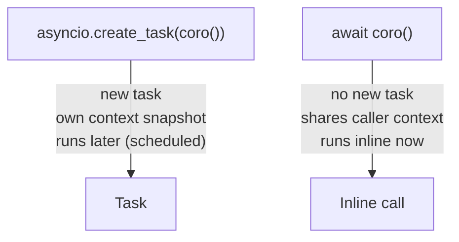

## The Problem: Shared State in Concurrent Code

In Python's `asyncio`, many tasks run concurrently on a single thread.
They interleave at `await` points — when one task hits `await`, the
event loop switches to another. This means a plain module-level global
is shared by all tasks simultaneously:

```python
_current_user: str = ""  # dangerous — shared by all tasks

async def task_a() -> None:
    global _current_user
    _current_user = "alice"
    await asyncio.sleep(0)         # yields — task_b runs
    print(_current_user)           # might print "bob"!

async def task_b() -> None:
    global _current_user
    _current_user = "bob"          # overwrites task_a's value
```

This is the classic race condition in async code.

---

## ContextVar: Per-Task Values

`ContextVar` is Python's stdlib solution (since 3.7). It stores a value
that is **scoped to the current task**, not the whole process.

```python
from contextvars import ContextVar

_current_user: ContextVar[str] = ContextVar("current_user")

async def handle_request(user: str) -> None:
    _current_user.set(user)        # sets value for THIS task only
    await process()

async def process() -> None:
    user = _current_user.get()     # reads THIS task's value
    print(user)
```

Task A sets `"alice"`, task B sets `"bob"` — each reads back its own
value. No interference.

### Mental model 🗒️

Think of it as a **sticky note attached to the current task**. Every
task has its own note. `.set()` writes on your note. `.get()` reads
your note. Other tasks have their own notes and never see yours.

---

## The ContextVar Object Is the Key

The underlying structure is a mapping:

```
{ ContextVar object → value, ContextVar object → value, ... }
```

The **instance itself** is the key — not the debug string you pass to
the constructor:

```python
a: ContextVar[str] = ContextVar("x")
b: ContextVar[str] = ContextVar("x")  # same name, different object

a.set("alice")
b.set("bob")

a.get()  # "alice" — keyed by object identity
b.get()  # "bob"
```

This means `ContextVar` must always be created at **module level** and
imported wherever needed. Creating a new instance with the same name in
a different module would be a different key — a separate slot.

---

## Three Methods

| Method | What it does |
|--------|-------------|
| `.set(value)` | Writes a value into the current context; returns a `Token` |
| `.get()` | Reads the value; raises `LookupError` if unset (or pass a default: `.get("fallback")`) |
| `.reset(token)` | Undoes the `.set()`, restoring the previous value |

The `Token` from `.set()` enables safe temporary overrides:

```python
token = _current_user.set("alice")
# ... do something
_current_user.reset(token)  # restores whatever was set before
```

---

## How Task Isolation Actually Works

When `asyncio.create_task()` spawns a new task, it takes a **snapshot**
of the current context at that moment. The new task starts with its own
copy of the context mapping.

```python
_current_user.set("main")

task = asyncio.create_task(some_coro())
# task's context snapshot: { _current_user: "main" }

_current_user.set("other")
# only changes the parent's context — task's copy is unaffected
```

The snapshot is a **shallow copy of the mapping**, not a deep copy of
the values. For immutable values like strings and integers this doesn't
matter. For mutable objects (lists, custom classes), both the parent
and task hold a reference to the **same object** — mutating it affects
both. Only reassigning via `.set()` is isolated.

---

## Coroutine vs Task

Understanding when isolation applies requires knowing the difference:



| | `create_task(coro())` | `await coro()` |
|---|---|---|
| New task created | ✅ yes | ❌ no |
| Own context copy | ✅ yes | ❌ shares caller's |
| Runs when | Later — scheduled | Right now — inline |
| Caller blocks | ❌ no | ✅ yes |

`await` is just a deep function call that can pause. `ContextVar`
isolation only kicks in with `create_task()`.

A coroutine can run in two ways:
1. **Become a task** — `create_task()` or framework equivalents like Textual's `@work`
2. **Be awaited inside a task** — runs inline, part of the same task's stack

---

## The Web Framework Parallel

In a web backend, each HTTP request maps to a task:

```
HTTP request → new task → handle request → return response
HTTP request → new task → handle request → return response
```

Frameworks use `ContextVar` to give each request its own state without
threading it through every function signature. This is how:

- **Flask** uses `g` (request-local dict) and `_request_ctx_stack`
- **Starlette/FastAPI** exposes `request` scoped to the current request
- **structlog** binds per-request fields (request ID, user ID) that
  automatically appear in every log line for that request:

```python
import structlog

# at the start of each request
structlog.contextvars.bind_contextvars(
    request_id=request.id,
    user_id=request.user.id,
)

# deep in the call stack — no logger passed around
log = structlog.get_logger()
log.info("processing payment")  # includes request_id and user_id automatically
```

The logger object is still a global — what's per-request is the
**metadata bound to it**. This sidesteps the mutable object problem:
you're storing primitive values (IDs), not the logger instance.

---

## When a Plain Global Is Fine

`ContextVar` is the right tool when different concurrent tasks need
**different values** for the same variable. If every task sets the same
value, a plain global works just as well.

Python's built-in `logging` is a good example — `Logger` is stateless
(it just pipes strings to a handler). A global logger shared by all
tasks is perfectly correct:

```python
# fine — stateless, shared by all
logger = logging.getLogger(__name__)

@app.get("/")
async def handler():
    logger.info("handling request")
```

Contrast this with a stateful logger like an AI agent's `SessionLogger`:

```python
class SessionLogger:
    def __init__(self, session_id: str, cwd: str) -> None:
        self._session_id = session_id
        self._conn = sqlite3.connect(DB_PATH)  # owns a DB connection
```

This holds a DB connection (a resource) and a session ID (identity).
It's not stateless — it's an instance tied to a specific session.

However, if **one process = one session** (true for a CLI agent), then
there is only ever one `SessionLogger` instance for the lifetime of the
process. A plain module-level global is sufficient:

```python
# logger_context.py
session_logger: SessionLogger = SessionLogger(
    str(uuid.uuid4()), os.getcwd()
)
```

Any module imports `session_logger` and calls methods on it directly —
no parameter threading required.

---

## Decision Guide

| Situation | Best approach |
|-----------|--------------|
| Truly process-wide constant (`MODEL = "gpt-4o"`) | Module-level global |
| Stateless infrastructure used everywhere (`logging.Logger`) | Module-level global |
| One instance for the entire process lifetime (`SessionLogger` in a CLI) | Module-level global |
| Per-request / per-task primitive value (user ID, request ID) | `ContextVar` |
| Per-request mutable object that differs per task | `ContextVar` storing an ID; fetch the object when needed |

The rule of thumb: if a value is **per-task and different between tasks**,
use `ContextVar`. If it's **the same for all tasks** or **process-wide**,
a global is fine.
