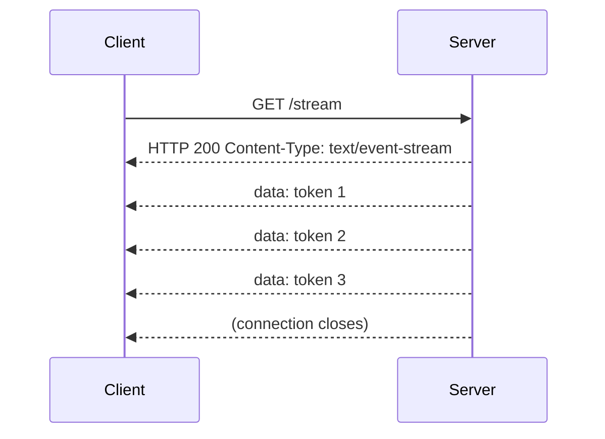

Server-Sent Events (SSE) is the backbone of LLM token streaming. Every major provider — OpenAI, Anthropic, Google Gemini — uses it to push tokens to the client as they are generated. This post covers how SSE works, what the OpenAI wire format looks like, and how tools like LiteLLM and Vercel AI SDK normalize the differences between providers.

## What is SSE?

SSE (Server-Sent Events) is a browser API and HTTP-based protocol for **one-way, server-to-client streaming** over a persistent HTTP connection.

- Defined in the **WHATWG HTML Living Standard** — not in an HTTP RFC
- Built on top of plain HTTP — no protocol upgrade needed (unlike WebSockets)
- `Content-Type: text/event-stream` is the signal that tells the client this is an SSE stream
- Response body is **plain text, always UTF-8 encoded** — no charset negotiation



### SSE vs WebSockets

| | SSE | WebSockets |
|---|---|---|
| Direction | Server → client only | Full-duplex |
| Protocol | Plain HTTP | Protocol upgrade |
| Reconnect | Built-in (automatic) | Manual |
| Best for | LLM streaming, live feeds | Chat, games |

For read-only streaming like LLM responses, SSE is simpler and the better choice.

## HTTP Response Format

A minimal SSE response:

```
HTTP/1.1 200 OK
Content-Type: text/event-stream
Cache-Control: no-cache
Connection: keep-alive

data: hello world

data: second message

```

Key headers:

- `Content-Type: text/event-stream` — required; tells client to treat body as SSE stream
- `Cache-Control: no-cache` — prevents proxies from buffering
- `Connection: keep-alive` — keeps TCP connection open

### Event fields

```
id: 123
event: price-update
data: {"symbol":"AAPL","price":189.42}
retry: 3000

```

| Field | Purpose |
|---|---|
| `data` | Payload (required) |
| `event` | Custom event name (default: `message`) |
| `id` | Last-event-ID — sent on reconnect |
| `retry` | Reconnect delay in ms |

Each event is terminated by a **blank line** (`\n\n`). Multi-line data repeats the `data:` field:

```
data: line one
data: line two

```

### No end-of-stream marker

There is **no special terminator** in the SSE spec. The only signal is the TCP connection closing (EOF). Because of this, APIs layer their own convention on top — OpenAI sends `data: [DONE]` as the last event before closing.

### Keepalive comments

Proxies and load balancers often have idle timeout settings. Servers send periodic comment lines to keep the connection alive:

```
: ping

: ping

data: actual event

```

Lines starting with `: ` are SSE comments — ignored by the client.

## Why SSE is Perfect for LLM Streaming

LLMs generate tokens one at a time. Waiting for a complete response before showing anything to the user feels slow. SSE lets each token arrive and display immediately.

```
Without streaming: user waits 5s → full response appears
With streaming:    user sees tokens appear word by word as they are generated
```

**SSE is now the standard** for all major LLM APIs: OpenAI, Anthropic, Google Gemini, Mistral.

## OpenAI SSE Format

### Normal text response

```
HTTP/1.1 200 OK
Content-Type: text/event-stream
Cache-Control: no-cache
Connection: keep-alive

data: {"id":"chatcmpl-123","object":"chat.completion.chunk","created":1710000000,"model":"gpt-4o","choices":[{"index":0,"delta":{"role":"assistant","content":""},"finish_reason":null}]}

data: {"id":"chatcmpl-123","object":"chat.completion.chunk","created":1710000000,"model":"gpt-4o","choices":[{"index":0,"delta":{"content":"Hello"},"finish_reason":null}]}

data: {"id":"chatcmpl-123","object":"chat.completion.chunk","created":1710000000,"model":"gpt-4o","choices":[{"index":0,"delta":{"content":" there"},"finish_reason":null}]}

data: {"id":"chatcmpl-123","object":"chat.completion.chunk","created":1710000000,"model":"gpt-4o","choices":[{"index":0,"delta":{"content":"!"},"finish_reason":null}]}

data: {"id":"chatcmpl-123","object":"chat.completion.chunk","created":1710000000,"model":"gpt-4o","choices":[{"index":0,"delta":{},"finish_reason":"stop"}]}

data: [DONE]
```

**Flow:**

1. First chunk — sets `role: assistant`, empty content
2. Middle chunks — each carries one or a few tokens, `finish_reason: null`
3. Last chunk — empty `delta`, `finish_reason: "stop"`
4. `[DONE]` — stream finished, server closes connection

**Key fields:**

| Field | Description |
|---|---|
| `id` | Same across all chunks of one response |
| `object` | Always `chat.completion.chunk` |
| `choices[0].delta.content` | Token(s) in this chunk |
| `choices[0].finish_reason` | `null` until last chunk, then `"stop"` / `"length"` / `"tool_calls"` |

### Tool call response

```
data: {"id":"chatcmpl-123","object":"chat.completion.chunk","created":1710000000,"model":"gpt-4o","choices":[{"index":0,"delta":{"role":"assistant","content":null},"finish_reason":null}]}

data: {"id":"chatcmpl-123","object":"chat.completion.chunk","created":1710000000,"model":"gpt-4o","choices":[{"index":0,"delta":{"tool_calls":[{"index":0,"id":"call_abc123","type":"function","function":{"name":"get_weather","arguments":""}}]},"finish_reason":null}]}

data: {"id":"chatcmpl-123","object":"chat.completion.chunk","created":1710000000,"model":"gpt-4o","choices":[{"index":0,"delta":{"tool_calls":[{"index":0,"function":{"arguments":"{\"loc"}}]},"finish_reason":null}]}

data: {"id":"chatcmpl-123","object":"chat.completion.chunk","created":1710000000,"model":"gpt-4o","choices":[{"index":0,"delta":{"tool_calls":[{"index":0,"function":{"arguments":"ation\":"}}]},"finish_reason":null}]}

data: {"id":"chatcmpl-123","object":"chat.completion.chunk","created":1710000000,"model":"gpt-4o","choices":[{"index":0,"delta":{"tool_calls":[{"index":0,"function":{"arguments":"\"Tokyo\"}"}}]},"finish_reason":null}]}

data: {"id":"chatcmpl-123","object":"chat.completion.chunk","created":1710000000,"model":"gpt-4o","choices":[{"index":0,"delta":{},"finish_reason":"tool_calls"}]}

data: [DONE]
```

**Differences from text response:**

| | Text | Tool call |
|---|---|---|
| `content` | string tokens | `null` |
| `delta` has | `content` | `tool_calls` |
| `finish_reason` | `"stop"` | `"tool_calls"` |

### ⚠️ Tool calls must wait for all chunks

Tool call `arguments` stream as **partial JSON fragments** — you cannot parse or invoke the tool until all chunks are received and concatenated:

```
chunk 1: {"name":"get_weather","arguments":""}
chunk 2: {"arguments":"{\"loc"}
chunk 3: {"arguments":"ation\":"}
chunk 4: {"arguments":"\"Tokyo\"}"}
→ concatenate → {"location":"Tokyo"}
→ now invoke get_weather(location="Tokyo")
```

Unlike text tokens (each immediately displayable), streaming tool arguments has no practical benefit — you must buffer everything anyway. The `finish_reason: "tool_calls"` event is the real signal to act.

## Provider SSE Format Differences

All providers use SSE as transport, but the JSON inside `data:` differs:

| Provider | Token field | Done signal |
|---|---|---|
| OpenAI | `choices[0].delta.content` | `data: [DONE]` |
| Anthropic | `delta.text` (in `content_block_delta`) | `message_stop` event |
| Google Gemini | `candidates[0].content.parts[0].text` | connection close |

## LiteLLM — Unified SSE for Python

[LiteLLM](https://github.com/BerriAI/litellm) is a Python library that normalizes 100+ LLM provider APIs into the **OpenAI format**.

```python
from litellm import completion

# Anthropic — same call signature as OpenAI
response = completion(
    model="claude-3-5-sonnet-20241022",
    messages=[{"role": "user", "content": "hello"}],
    stream=True
)

for chunk in response:
    print(chunk.choices[0].delta.content)  # always OpenAI format
```

**What LiteLLM does under the hood:**

```
Anthropic SSE:  data: {"type":"content_block_delta","delta":{"type":"text_delta","text":"Hello"}}
                ↓ LiteLLM translates
OpenAI SSE:     data: {"choices":[{"delta":{"content":"Hello"},"finish_reason":null}]}
```

Your consuming code never sees the provider-specific format.

LiteLLM also ships a **proxy server** — an OpenAI-compatible HTTP endpoint you run in your infra. Any tool that speaks the OpenAI API can point to it and transparently access any provider.

> **Caveat:** Normalization is complete for standard text streaming. Provider-specific features (e.g., Anthropic's extended thinking blocks) may not map cleanly.

## Vercel AI SDK — Unified SSE for TypeScript

[Vercel AI SDK](https://sdk.vercel.ai) is the TypeScript equivalent — one interface across providers, with React hooks for the frontend.

```ts
import { streamText } from 'ai';
import { anthropic } from '@ai-sdk/anthropic';

const result = await streamText({
  model: anthropic('claude-3-5-sonnet-20241022'),
  prompt: 'Hello',
});

return result.toDataStreamResponse();
```

Swap the model adapter and everything else stays the same.

| | LiteLLM | Vercel AI SDK |
|---|---|---|
| Language | Python | TypeScript |
| Primary use | Backend / infra | Frontend + backend |
| Interface standard | OpenAI format | Its own stream format |
| Proxy server | ✅ Yes | ❌ No |
| React hooks | ❌ No | ✅ Yes |

## Rendering Streamed Markdown

LLM responses often contain markdown, but tokens arrive as fragments:

```
chunk 1: "**hel"
chunk 2: "lo**"
chunk 3: " world"
```

You cannot render `**hel` as bold — the closing `**` hasn't arrived yet.

### Approach 1: Accumulate and re-render (most common)

Buffer all received text, re-render the full markdown string on every new chunk:

```js
let fullText = "";

for await (const chunk of stream) {
  fullText += chunk.choices[0].delta.content ?? "";
  container.innerHTML = renderMarkdown(fullText); // re-render entire string
}
```

Works correctly because rendering always operates on complete markdown. With React / virtual DOM, only changed DOM nodes actually update — so re-rendering the full string is cheaper than it sounds.

For smoother performance, batch renders using `requestAnimationFrame`:

```js
let fullText = "";
let rafId;

for await (const chunk of stream) {
  fullText += chunk.choices[0].delta.content ?? "";

  cancelAnimationFrame(rafId);
  rafId = requestAnimationFrame(() => {
    container.innerHTML = renderMarkdown(fullText);
  });
}
```

This limits renders to ~60fps instead of once per token.

### Approach 2: Raw text during stream, markdown on finish

```js
// during stream
container.textContent = fullText;

// on finish
container.innerHTML = renderMarkdown(fullText);
```

Avoids any mid-stream rendering artifacts, at the cost of a visual switch at the end.

**Popular markdown libraries:**

| Library | Notes |
|---|---|
| `marked` | Fast, works well with streaming |
| `markdown-it` | More spec-compliant |
| `react-markdown` | React-specific, handles re-renders efficiently |

## References

- [WHATWG SSE Spec](https://html.spec.whatwg.org/multipage/server-sent-events.html)
- [OpenAI Streaming API Reference](https://platform.openai.com/docs/api-reference/chat/streaming)
- [OpenAI Streaming Guide](https://platform.openai.com/docs/guides/streaming-responses)
- [LiteLLM GitHub](https://github.com/BerriAI/litellm)
- [Vercel AI SDK](https://sdk.vercel.ai)
