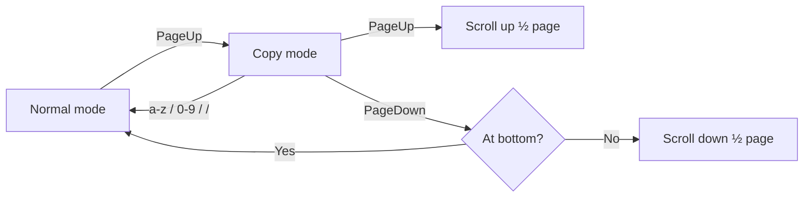

## The Question: Is Ugly Code Ever Acceptable?

Many GitHub repos contain blocks like this:

```python
# ==========================================
someHackyCode()
# ==========================================
```

or

```js
//////////////////////////////
// temp workaround
//////////////////////////////
```

These visual "fence" patterns are informal — not an industry standard. Modern style guides (Google, Airbnb, etc.) don't endorse them. They're hard to search, easy to forget, and add no semantic value over a plain comment.

But the real question isn't about the formatting. It's this: **is ugly code ever the right choice?**

The answer is yes — when:

- The proper fix requires significantly more time or effort than the problem warrants
- There is no clean solution; you're working around an external constraint
- The workaround is intentional, understood, and documented

The goal shifts from *write clean code* to *write ugly code responsibly*.

---

## How to Write Ugly Code Well

The key principle: **leave a trail**. A developer reading your code at 2am during an incident should immediately understand *"this is intentional, not a bug, here's why it works."*

### ✅ Good workaround comment

```python
# HACK: workaround for upstream bug github.com/lib/issue/123
# Proper fix requires refactoring AuthService (~3 days work). Ticket: PROJ-456.
# This works because the null check on line 42 guarantees X is never falsy here.
# Owner: @yourname. Written: 2026-04-18.
someUglyCode()
```

### ❌ Useless workaround comment

```python
# sorry for this lol
someUglyCode()
```

### The comment must answer

| Question | Why it matters |
|---|---|
| **Why is it ugly?** | Constraint, time pressure, no clean solution |
| **Why does it still work?** | The invariant or assumption that makes it safe |
| **What is the proper fix?** | So future devs know the direction |
| **Who owns it and when?** | Accountability and staleness detection |

### Standard tags (IDE/linter-recognized)

Prefer these over banner-style fences — they're searchable and understood by tooling:

```python
# TODO: remove after upgrading to v3
# FIXME: crashes on empty input  
# HACK: upstream bug workaround — see issue #123
```

For larger workaround blocks, use a clear begin/end marker so the entire block can be found and removed atomically:

```python
# WORKAROUND BEGIN: short description of the problem
# Why: explanation. Remove when: condition.
...workaround code...
# WORKAROUND END: short description
```

---

## A Real Example: tmux + Claude Code

### The root cause

This is a genuine example of ugly code done intentionally — adapting tmux copy-mode for a workflow it was never designed for.

**tmux copy-mode** was built for navigating static text files — like `less` or `vim`. The interaction model is: scroll up, select text, copy, done.

**Claude Code chat** is a streaming, append-only log. The interaction model is: scroll up to read context, then immediately return to the bottom to type a new prompt.

These are fundamentally different patterns. tmux never anticipated the "peek and return" model, so every workaround is fighting the tool's assumptions.



### The problems and workarounds

#### 1️⃣ Entering copy mode requires a prefix key

Default: `Ctrl+b [` — a two-key chord just to start scrolling.

**Workaround:** bind `PageUp` directly without a prefix (`-n` flag):

```tmux
# HACK: no single tmux command enters copy mode AND scrolls;
# chain copy-mode + halfpage-up.
bind-key -n PageUp copy-mode \; send-keys -X halfpage-up
```

The ugly part: `copy-mode` has no built-in half-page scroll on entry, so we chain two commands with `\;`.

#### 2️⃣ PageUp/PageDown scroll a full page

For chat history, half-page scrolling preserves context — you always see where you were.

```tmux
bind-key -T copy-mode    PageUp send-keys -X halfpage-up
bind-key -T copy-mode-vi PageUp send-keys -X halfpage-up
```

> ⚠️ tmux has **two separate copy-mode key tables**: `copy-mode` (emacs-style, the default) and `copy-mode-vi` (vi-style). A binding in one is invisible to the other. Both must be set.

#### 3️⃣ PageDown doesn't auto-exit when you reach live output

When you scroll back to the bottom, you're back at live terminal output — copy mode is no longer useful. But tmux doesn't exit automatically.

```tmux
# HACK: no primitive for "halfpage-down then exit if at bottom".
# run-shell checks scroll_position (0 = at bottom) after scrolling.
bind-key -T copy-mode-vi PageDown run-shell \
  "tmux send-keys -X halfpage-down; \
   [ \$(tmux display -p '#{scroll_position}') -eq 0 ] \
   && tmux send-keys -X cancel; true"
```

Breaking down the shell command:

| Part | Meaning |
|---|---|
| `tmux send-keys -X halfpage-down` | Scroll down half page inside copy mode |
| `tmux display -p '#{scroll_position}'` | Print scroll position (0 = at bottom) |
| `\$(...)` | `\$` escapes `$` so the *shell* evaluates it, not tmux |
| `&& tmux send-keys -X cancel` | Exit copy mode only if at bottom |
| `; true` | Always exit with code 0 — prevents tmux from showing an error |

#### 4️⃣ Exiting copy mode to type a new prompt

After reading history, the natural next action is typing. But in vi copy mode, `[a-z]` keys are bound to vi navigation commands — pressing `h` moves the cursor left instead of exiting and typing `h`.

The fix: bind every character to exit copy mode **and replay the key** to the terminal, so the first character of the new prompt is not lost.

```tmux
# HACK: 26 × 2 bindings — no tmux primitive for "exit and forward key".
bind-key -T copy-mode-vi a send-keys -X cancel \; send-keys "a"
bind-key -T copy-mode-vi b send-keys -X cancel \; send-keys "b"
# ... repeated for c-z, 0-9, /
```

The pattern: `send-keys -X cancel` exits copy mode, then `send-keys "a"` (without `-X`) sends a regular keypress to the terminal pane.

This requires **26 + 10 + 1 = 37 separate bindings** for each key table — 74 lines total. There is no loop construct in tmux config.

### The full workaround block

All of this is wrapped in a marked block so it can be found and removed cleanly if tmux ever adds native chat-scroll support:

```tmux
# WORKAROUND BEGIN: chat-scroll (tmux copy-mode vs chat app mismatch)
# Root cause: tmux copy-mode is designed for text/file navigation, not chat.
# These bindings make PageUp/PageDown behave like a chat app's scroll.
# Replace this block when tmux adds native chat-scroll support.
# =============================================================================
...all bindings...
# WORKAROUND END: chat-scroll
```

To find all workarounds at any time:

```bash
grep WORKAROUND ~/.tmux.conf
```

---

## The Takeaway

Ugly code is not the same as bad code. Bad code is ugly *and* undocumented, leaving future maintainers no trail to follow. **Ugly code done right** is:

- ✅ Intentional
- ✅ Clearly marked with begin/end boundaries
- ✅ Explained: why it's ugly, why it works, what the real fix would be
- ✅ Linked to a ticket or issue
- ✅ Owned by someone

The tmux example above is ugly because it's fighting a tool's fundamental assumptions. But it's documented, bounded, and removable. That's the standard to hold workaround code to.
