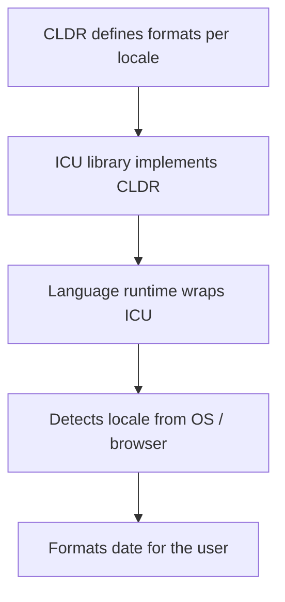

## The Core Tradeoff

Every date and time format lives on a spectrum between two extremes:

| | Machine-friendly | Human-friendly |
|--|--|--|
| **Example** | `2026-04-19T14:30:00Z` | `Sunday, April 19, 2026 at 2:30 PM` |
| **Pros** | Unambiguous, sortable, parseable | Readable, natural |
| **Cons** | Hard to read at a glance | Locale-specific, ambiguous |

In practice, most systems use **both**: ISO 8601 for storage and APIs, locale-formatted strings in the UI.

---

## ISO 8601 — The Machine Standard

ISO 8601 is the universal standard for representing date and time in a way that code can reliably parse.

```
Date:       2026-04-19
Time:       14:30:00
Combined:   2026-04-19T14:30:00
With UTC:   2026-04-19T14:30:00Z
With offset: 2026-04-19T14:30:00+05:30
With ms:    2026-04-19T14:30:00.123Z
```

**Key rules:**
- Always **big-endian**: year → month → day (eliminates US/EU ambiguity)
- `T` separates date from time
- `Z` means UTC; offsets like `+05:30` for other timezones
- Naturally sortable as a string

---

## Other Common Machine Formats

| Format | Example | Used in |
|--------|---------|---------|
| RFC 2822 | `Sun, 19 Apr 2026 14:30:00 +0000` | Email headers |
| RFC 3339 | `2026-04-19T14:30:00Z` | REST APIs (subset of ISO 8601) |
| Unix timestamp | `1745072400` | Databases, logging |
| HTTP date | `Sun, 19 Apr 2026 14:30:00 GMT` | HTTP headers (RFC 7231) |

RFC 3339 is effectively ISO 8601 with stricter rules — the safe default for APIs.

---

## CLDR — The Human Display Standard

For displaying dates to humans, there is no single universal format — it depends on locale. The **Unicode Common Locale Data Repository (CLDR)** defines how each locale formats dates, times, and weekdays.



Most i18n libraries — `Intl.DateTimeFormat` in JavaScript, `strftime` in Python, `DateTimeFormatter` in Java — implement CLDR via the ICU library.

---

## Locale Detection

| Context | How locale is detected |
|---------|----------------------|
| Browser | `navigator.language` (e.g. `en-US`, `ja-JP`) |
| OS | Environment variables: `LANG`, `LC_TIME` |
| Web server | `Accept-Language` HTTP request header |

> ⚠️ Server-side, the machine's locale is the *server's* locale, not the user's. For web apps, pass the user's locale explicitly (from browser or user settings) rather than relying on server detection.

---

## CLDR Formats by Region

Using the example: **Sunday, April 19, 2026, 2:30 PM**

| Locale | Output |
|--------|--------|
| `en-US` 🇺🇸 | Sunday, April 19, 2026 at 2:30 PM |
| `en-GB` 🇬🇧 | Sunday, 19 April 2026 at 14:30 |
| `de-DE` 🇩🇪 | Sonntag, 19. April 2026, 14:30 Uhr |
| `fr-FR` 🇫🇷 | dimanche 19 avril 2026 à 14:30 |
| `ja-JP` 🇯🇵 | 2026年4月19日日曜日 14:30 |
| `zh-CN` 🇨🇳 | 2026年4月19日星期日 14:30 |
| `zh-TW` 🇹🇼 | 2026年4月19日 星期日 下午2:30 |
| `ko-KR` 🇰🇷 | 2026년 4월 19일 일요일 오후 2:30 |
| `ar-SA` 🇸🇦 | الأحد، ١٩ أبريل ٢٠٢٦ في ٢:٣٠ م |
| `hi-IN` 🇮🇳 | रविवार, 19 अप्रैल 2026 को 2:30 pm बजे |
| `ru-RU` 🇷🇺 | воскресенье, 19 апреля 2026 г. в 14:30 |
| `pt-BR` 🇧🇷 | domingo, 19 de abril de 2026 às 14:30 |
| `es-ES` 🇪🇸 | domingo, 19 de abril de 2026, 14:30 |

**Patterns to notice:**
- 🏯 **East Asia** (JP, CN, KR) uses big-endian: year → month → day
- 🕌 **Arabic** uses Eastern Arabic numerals and right-to-left text
- 🕐 **Europe** mostly uses 24h time; **US, TW, KR** use 12h AM/PM
- Month names and weekday names are fully translated

---

## Code Examples

### JavaScript — auto-detects browser locale

```js
new Intl.DateTimeFormat(undefined, {
  weekday: 'long',
  year: 'numeric',
  month: 'long',
  day: 'numeric',
  hour: 'numeric',
  minute: '2-digit',
}).format(new Date())
```

Pass a specific locale instead of `undefined` to override:

```js
new Intl.DateTimeFormat('ja-JP', { ... }).format(new Date())
```

### Python — reads OS locale

```python
import locale, datetime
locale.setlocale(locale.LC_TIME, '')  # '' = system default
datetime.datetime.now().strftime('%A, %x %X')
```

### Java — auto-detects system locale

```java
DateTimeFormatter.ofLocalizedDateTime(FormatStyle.FULL)
    .format(LocalDateTime.now())
```

---

## Summary

```
Store / transfer  →  ISO 8601 / RFC 3339  (e.g. 2026-04-19T14:30:00Z)
Display to users  →  CLDR via locale formatter
```

Use the platform's built-in locale formatter rather than hardcoding a format string — it adapts to the user's region automatically and stays correct as CLDR data is updated.
