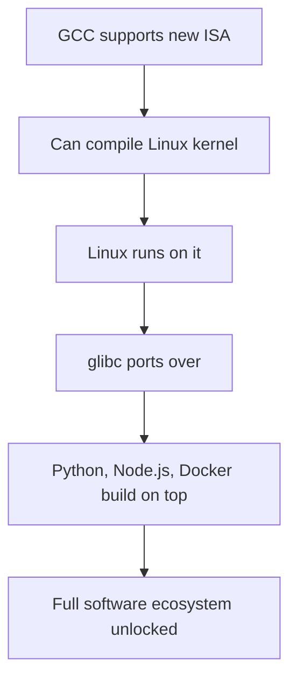

## What Is an ISA?

An **Instruction Set Architecture (ISA)** is the specification of what instructions a CPU understands — what operations exist (`add`, `mov`, `jmp`), how they're encoded in binary, how many registers exist, and how memory is addressed.

It's the contract between software and hardware. Code compiled for x86_64 runs on any x86_64 CPU (Intel or AMD) because they all implement the same ISA, even though their internal circuits differ entirely.

## Major ISAs Today

| ISA | Also Known As | Used In |
|-----|--------------|---------|
| **x86_64** | AMD64, Intel 64 | Desktop, laptop, server (Intel, AMD) |
| **ARM64** | AArch64 | Phones, Apple Silicon, embedded, servers |
| **RISC-V** | — | Embedded, open-source hardware, growing fast |
| **ARM32** | — | Older phones, microcontrollers |
| **MIPS** | — | Routers, older consoles (PS1, PS2, N64) |
| **PowerPC** | PPC | Older Macs, game consoles (Xbox 360, PS3, Wii) |
| **SPARC** | — | Older Sun/Oracle servers |

x86_64 and ARM64 dominate today. RISC-V is the one to watch.

## Who Owns What

The ownership model differs drastically between ISAs:

- **x86_64** — owned by Intel and AMD under a cross-license. Not available for outside companies to license. You cannot build a new x86_64 CPU unless you're Intel or AMD.
- **ARM** — owned by ARM Ltd. You pay a license fee to design your own ARM chip. Qualcomm, Apple, Samsung, and many others do this.
- **RISC-V** — open and royalty-free. Anyone can design a RISC-V CPU without permission or payment.

## Why C Code Is (Mostly) ISA-Agnostic

C was designed as a portable language. A compiler like GCC or Clang translates the same C source into machine code for any target:

```
source.c  →  [GCC x86_64]  →  x86_64 binary
source.c  →  [GCC arm64]   →  ARM64 binary
source.c  →  [GCC riscv]   →  RISC-V binary
```

This is why Linux can run on so many architectures — most of the kernel is written in portable C. The parts that *must* know about hardware are isolated into architecture-specific directories:

```
linux/arch/x86/
linux/arch/arm64/
linux/arch/riscv/
```

Each `arch/` folder implements the same interface (functions and macros) that the portable C code calls — a **Hardware Abstraction Layer (HAL)**. The Linux kernel team writes assembly for each ISA so the C code above it never needs to care which hardware is running.

## The Real Problem: Ecosystem, Not ISA Design

Designing a new ISA is not technically the hard part. The hard part is the **chicken-and-egg ecosystem problem**:

- No software → no users → hardware doesn't sell
- No hardware → no users → no one ports software

A new ISA needs compilers, OS support, standard libraries, debuggers, runtimes, and tooling. Without these, the hardware is useless regardless of how well-designed the ISA is.



**Linux + GCC is the critical unlock.** Once those two support a new ISA, most existing software "just compiles" because it's already written in portable C. The cascade follows automatically.

This is exactly why RISC-V succeeded where previous open ISA attempts failed — they invested in getting upstream GCC and Linux support *before* pushing hardware. The ecosystem followed.

## Closed Vertical Stacks: Apple and Microsoft

Rather than relying on an open community, some companies build the entire vertical stack themselves:

**Apple (ARM64 / Apple Silicon):**
- Licenses ARM ISA from ARM Ltd
- Designs the chip (M1, M2, M3...)
- Writes the OS (macOS, iOS)
- Controls the toolchain (Xcode, LLVM/Clang)
- Controls the app ecosystem (App Store)

**Microsoft:**
- Writes the OS (Windows)
- Writes the toolchain (MSVC)
- Controls the app ecosystem (Windows Store, Win32)

The contrast with the Linux ecosystem: Linux is many companies and individuals collaborating with no single owner. Apple and Microsoft own and control every layer.

The advantage of vertical control is cross-layer optimization — Apple Silicon performs exceptionally because Apple co-designs the chip and OS together, squeezing out inefficiencies that open ecosystems cannot easily coordinate. The tradeoff is lock-in and a single point of failure.

## Summary

The history of ISAs is really a story about ecosystem gravity. x86_64 dominates desktops not because it's the best ISA, but because decades of software, tooling, and optimization are built around it. ARM dominates mobile for similar reasons. RISC-V's bet is that openness lowers the barrier enough that a new gravity well can form — and so far, it's working.
