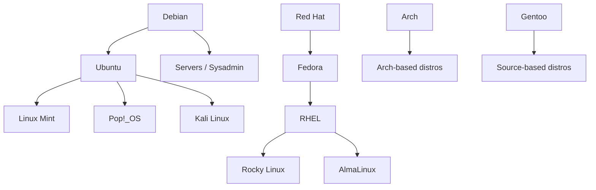

## The Linux Kernel

The Linux kernel was created by **Linus Torvalds** in 1991. It is the **core** of the OS — managing hardware, memory, CPU scheduling, and processes. It handles communication between software and hardware. By itself, the kernel is not a usable desktop or server OS.

## What is a Linux Distribution?

A **distribution** (distro) takes the Linux kernel and packages it into a complete, usable operating system by adding:

| Layer | Examples |
|---|---|
| Package manager | apt, dnf, pacman |
| Init system | systemd, OpenRC |
| Shell | bash, zsh |
| Desktop environment | GNOME, KDE, XFCE |
| Pre-installed software | browsers, editors, tools |
| Configuration & defaults | boot process, file structure |

All distros share the **same kernel** (with minor version differences) — what differentiates them is everything built on top.

### Visual Stack

```
[ User Applications        ]
[ Desktop Environment      ]
[ System Libraries (glibc) ]
[ Shell & Utilities        ]
[ Package Manager          ]
[ Linux Kernel             ]  ← same kernel, different everything above
[ Hardware                 ]
```

## Popular Linux Distributions

### Beginner-Friendly
- **Ubuntu** — most popular overall, great starting point
- **Linux Mint** — based on Ubuntu, very Windows-like
- **Pop!_OS** — Ubuntu-based, great for developers and gaming

### Intermediate
- **Fedora** — cutting-edge packages, Red Hat sponsored
- **Debian** — stable, community-driven, server favorite
- **openSUSE** — enterprise-grade, good tooling

### Advanced / DIY
- **Arch Linux** — minimal, you build it yourself, rolling release
- **Gentoo** — compile everything from source, maximum control
- **NixOS** — declarative configuration, reproducible builds

### Enterprise / Server
- **RHEL** (Red Hat Enterprise Linux) — paid, enterprise standard
- **CentOS Stream** — RHEL upstream, free
- **Rocky Linux / AlmaLinux** — RHEL clones, free alternatives

### Specialized
- **Kali Linux** — penetration testing and security
- **Tails** — privacy-focused, runs from USB
- **Alpine Linux** — ultra-minimal, popular in Docker containers
- **Raspberry Pi OS** — optimized for Raspberry Pi hardware

### Distro Lineage

Most distros trace back to two roots:



## Debian vs Ubuntu

Ubuntu is based on Debian. Here's how they compare:

| Feature | Debian | Ubuntu |
|---|---|---|
| Founded | 1993 | 2004 |
| Based on | Independent | Debian |
| Release cycle | ~2 years (stable) | 6 months + LTS every 2 years |
| Stability | Very stable, conservative | Slightly newer packages |
| Package manager | apt | apt (same) |
| Default desktop | GNOME (minimal) | GNOME (polished) |
| Target user | Experienced users, servers | Beginners, desktops, servers |
| Corporate backing | Community-driven | Canonical |
| Snap support | Optional | Built-in |

Ubuntu takes Debian's solid foundation and makes it more accessible — newer software, better hardware support, and a more polished experience. Debian prioritizes stability and freedom — packages are older but extremely well-tested.

## Why Ubuntu is Popular

1. ⚙️ **User-friendly** — one of the easiest Linux distros to install and use
2. 👥 **Large community** — massive forums, documentation, and Stack Overflow presence
3. 🔒 **Long-Term Support (LTS)** — 5-year supported releases for stability
4. 📦 **Wide software availability** — huge package repos, snap support, good hardware compatibility
5. 💸 **Free** — no licensing costs, attractive for servers and development
6. 🏢 **Corporate backing** — Canonical provides professional support
7. 🐳 **Default for many tools** — Docker images, CI runners, and cloud VMs often default to Ubuntu

## BSD: A Separate Open Source OS Family

BSD stands for **Berkeley Software Distribution**. It originated at UC Berkeley in the 1970s–80s, derived from original AT&T Unix code. It is **not Linux** — it has a completely separate kernel and userland.

### Major BSD Distributions

| BSD | Focus |
|---|---|
| **FreeBSD** | Most popular, servers and desktops |
| **OpenBSD** | Security-focused, extremely audited |
| **NetBSD** | Portability — runs on almost any hardware |
| **DragonFlyBSD** | Performance, unique HAMMER filesystem |

### BSD vs Linux

| | Linux | BSD |
|---|---|---|
| Kernel + userland | Separate projects | Developed together |
| License | GPL (copyleft) | BSD license (permissive) |
| Ecosystem | Huge, fragmented | Smaller, cohesive |
| Desktop popularity | Much higher | Niche |
| Server/embedded | Dominant | Strong presence |

The key difference: Linux is just a **kernel** — distros add everything else. BSD is a **complete OS** — kernel and core utilities developed together as one project.

### BSD is Everywhere 🌍

BSD is hidden inside many familiar products:

- **macOS / iOS** — Apple's OS is built on BSD (Darwin kernel)
- **PlayStation OS** — based on FreeBSD
- **Nintendo Switch** — FreeBSD-based
- **Netflix** — uses FreeBSD for streaming infrastructure
- **WhatsApp** — ran on FreeBSD servers
