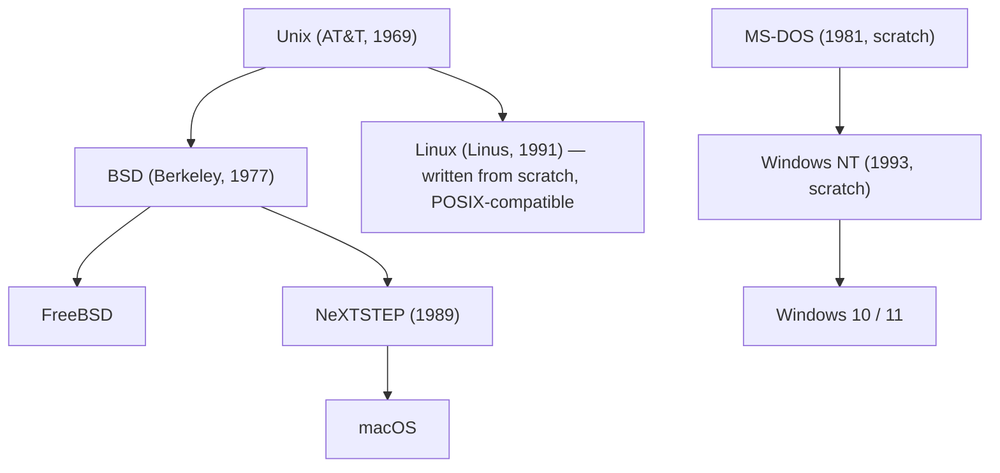

## macOS, MacBook — What's What?

Before diving into the kernel, a quick clarification:

- **macOS** — the operating system (equivalent to Windows or Linux)
- **MacBook** — the hardware model (the laptop); other models include Mac mini, Mac Studio, Mac Pro, iMac

All Apple computers run macOS.

---

## The Unix Family Tree

To understand macOS's internals, you need to see where it sits in history:



macOS descends from BSD, which descends from Unix. Linux was written from scratch but was *designed* to behave like Unix (POSIX-compliant). Windows has no Unix heritage at all.

> macOS is officially **certified Unix** by The Open Group. Linux is Unix-*like* but not officially certified (too expensive to certify).

---

## What Is Darwin?

**Darwin** is the open-source foundation underneath macOS (and iOS, iPadOS, etc.). It includes:

- The **XNU kernel**
- **BSD userland utilities** (ls, cp, mv, grep, …)
- Basic system libraries

Think of Darwin as the minimal, bootable Unix base layer. Apple builds the proprietary macOS experience — GUI, Finder, Safari, frameworks — on top of Darwin. Darwin alone has no GUI and is rarely used standalone.

Apple publishes Darwin (including XNU) on GitHub under the **APSL** (Apple Public Source License). The upper layers of macOS remain proprietary.

---

## XNU — The Hybrid Kernel

The macOS kernel is called **XNU**, which stands for **"X is Not Unix"** (a recursive acronym, like GNU = "GNU's Not Unix").

XNU is a *hybrid kernel*: it combines code from multiple origins into a single kernel binary.

### Architecture

```
┌─────────────────────────────────┐
│         User Space              │
│   (apps, system calls, libc)    │
└────────────┬────────────────────┘
             │ syscalls
┌────────────▼────────────────────┐
│         BSD Layer               │  ← POSIX API, sockets, VFS, processes
├─────────────────────────────────┤
│         IOKit                   │  ← device drivers (C++)
├─────────────────────────────────┤
│         libkern                 │  ← C++ runtime for kernel extensions
├─────────────────────────────────┤
│         Mach                    │  ← threads, memory, IPC, scheduling
└─────────────────────────────────┘
         Hardware
```

| Layer | Origin | Role |
|-------|--------|------|
| **Mach** | Carnegie Mellon University | Threads, memory management, IPC, scheduling |
| **BSD layer** | FreeBSD (mostly) | POSIX APIs, networking, VFS, process model |
| **IOKit** | Apple (C++) | Device driver framework |
| **libkern** | Apple | C++ runtime for kernel extensions |

All layers compile into **one single kernel binary** — they share the same address space. This is what makes it a hybrid rather than a true microkernel (where components would run in separate processes).

---

## Why a Hybrid Kernel?

Apple didn't choose this design from scratch — they *inherited* it.

**Historical reason:**
- Apple acquired **NeXT** in 1997. macOS descends from NeXTSTEP.
- NeXTSTEP was already built on Mach + BSD. Apple evolved what existed rather than starting over.

**Why keep Mach:**
- Solid abstractions for memory management and IPC
- Good foundation for multiprocessing and later multi-core hardware

**Why keep BSD:**
- Instant Unix compatibility — tools, software, and developers could port easily
- Unix certification matters for enterprise adoption
- BSD code carried open-source obligations from its heritage

**Why not build from scratch:**
- Enormously expensive and risky
- You lose decades of battle-tested, stable code
- No ecosystem or compatibility on day one

Linux made the opposite choice — Linus built it from scratch — but it took years to mature.

---

## Do the Upstream Codebases Still Get Merged?

XNU pulls from multiple origins, but the relationship today is nuanced:

| Component | Upstream status |
|-----------|----------------|
| **Mach** | Original CMU project is dead (~1994). Apple maintains their own fork independently. |
| **BSD (FreeBSD)** | Still actively developed. Apple selectively cherry-picks fixes, especially security patches and networking improvements — but it's manual and infrequent. |
| **IOKit / libkern** | Fully Apple-owned. No external upstream. |

After 25+ years of divergence, XNU is effectively Apple's own project. The codebases have drifted so far that integration from FreeBSD is non-trivial — it's selective cherry-picking, not a regular merge.

---

## Why macOS Feels Like Linux

The similarity between macOS and Linux comes from three sources:

1. **Shared BSD userland** — Darwin ships BSD tools (`ls`, `cp`, `mv`, etc. are FreeBSD-derived programs, not kernel code)
2. **POSIX compliance** — both macOS and Linux follow the POSIX standard, which defines how Unix-like systems should behave
3. **Common Unix heritage** — both trace back to Unix design philosophy

The kernel providing syscalls is separate from the userland tools. `ls` and `vim` are not kernel code — they are programs that run on top of the kernel.

One subtle difference: macOS uses **BSD tools**, Linux typically uses **GNU tools**. They behave similarly but have differences:

```bash
# GNU ls (Linux) — uses long option
ls --color=auto

# BSD ls (macOS) — uses short flag
ls -G
```

---

## Why Windows Is Different

Windows was built completely independently, with no Unix heritage:

| | macOS | Linux | Windows |
|-|-------|-------|---------|
| **Kernel** | XNU (Mach + BSD) | Linux (scratch, POSIX) | NTOS (scratch) |
| **Heritage** | Unix → BSD → NeXT | Unix-inspired | MS-DOS → NT |
| **POSIX** | ✅ Certified Unix | ✅ Compatible | ❌ (WSL is a layer on top) |
| **CLI tools** | BSD userland | GNU userland | Win32 / PowerShell |

Windows NT was designed by Dave Cutler (ex-DEC VMS engineer) from scratch in 1993. Microsoft had no BSD obligation, no Unix heritage, and prioritized GUI and Win32 backward compatibility over Unix design philosophy.

The result: 40+ years of divergent development, completely different filesystem conventions (`C:\`), different CLI, different APIs.

---

## Summary

- macOS's kernel is **XNU**, a hybrid kernel combining Mach, FreeBSD code, and Apple's own layers
- XNU is open source; full macOS is not
- **Darwin** = XNU + BSD userland tools = the open-source base layer
- macOS feels like Linux because both trace back to Unix and both follow POSIX
- Windows was built from scratch with no Unix DNA
