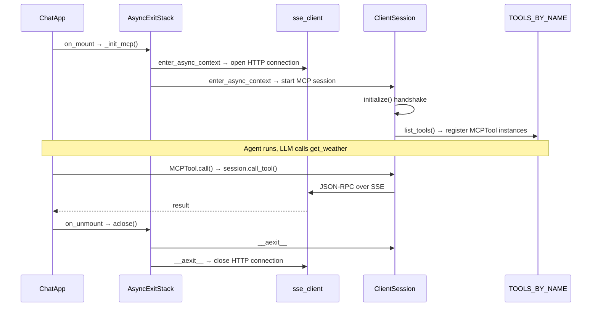

Building an MCP client into a Python AI agent touches several Python fundamentals that are easy to use without fully understanding: `async`/`await`, the event loop, tasks, context managers, and `AsyncExitStack`. This post traces through all of them in the order they come up naturally when doing the integration.

## What is async in Python?

Async is about **waiting without blocking**.

Normal (sync) code — when you wait, the whole thread freezes:

```python
data = requests.get(url)  # thread does nothing for 200ms
```

Async code — when you wait, Python switches to other work:

```python
data = await httpx.get(url)  # Python runs other tasks during the wait
```

### The event loop

A Python process has one event loop by default. It runs on a single thread. Inside that loop, there are many **tasks** — each task is a running instance of an `async def` function (a coroutine).

```
event loop (single thread)
  ├── task A: fetch google.com   → waiting for network
  ├── task B: fetch github.com   → waiting for network
  └── task C: write to database  → waiting for disk
```

At any moment, only one task is executing. They make progress by yielding at `await` points:

```
A runs → hits await → switches to B
B runs → hits await → switches to C
C: disk ready → continues
A: response arrived → continues
```

This is **concurrent but not parallel** — multiple tasks in progress, only one running at any instant.

### `await` and `async def`

Two rules:
1. To use `await`, your function must be `async def`
2. `await` means: "I'm waiting for something — go run other tasks, come back when it's ready"

```python
async def my_task():
    x = compute_something()       # sync — no yield, runs straight through
    data = await fetch(url)       # yields here — event loop can switch tasks
    result = process(data)        # sync again
    await save(result)            # yields again
```

Everything between `await`s is an uninterrupted run. A long sync computation inside an async function blocks the entire loop.

### When is async useful?

Only when waiting on something external — network, disk, database. CPU-bound work gets no benefit.

```python
# useful — waiting on network
async def fetch(url):
    return await httpx.get(url)

# pointless — pure CPU, no waiting
async def add(a, b):
    return a + b
```

---

## Context managers

A context manager is an object with two methods:
- `__enter__` — runs when `with` starts
- `__exit__` — runs when `with` ends, even if an exception was raised

`with` is syntax sugar:

```python
with open("file.txt") as f:
    data = f.read()
```

Exactly equivalent to:

```python
cm = open("file.txt")
f = cm.__enter__()
try:
    data = f.read()
finally:
    cm.__exit__(None, None, None)
```

The core value: **guaranteed cleanup**. Whatever happens inside the block, `__exit__` always runs.

### Async context managers

Same idea, but `__aenter__` and `__aexit__` are awaited. Used when setup or teardown is itself async — opening a network connection, acquiring an async lock.

```python
async with sse_client(url) as streams:
    ...
```

Sugar for:

```python
cm = sse_client(url)
streams = await cm.__aenter__()
try:
    ...
finally:
    await cm.__aexit__(None, None, None)
```

---

## ExitStack and AsyncExitStack

`with` forces open and close to happen in the same scope. Sometimes that doesn't fit — the resource must stay open across multiple functions, or be opened dynamically.

**`ExitStack`** is a list of `__exit__` callbacks. `enter_context()` enters a context manager and saves its exit for later. `close()` runs them all in reverse.

```python
stack = ExitStack()
conn = stack.enter_context(get_connection())
# conn stays open after this function returns

do_work(conn)

stack.close()  # close when you decide
```

**`AsyncExitStack`** is the async version — `enter_async_context()` awaits `__aenter__`, `aclose()` awaits all `__aexit__`s.

The one rule for choosing between `with` and `ExitStack`:

> **Use `ExitStack` when open and close happen in different functions.**

`with` when they're in the same scope. `ExitStack` when the lifetime spans multiple methods or can't fit in a single block.

`AsyncExitStack` is a superset — it can hold both sync and async context managers.

---

## MCP client integration

MCP (Model Context Protocol) is a standard for exposing tools to AI agents. The Python SDK uses a two-layer design:

```
sse_client(url)          → transport layer (HTTP SSE connection, raw streams)
ClientSession(read, write) → protocol layer (MCP JSON-RPC on top of streams)
```

They're separate so you can swap transports without changing the protocol:

```python
# SSE transport
read, write = await stack.enter_async_context(sse_client(url))

# stdio transport — same session, different transport
read, write = await stack.enter_async_context(stdio_client(process))

# same in both cases:
session = await stack.enter_async_context(ClientSession(read, write))
```

### `load_mcp_tools`

```python
async def load_mcp_tools(
    url: str,
    exit_stack: AsyncExitStack,
) -> list[Tool]:
    read, write = await exit_stack.enter_async_context(sse_client(url))
    session = await exit_stack.enter_async_context(ClientSession(read, write))
    await session.initialize()  # MCP handshake

    response = await session.list_tools()
    return [
        MCPTool(name=t.name, description=t.description or "",
                input_schema=t.inputSchema, session=session)
        for t in response.tools
    ]
```

Four steps:
1. Open SSE connection → get raw streams
2. Wrap streams in `ClientSession` → get MCP protocol layer
3. `initialize()` → client/server capability handshake
4. `list_tools()` → discover available tools, wrap each as `MCPTool`

The `exit_stack` is passed in from the caller. Both context managers are entered into it — the connection stays alive for the lifetime of the stack.

### `MCPTool`

```python
class MCPTool(Tool):
    async def call(self, args: dict[str, Any]) -> ToolResult:
        result = await self._session.call_tool(self.name, args)
        text = "\n".join(
            block.text for block in result.content
            if isinstance(block, TextContent)
        )
        return ToolResult.of(text)
```

`MCPTool` adapts a remote MCP tool to the local `Tool` ABC. The LLM sees the same schema it sees for local tools — name, description, parameters. It has no idea whether execution runs local Python or crosses an HTTP connection.

### Lifecycle in the app

```python
class ChatApp(App):
    def __init__(self):
        self._mcp_stack = AsyncExitStack()  # owns the connection lifetime

    async def on_mount(self):
        await self._init_mcp()  # connect, discover, register

    async def _init_mcp(self):
        config = json.loads(_MCP_CONFIG.read_text())
        for server in config["servers"]:
            tools = await load_mcp_tools(server["url"], self._mcp_stack)
            register_mcp_tools(tools)  # add to TOOLS_BY_NAME

    async def on_unmount(self):
        await self._mcp_stack.aclose()  # close SSE connection
```

`on_mount` and `on_unmount` are in different methods — exactly the case `AsyncExitStack` is designed for. Open in `on_mount`, close in `on_unmount`, stack holds the connection alive in between.

---

## The full picture



The key insight: **the LLM sees local and remote tools identically.** The `Tool` ABC is the uniform interface. Whether `call()` runs local Python or sends a JSON-RPC request over HTTP is an implementation detail hidden behind the interface.
