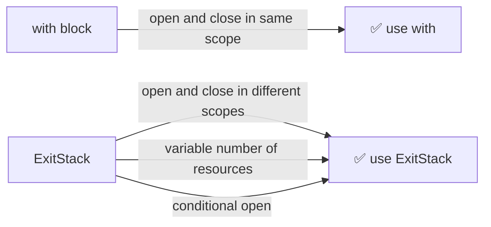

## What is a context manager?

A context manager is an object that defines what happens when you enter and exit a `with` block.

```python
with open("file.txt") as f:
    data = f.read()
# file closed automatically here
```

This is exactly equivalent to:

```python
f = open("file.txt")
f.__enter__()
...
f.__exit__()
```

`with` is syntax sugar for "call `__enter__` at the start, call `__exit__` at the end." The core guarantee: **`__exit__` always runs**, even on exception or early return — no need for `try/finally`.

You can write your own:

```python
class Timer:
    def __enter__(self):
        self.start = time.time()
        return self

    def __exit__(self, *args):
        print(f"elapsed: {time.time() - self.start:.2f}s")

with Timer():
    do_something()
```

Async context managers are identical but use `__aenter__`/`__aexit__` and `async with`.

---

## The problem with `with`

`with` has one hard constraint: **open and close must happen in the same block.** This breaks when the resource lifetime doesn't fit inside a single function.

```python
def connect():
    with get_connection() as conn:
        return conn  # conn is already closed here!
```

---

## What is ExitStack?

`ExitStack` (added in Python 3.3, `contextlib.ExitStack`) is a container that holds open context managers and closes them all when you call `close()`.

**Mental model:** it's just a list of `__exit__` callbacks.

```python
stack = ExitStack()
stack.enter_context(open("a.txt"))  # calls __enter__, saves __exit__
stack.enter_context(open("b.txt"))  # calls __enter__, saves __exit__

# stack holds: [a.__exit__, b.__exit__]

stack.close()  # runs b.__exit__, then a.__exit__ (reverse order)
```

`AsyncExitStack` is the async version — same idea, uses `await` for entering and closing.

---

## When to use ExitStack vs `with`

> **Simple rule:** if open and close are in the same scope, use `with`. If they're in different scopes, use `ExitStack`.

Three concrete cases:

### Case 1 — Variable number of things to open

```python
# can't write this statically
with open(files[0]), open(files[1]), ...:
    ...

# ExitStack handles any number at runtime
with ExitStack() as stack:
    handles = [stack.enter_context(open(f)) for f in files]
```

### Case 2 — Conditional open

```python
with ExitStack() as stack:
    f = stack.enter_context(open("log.txt")) if debug else None
```

### Case 3 — Open and close in different methods ← the core use case

```python
class ChatApp:
    def on_mount(self):
        self._stack = AsyncExitStack()
        await self._stack.enter_async_context(sse_client(url))
        # can't use `with` — the block would close immediately

    def on_unmount(self):
        await self._stack.aclose()  # close happens here, different method
```

Cases 1 and 2 are secondary. The fundamental reason people reach for `ExitStack` is: **the lifetime of the resource doesn't fit inside a single function.**

---

## Real example: MCP SSE connection

In an AI agent app, an MCP (Model Context Protocol) server connection must stay open for the entire app session — from startup to shutdown. Two different lifecycle methods own the open and the close.

```python
from contextlib import AsyncExitStack
from mcp.client.sse import sse_client
from mcp.client.session import ClientSession

class ChatApp:
    def __init__(self):
        self._mcp_stack = AsyncExitStack()

    async def on_mount(self):
        # open SSE connection — must stay alive for the whole session
        read, write = await self._mcp_stack.enter_async_context(
            sse_client("http://localhost:8000/sse")
        )
        session = await self._mcp_stack.enter_async_context(
            ClientSession(read, write)
        )
        await session.initialize()
        # session is now live and held open by _mcp_stack

    async def on_unmount(self):
        await self._mcp_stack.aclose()
        # closes ClientSession, then sse_client, in reverse order
```

The stack holds two context managers. `aclose()` runs their exits in reverse order — session first, then the SSE connection — which is the correct shutdown sequence.

---

## Summary



| | `with` | `ExitStack` |
|---|---|---|
| Open/close scope | Same block | Different methods/functions |
| Number of resources | Fixed at write time | Dynamic at runtime |
| Available since | Always | Python 3.3 |
| Async version | `async with` | `AsyncExitStack` |
