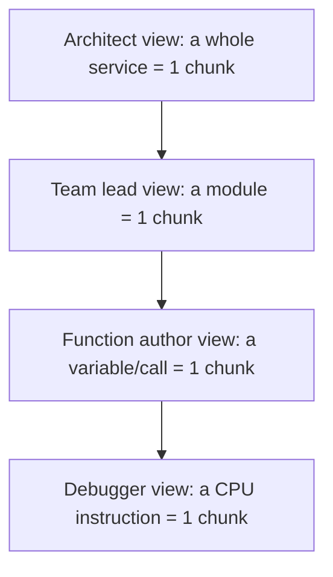

## The real problem with a long function

Long functions are hard to work with. The usual list of symptoms:

- Hard to hold in your head — too many variables, branches, and states at once.
- Mixed abstraction levels — high-level intent interleaved with low-level detail.
- Harder to test — more branches mean more input combinations, and behaviors can't be isolated.
- Harder to reuse — logic trapped inside can't be called from elsewhere without duplication.
- Higher change risk — shared locals and long bodies produce surprising side effects.
- Weaker naming — one name has to summarize too much, so it ends up vague (`process`, `handle`).
- Shared mutable state — later code depends on earlier locals implicitly; refactors break.

But length alone isn't the sin. A 100-line function doing one linear thing can be fine; a 30-line function mixing validation, I/O, and business rules is worse. The real smell is **too many responsibilities or abstraction levels in one place** — length is just the usual symptom.

## The root cause: human working memory

The root cause of "function too long" isn't aesthetic. It's that **the human brain can't hold many pieces of logic and state at once.** Everything else is downstream.

- **Bugs** happen when the function exceeds what you can simulate in your head, so you miss an interaction between distant lines.
- **Testing is hard** because you can't enumerate cases you can't hold in mind.
- **Reviews miss things** — the reviewer's working memory is the same size as the author's.
- **Naming gets vague** — you can't compress what you couldn't fully grasp.
- **Refactors break** — implicit dependencies exceed what anyone tracked.

The function-length rule is an ergonomic constraint on a fixed piece of hardware: the reader's brain. Machines don't care.

## How many chunks can a brain hold?

Capacity has been revised over time:

| Year | Author | Claim |
| --- | --- | --- |
| 1956 | Miller | "The Magical Number Seven, Plus or Minus Two" — based on digit span |
| 2001 | Cowan | "The magical number 4 in short-term memory" — raw capacity is ~3–5 items when chunking/rehearsal are controlled for |

Modern estimate: **~4 chunks.** Important nuances:

- It's **chunks, not items.** A chunk is whatever your brain treats as a unit. "FBI" is one chunk to you, three to someone who doesn't know the acronym.
- Capacity varies by task, modality, and individual — 4 is a central estimate, not a hard ceiling.
- Chunking is **learned.** Experts in a domain have larger effective working memory *in that domain* because they've built richer chunks. A chess master sees "a Sicilian defense" where a novice sees 20 pieces.

So the "4" isn't a fixed ceiling on complexity — it's a ceiling on *unchunked* items. The job of good code is to make each piece chunkable so the reader's 4 slots go further.

## What counts as a chunk in code?

A chunk is **whatever the reader can treat as one unit without unpacking it.** Not tied to any specific syntactic construct — any of these can be a chunk, or not, depending on the reader and how well-formed it is.

What makes something chunk-able:

- **A clear name that matches its behavior.** `sendEmail(user)` is one chunk. `doStuff(x)` forces you to read the body, so it's 20 chunks.
- **No surprises inside.** If `getUser()` also writes to the database, the name lied and you can't trust it as a chunk anymore — you have to keep the internals loaded.
- **Familiarity.** `map`, `filter`, `for i in range(n)` are one chunk each to an experienced dev. A custom DSL is many chunks until learned.

Rough hierarchy of what typically forms a chunk:

- **Variable** — one chunk if well-named (`userEmail`). If named `x` or `tmp`, it costs a slot because you have to remember what it holds.
- **Function call** — one chunk if the name is honest and there are no hidden side effects.
- **Class / module** — one chunk at the usage site (`HttpClient`), many chunks when you're inside it.
- **Idiom / pattern** — `try/finally`, a list comprehension, a null check — one chunk to someone fluent in the language.
- **Design pattern** — "it's a visitor" collapses a lot of code into one chunk *if* the reader knows the pattern.

**The unit of chunking is the name, not the construct.** Good code is code where names let the reader skip reading.

## Chunks are scale-relative

A chunk's size depends on the layer you're reasoning at. The same thing can be one chunk or a thousand, depending on where you're standing:

The 4-slot limit applies **at whatever layer you're currently operating on.** You can't hold 4 services *and* the internals of each simultaneously — you zoom in, the outer level collapses, and your 4 slots refill with the new layer's details.

This is why **layered abstraction** is the core trick of software, not just a style preference:

- Each layer exists so the layer above can treat it as a chunk.
- A good abstraction is one you *don't* have to open to use — the name + interface is enough.
- A **leaky abstraction** forces you to hold its internals *and* its interface at once, costing slots at two levels simultaneously. That's why leaks feel exhausting.

So "too long" is the same failure at every scale:

| Scale | Symptom | Fix |
| --- | --- | --- |
| Function | Too long to chunk | Split into named sub-functions |
| Class | Too big to chunk | Split into smaller classes |
| Service | Doing too much | Split into services |
| Monorepo | Too tangled | Introduce module boundaries |

Same root cause (4-slot working memory), same fix (create honest named chunks at the next level down), just different zoom levels.

## Why experts can "close" a chunk and less-experienced engineers can't

A common experience: you finish a class or a function and move on, but the internal details of the previous part are still resident in your head, confusing you as you write the next piece. An expert doesn't seem to have this problem — once they finish a part, they see it as a single chunk.

The difference isn't intelligence. It's **trust and chunk-formation**, both learned skills.

- An expert trusts the part they just finished. They've seen enough patterns like it that they believe the name captures the behavior, so their brain *releases* the internals.
- Less experienced engineers can't release yet because they don't fully trust that the code does what its name says — so the details stay resident, eating slots.

It's the same reason a new driver consciously thinks "check mirror, signal, turn wheel" while an experienced driver just "changes lanes" as one chunk. The chunk forms through **repetition plus verified success.**

## Practical habits that accelerate chunk-formation

- [ ] **Write tests, then trust them.** Once a function has tests covering its contract, you're allowed to forget the internals. Tests become external memory. Single biggest shortcut.
- [ ] **Name things honestly.** If you can't name a function in a way that lets *you* forget its internals, it's doing too much or the name is wrong. Rename until the name is load-bearing.
- [ ] **Prefer pure functions over stateful ones.** State leaks out of chunks; pure functions stay closed.
- [ ] **Write the name first.** Write the signature and docstring before implementing. If the name doesn't satisfy the caller, don't implement yet. Trains the habit of treating your own code as a chunk from the start.
- [ ] **Take a break between parts.** A short walk after finishing a class lets working memory flush. You come back and the previous part is genuinely gone — you can only access it via its name/interface, which is exactly the state you want.
- [ ] **Re-enter through the interface.** When you return, don't re-read the implementation. Read only the signature/tests. If that's not enough to use it, *that's a signal the abstraction is bad*, not that you need to re-memorize.

## Summary

- The 4-slot working-memory limit is the hardware constraint all "code quality" rules point back to.
- A chunk is a named unit the reader can use without unpacking. Names, not constructs, do the chunking work.
- Chunks are scale-relative — the same rule shows up as "split this function" or "split this service" at different zoom levels.
- Expertise isn't a bigger brain; it's denser, more trusted chunks, built through repetition and verified success.
- Good code is the discipline of making each piece chunkable so the next reader's 4 slots are spent on intent, not on holding your internals.
