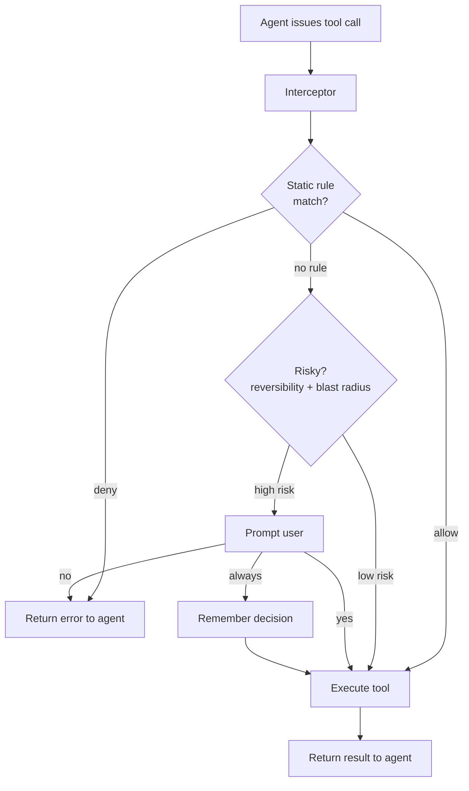

Designing a permission system for an AI agent feels deceptively simple at first — until you start listing the axes you might need to control: tool use, time limits, CPU limits, API quotas, file scope, network reach… and the design space explodes. This note is a mental framework that makes the problem tractable, together with a concrete starting point.

## 🧭 Core principles

Before picking mechanisms, fix the principles:

- **Least privilege** — agents get only what the task needs.
- **Human-in-the-loop (HITL)** — risky or irreversible actions require explicit approval.
- **Trust hierarchy** — operator (system) > user (runtime) > subagent. A subagent cannot grant itself more trust than its parent.
- **Prompt-injection defense** — treat external data (tool results, web pages) as untrusted. Malicious content must not escalate permissions.
- **Sandboxing** — isolate execution so a compromised agent can't damage the host.

## 🧱 Separate the axes

Don't design "one permission system." Design **independent layers**, each handling one concern:

| Layer          | Question                     | Mechanism                          |
| -------------- | ---------------------------- | ---------------------------------- |
| **Capability** | *Can* the agent do X?        | Allow/deny lists (tools, APIs)     |
| **Resource**   | *What* can it touch?         | Path globs, scopes, ACLs           |
| **Quota**      | *How much*?                  | Rate limits, token / CPU / mem     |
| **Time**       | *When / how long*?           | TTL, session expiry                |
| **Approval**   | *Who confirms*?              | HITL prompts for risky ops         |
| **Isolation**  | *Blast radius*?              | Sandboxes, containers, worktrees   |

Each layer is simple on its own. Complexity comes from stacking them — but you don't have to build all of them at once.

## 🛠️ Claude Code's pragmatic choice

Claude Code picks **capability + approval** as the primary axes (allow/deny rules + a permission prompt) and delegates the rest:

- **Resource** → OS file permissions
- **Quota** → API provider (rate limits)
- **Isolation** → OS / git worktrees
- **Time** → session lifecycle

That's why it feels simple — it didn't reinvent what the OS already does.

## 🧮 A decision heuristic

For every action, ask two questions:

1. **Reversibility** — can we undo it? (read = yes, `rm -rf` = no, send email = no)
2. **Blast radius** — local, shared, or external?

High-risk on either axis → require approval. Low-risk on both → auto-allow. This collapses most of the decision space.

## 🚀 Where to start: the approval loop

The backbone every other layer hooks into is the **approval loop on tool use**. Build this first.

### Why start here

A working approval loop gives you:

- 🎯 An **interception point** — every tool call flows through one gate.
- 📝 A **decision record** — you know what was asked and what was approved.
- 🤝 A **UX contract** — users learn "the agent pauses before acting."

Once the gate exists, every other layer is just a *policy* plugged into it:

- Allow/deny list → "auto-decide without asking"
- Quota → "deny if budget exceeded"
- Resource scope → "deny if path outside allowed glob"
- Time limit → "deny if session expired"

Without the gate, each layer has to re-implement interception.

### Minimal v1

```text
agent wants to call tool(name, args)
  → interceptor.check(name, args)
      → ask user: "Allow <name>(<args>)? [y/n/always]"
      → record decision
  → if allowed: execute, return result
  → if denied:  return error to agent
```

That's it — roughly 50 lines of code.

## 🔁 The flow



## 📶 Layering order

Add layers only when the previous one shows a real pain point:

1. ✅ **Remember decisions** — "always allow" / session cache. Removes prompt fatigue, the #1 UX issue.
2. ✅ **Allow/deny rules** — static config so common tools skip the prompt.
3. ✅ **Risk classification** — auto-allow read-only, always-ask for destructive.
4. ⚙️ **Resource scoping** — path / URL / arg pattern matching.
5. ⚙️ **Quota / rate limits** — once you see real usage.
6. 🔒 **Sandboxing** — when you need hard guarantees, not just policy.

Each step is driven by observed pain from the previous step. Don't build ahead of the pain.

## ⚠️ The one trap to avoid

Make the interceptor **the only path** to tool execution. If agents can bypass it, every layer above is theater.

This is the single most important invariant — get it right in v1, and everything else is incremental.

## 📌 Takeaways

- Permission design is overwhelming only if you try to solve every axis at once.
- Separate independent concerns into layers; reuse OS / provider primitives where you can.
- Start from the approval loop — it's the gate every future policy plugs into.
- Classify actions by reversibility and blast radius to cut the decision space.
- Keep the interceptor un-bypassable. Everything else can evolve.
