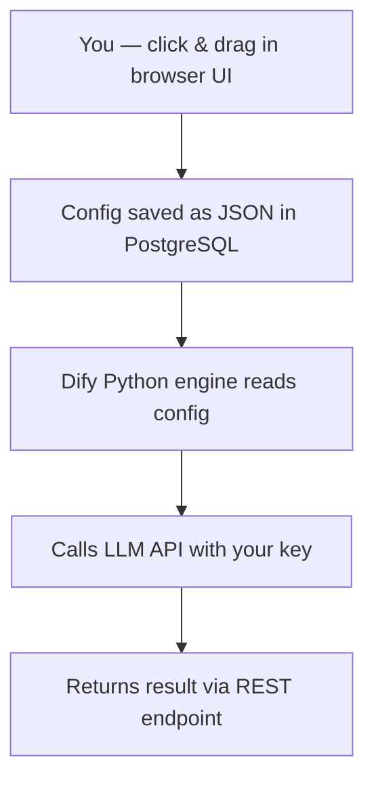

Dify is an open-source platform for building LLM-powered applications **without writing code**. Instead of importing a framework into Python or JavaScript, you design your app by dragging and connecting nodes on a visual canvas — similar to how Figma works for UI design, but for AI workflows.

## How It Works

The mental model is simple:



What you build in the UI is stored as a **config/JSON** inside Dify's database. The Python backend reads that config and executes it at runtime — calling whichever LLM API keys you provided in settings. You never own runnable source code; you own a config that the Dify engine interprets.

## Tech Stack

| Layer | Technology |
|---|---|
| Backend engine | Python (Flask + Celery) |
| Frontend UI | TypeScript + Next.js (React) |
| Queue / workers | Celery + Redis |
| Database | PostgreSQL |
| Self-host method | Docker Compose |

The backend is Python, not Node.js. The Next.js frontend is just the visual editor and dashboard.

## Running It

The simplest way is Docker Compose — one command starts everything:

```bash
git clone https://github.com/langgenius/dify.git
cd dify/docker
cp .env.example .env
docker compose up -d
```

Then open `http://localhost` in your browser. Docker handles the Python backend, Next.js frontend, PostgreSQL, and Redis together. Minimum ~4 GB RAM recommended.

## What You Can Build

**RAG (Retrieval-Augmented Generation)**
- Upload documents (PDF, Word, web pages)
- Dify chunks, embeds, and stores them in a vector database
- At runtime, retrieves relevant chunks before calling the LLM

**Workflow nodes available on the canvas**

| Node type | What it does |
|---|---|
| LLM | Call any supported model with a prompt |
| HTTP request | Call an external REST API |
| Code | Run a Python or JavaScript snippet |
| Condition | If/else branching |
| Loop | Iterate over a list |
| Variable | Assign and pass values between nodes |

**Agents**
- Tool use / function calling
- ReAct-style reasoning loops
- Built-in tools: web search, Wikipedia, etc.

**Other capabilities**
- Multi-turn conversation memory
- Prompt templating with variables
- Output parsing and formatting
- Human-in-the-loop approval steps
- Logging and observability dashboard

## Using Your App After Building

Once your workflow is configured, you have several options — none require extra coding:

1. **Dify built-in chat UI** — Dify generates a hosted chat page you can share via URL immediately
2. **Embed in your website** — Dify provides an `<iframe>` snippet to paste into any HTML page
3. **REST API** — Dify exposes an endpoint your own frontend or backend can call like any HTTP API
4. **Standalone WebApp** — Dify's "WebApp" mode gives a public hosted URL

The simplest path: build config → share the Dify-generated URL. No coding needed at all.

## Platform vs. Framework

Dify is a **platform**, not a code framework like LangChain or LlamaIndex. The distinction matters:

- ✅ Faster to get started — visual, no boilerplate
- ✅ No deployment code to write
- ⚠️ Your app depends on Dify staying running — stop hosting it and the app stops
- ⚠️ You cannot export runnable source code to deploy independently

If you want to *own* the code, tools like LangChain, LlamaIndex, or the direct Anthropic/OpenAI SDK are better fits. If you want to *assemble* an app visually and ship quickly, Dify (or similar tools like Flowise, LangFlow, or Coze) is the right choice.
