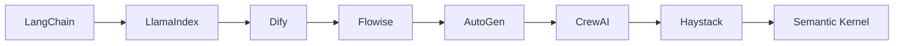

## What Is an LLM Application Development Platform?

An LLM application development platform provides the infrastructure and abstractions needed to build software powered by large language models — without wiring everything together from scratch.

Concretely, these platforms handle:

| Concern | What it covers |
|---|---|
| **Prompt management** | Versioning and testing prompts |
| **RAG pipelines** | Chunking, embedding, and retrieval from documents |
| **Agent orchestration** | Chaining tools, APIs, and model calls into workflows |
| **Memory** | Persisting conversation context across sessions |
| **Model routing** | Switching between OpenAI, Anthropic, local models, etc. |
| **Observability** | Logging inputs/outputs, tracking costs and latency |

The alternative is building all of that yourself using raw API calls. Frameworks abstract away that plumbing so teams can focus on application logic — at least in theory.

---

## Popular Platforms, Ranked by Community Adoption

### 🏆 Top Tier

1. **LangChain** — by far the largest ecosystem and mindshare; Python and JavaScript; massive plugin library
2. **LlamaIndex** — strong second, especially for RAG and data ingestion use cases
3. **Dify** — fastest-growing visual platform; open-source and self-hostable; huge GitHub traction

### 🥈 Mid Tier

4. **Flowise** — popular self-hosted visual alternative; drag-and-drop LangChain flows
5. **AutoGen** (Microsoft) — strong in research and multi-agent communities
6. **CrewAI** — rapidly growing; simpler multi-agent API than AutoGen
7. **Haystack** (deepset) — solid but more niche; enterprise search and RAG focus

### 🏢 Enterprise / Ecosystem

8. **Semantic Kernel** (Microsoft) — popular in .NET and enterprise Microsoft shops
9. **n8n** — broader automation tool; AI is one component among many
10. **LangSmith** — observability and prompt management layer for LangChain, not a framework itself
11. **Vertex AI** (Google) — widely used but more infrastructure than developer framework
12. **Azure AI Foundry** — enterprise adoption; less open-source community visibility
13. **Amazon Bedrock** — same profile as Azure; preferred by AWS-native teams

**Short version:** LangChain → LlamaIndex → Dify are the top three by community size. Cloud platforms (Bedrock, Vertex, Azure) have large *usage* numbers but smaller open-source communities.

---

## The Dirty Secret: Frontier Teams Write From Scratch

Products like **Claude Code**, **OpenAI Codex**, **Cursor**, **Perplexity**, and **Manus** are not built on LangChain or Dify. Their actual stack is typically:

- Raw LLM SDK (Anthropic SDK, OpenAI SDK)
- LiteLLM or similar for model routing (optional)
- Everything else: **custom-built**

### Why They Avoid Frameworks

**Control** — frameworks abstract away the exact behavior you need to tune for a production product. Agent loop timing, retry logic, context window management — all of these need precise control.

**Performance** — every abstraction layer adds latency and overhead. In a product where response speed matters, framework magic has a real cost.

**Reliability** — LangChain especially has a reputation for breaking changes and unpredictable behavior in production. When the framework does something unexpected, debugging is painful.

**Debuggability** — when something goes wrong at 3am, you want to trace every step. Framework abstractions make that much harder.

**Fit** — real product requirements are very specific. Generic frameworks are designed for the median use case, not your use case.

### The Inevitable Rewrite Pattern

> Frameworks are great for prototyping and demos. But when a team ships a real product and starts hitting edge cases, they gradually replace framework pieces with their own code — until eventually they've rewritten everything anyway.

This is a well-known pattern in the LLM ecosystem. Most "built with LangChain" demos never reach production. Most production AI products start with a framework, hit its limits within weeks, and end up on a custom stack.

---

## Who Should Use Frameworks Then?

Frameworks and low-code platforms are genuinely useful for:

- **Rapid prototyping** and proof-of-concept demos
- **Non-engineers** or small teams who need to ship fast
- **Internal tools** where performance and fine-grained control are not critical
- **Evaluating ideas** before committing to a custom build

Dify and Flowise in particular are well-suited for internal tooling and MVPs. LangChain remains useful as a reference implementation — even if you don't use it directly, understanding how it works helps you design your own solution.

---

## Summary

| Use case | Recommended approach |
|---|---|
| Prototyping / demo | LangChain, Dify, Flowise |
| Internal tool / MVP | Dify, Flowise, n8n |
| Production AI product | Custom stack + raw SDK |
| Enterprise infrastructure | Vertex AI, Bedrock, Azure AI Foundry |

The LLM framework ecosystem is maturing rapidly, but the most ambitious products being built today — the ones redefining what software can do — are written from scratch. The frameworks serve a real purpose, but they are not where the frontier is.
