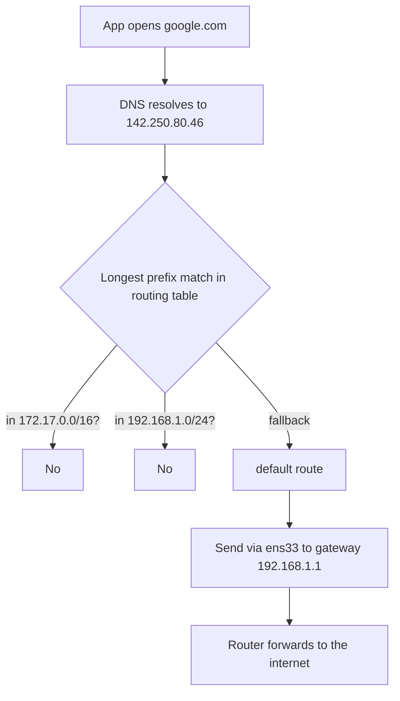

A walk through what a network interface is, the naming conventions Ubuntu uses, and how the kernel picks an interface when you open `google.com`. All examples come from a real Ubuntu VM.

## Table of Contents

## What is a network interface?

A **network interface** is the point of connection between your computer and a network. It can be physical hardware or a software construct.

| Type | Examples | Purpose |
|------|----------|---------|
| Physical — Ethernet | `eth0`, `ens33`, `enp0s3` | Wired LAN |
| Physical — Wi-Fi | `wlan0`, `wlp3s0` | Wireless LAN |
| Virtual — loopback | `lo` | Talk to yourself (127.0.0.1) |
| Virtual — Docker bridge | `docker0` | Container networking |
| Virtual — VPN tunnel | `tun0`, `tap0` | Encrypted overlays |
| Virtual — software bridge | `br0` | Bridging multiple interfaces |

Each interface carries a small bundle of attributes:

- A **name** (e.g., `ens33`)
- A **MAC address** — hardware identifier, like `00:0c:29:ab:cd:ef`
- Zero or more **IP addresses**
- A **state** (up/down) and flags (broadcast, multicast, loopback…)

A machine can have many interfaces — each one is effectively a "door" the OS uses to send and receive packets, each leading to a different network.

## Finding local IPs quickly

The fastest way to see your local IP addresses:

```bash
hostname -I
# 192.168.1.156 172.17.0.1
```

More detail:

```bash
ip -4 addr show          # per-interface IPv4
ip route get 1.1.1.1     # which IP/interface outbound traffic uses
```

## Listing interfaces

```bash
ip -brief link
```

On the example machine:

```text
lo        UNKNOWN  00:00:00:00:00:00  <LOOPBACK,UP,LOWER_UP>
ens33     UP       00:0c:29:5c:f5:09  <BROADCAST,MULTICAST,UP,LOWER_UP>
docker0   DOWN     ba:7e:64:ea:e8:18  <NO-CARRIER,BROADCAST,MULTICAST,UP>
```

Three interfaces:

1. **`lo`** — loopback, always present.
2. **`ens33`** — the Ethernet adapter, actively carrying traffic.
3. **`docker0`** — Docker's bridge, currently `DOWN` because no containers are running.

## Interface naming: what is `ens33`?

`ens33` follows systemd's **Predictable Network Interface Names** scheme:

- `en` → Ethernet
- `s33` → hotplug PCI slot 33

This name is common in **VMware** VMs, which by default attach the NIC to PCI slot 33. On bare metal you are more likely to see:

- `eno1` — onboard NIC index 1
- `enp0s3` — PCI bus 0, slot 3 (common in VirtualBox)
- `eth0` — legacy kernel-assigned name

The goal of the predictable scheme is that names do not change across reboots or kernel upgrades — unlike the old `eth0`/`eth1` ordering, which depended on probe order.

## How does the OS pick an interface for `google.com`?

The kernel uses the **routing table**. Viewing it:

```bash
ip route
```

```text
default via 192.168.1.1 dev ens33 proto static
172.17.0.0/16 dev docker0 proto kernel scope link src 172.17.0.1 linkdown
192.168.1.0/24 dev ens33 proto kernel scope link src 192.168.1.156
```

The decision process, step by step:



You can ask the kernel directly which route it would use:

```bash
ip route get 142.250.80.46
# 142.250.80.46 via 192.168.1.1 dev ens33 src 192.168.1.156
```

### Rules of thumb

- Destination on the **same subnet** → sent directly out the matching interface.
- Destination **elsewhere** → sent to the `default` gateway.
- When multiple routes match, the **most specific** (longest prefix) wins.

## Putting it together

For this machine:

- `lo` handles `127.0.0.0/8` — internal localhost traffic.
- `docker0` would handle `172.17.0.0/16` — but it is down, so no containers to reach.
- `ens33` owns `192.168.1.0/24` and is also the **default route**, so anything not matching a more specific rule — including `google.com` — leaves through it to the router at `192.168.1.1`.

The mental model: interfaces are doors, the routing table is the sign that tells each packet which door to take.
