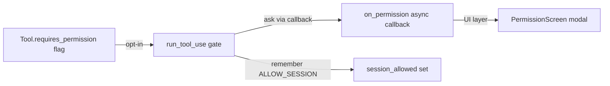
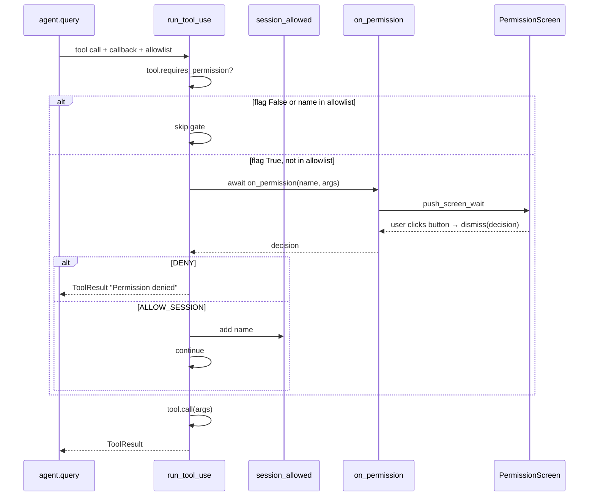

An AI agent that calls tools on your behalf — MCP servers, shell, file writes — needs a gate. Without it, the LLM can run anything it wants. This post walks through the design we landed on: a per-tool flag, an async callback, a session allowlist, and a modal dialog. Small surface area, clean separation of concerns.

## Requirements

- Unsafe tools (MCP, bash, write_file) prompt the user before executing.
- Safe tools (local, read-only) skip the prompt entirely.
- User can **allow once**, **allow for session**, or **deny**.
- "Allow for session" remembers the decision per-tool-name for the rest of the app run. Nothing persists to disk.
- Denial must flow back to the LLM so it can recover (apologize, try something else).
- The agent loop must be UI-agnostic — it shouldn't know about Textual modals.

## Design

Four pieces, each with one job:



### 1. Per-tool flag

Every `Tool` gets a class attribute. Default is `False` — safe by default means new tools opt in explicitly:

```python
class Tool(ABC):
    name: str
    description: str
    input_schema: dict[str, Any]
    requires_permission: bool = False
```

Tools that need the gate override it:

```python
class MCPTool(Tool):
    requires_permission: bool = True
```

### 2. Decision type

A three-valued enum:

```python
class PermissionDecision(str, Enum):
    ALLOW_ONCE = "allow_once"
    ALLOW_SESSION = "allow_session"
    DENY = "deny"
```

Mixing in `str` makes members usable as plain strings (JSON, logging) while keeping type-checker precision.

### 3. Async callback contract

```python
PermissionCallback = Callable[
    [str, dict[str, Any]], Awaitable[PermissionDecision]
]
```

An async function that takes a tool name + args and returns a decision. **Async is required** — the callback has to wait for user input without freezing the event loop.

### 4. The gate

`run_tool_use` checks the flag, asks the callback, handles the decision:

```python
async def run_tool_use(
    tool_call,
    tools_by_name,
    on_permission: PermissionCallback | None = None,
    session_allowed: set[str] | None = None,
) -> ToolResult:
    ...
    if (
        tool.requires_permission
        and on_permission is not None
        and (session_allowed is None or name not in session_allowed)
    ):
        decision = await on_permission(name, args)
        if decision == PermissionDecision.DENY:
            return ToolResult.of(
                f"Permission denied by user for tool '{name}'."
            )
        if (
            decision == PermissionDecision.ALLOW_SESSION
            and session_allowed is not None
        ):
            session_allowed.add(name)

    return await tool.call(args)
```

Key details:

- **DENY returns a ToolResult, not an exception.** The LLM sees `"Permission denied..."` as a tool result and can react — try a different approach, ask the user, give up gracefully.
- **The allowlist is per-tool-name**, not per-tool+args. Simpler; matches how humans think ("I trust this tool" not "I trust this one specific call").
- **No hardcoded policy.** Both `on_permission` and `session_allowed` are optional. If omitted, every tool runs (useful for tests or headless runs).

---

## UI layer: the modal

The TUI is where `on_permission` actually becomes a prompt. Textual's `ModalScreen` + `push_screen_wait` is a perfect fit — the screen pauses the caller until the user dismisses it.

```python
class PermissionScreen(ModalScreen[PermissionDecision]):
    BINDINGS = [Binding("escape", "deny", "Deny")]

    def compose(self) -> ComposeResult:
        with Vertical(id="dialog"):
            yield Label(...)
            yield Button("Allow once", id="once")
            yield Button("Allow for session", id="session")
            yield Button("Deny", id="deny")

    def on_button_pressed(self, event: Button.Pressed) -> None:
        mapping = {
            "once": PermissionDecision.ALLOW_ONCE,
            "session": PermissionDecision.ALLOW_SESSION,
            "deny": PermissionDecision.DENY,
        }
        self.dismiss(mapping[event.button.id])

    def action_deny(self) -> None:
        self.dismiss(PermissionDecision.DENY)
```

The generic parameter `ModalScreen[PermissionDecision]` tells Textual the screen returns a `PermissionDecision` when dismissed — type-safe all the way through.

The callback is a one-liner inside `_run_agent`:

```python
async def on_permission(name, args) -> PermissionDecision:
    return await self.push_screen_wait(PermissionScreen(name, args))
```

`push_screen_wait` pushes the modal and awaits until `dismiss(value)` is called. The value flows back through the await, then back through `on_permission`, then back into the gate in `run_tool_use`.

---

## Why these choices

### Callback, not hardcoded UI

The agent layer defines the *need* (must get a decision) but not the *how* (modal? CLI prompt? always-allow policy?). Any UI or test harness can plug in. The agent can run headless in tests without mocking Textual.

### Passing `session_allowed` explicitly, not making it global

A global would be simpler to write, but:

- Tests would share state across runs — annoying to reset.
- Sub-agents couldn't have isolated allowlists.
- The dependency would be hidden — future-you wouldn't know `run_tool_use` reads shared state.

Globals are fine for process-wide constants. Mutable per-session state should live on the object that owns the session. `ChatApp` owns `_session_allowed`.

### DENY returns ToolResult instead of raising

The LLM's turn is structured around tool results. Throwing an exception would bubble through the agent loop and kill the turn. A denial result flows naturally — the model reads it, adjusts, and either retries or explains.

### Per-tool-name allowlist, not per-call

A user granting "allow session" for `bash` means "I trust bash for this session" — not "I trust this one `ls` call". Matches user intent, avoids re-prompting for every argument variant. If finer granularity is needed later, it can be added without changing the basic model.

### Safe-by-default flag

`requires_permission: bool = False` means new tools run freely until you flip the flag. Wrong direction? Arguably yes from a security perspective — but the built-in tools in this project are all read-only/pure, and forcing every future tool to explicitly opt out would be noise. The rule is: any tool with side effects (file write, remote call, shell) sets the flag.

---

## Flow



---

## Summary table

| Concern | Decision |
|---|---|
| Opt-in or opt-out? | Per-tool flag, default `False` (opt-in via override) |
| Where does the gate live? | `run_tool_use` — single choke point for all tools |
| How does UI plug in? | Async callback `on_permission` |
| Session memory? | `set[str]` of tool names, per app instance |
| Denial behavior? | Return `ToolResult`, don't raise |
| Allowlist granularity? | Per-tool-name |
| Global or passed-in? | Passed-in — better testability, isolation |

The whole design is about **separating concerns**: the `Tool` declares its need, the agent layer enforces it, the UI layer answers it, and state lives with the owner of the session. Each piece does one thing.
