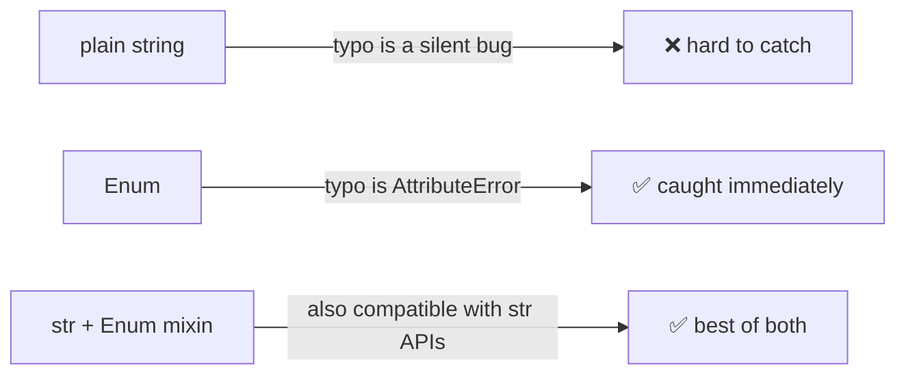

An `Enum` is a fixed set of named constants. Instead of scattering magic strings or integers across your code, you define them once and refer to them by name.

## Basic usage

```python
from enum import Enum

class Color(Enum):
    RED = 1
    GREEN = 2
    BLUE = 3
```

Access a member:

```python
Color.RED          # <Color.RED: 1>
Color.RED.name     # "RED"
Color.RED.value    # 1
```

Compare:

```python
Color.RED == Color.RED    # True
Color.RED == Color.BLUE   # False
```

Use in conditions:

```python
def describe(c: Color) -> str:
    if c == Color.RED:
        return "warm"
    return "other"
```

---

## Why enum over plain strings?

The core benefit is **catching bugs at definition time, not at runtime**.

```python
# strings — typo silently never matches
if decision == "alow_once":   # bug, always False
    ...

# enum — typo is an AttributeError caught immediately
if decision == PermissionDecision.ALOW_ONCE:   # AttributeError
    ...
```

Additional benefits:

| | Plain strings | Enum |
|---|---|---|
| Typo safety | ❌ silent bug | ✅ AttributeError |
| Autocomplete | ❌ | ✅ |
| Type annotation | weak (`str`) | precise (`Color`) |
| Exhaustive match | ❌ | ✅ (type checkers warn) |

---

## The `str` mixin pattern

Inheriting from both `str` and `Enum` makes each member a real string value:

```python
class Status(str, Enum):
    OK = "ok"
    ERROR = "error"

Status.OK == "ok"    # True — it IS a str
str(Status.OK)       # "ok"
```

Without the mixin:

```python
class Status(Enum):
    OK = "ok"

Status.OK == "ok"    # False — it's a Status, not a str
```

**When to use the mixin:** when the enum value needs to pass through code that expects a plain string — JSON serialization, logging, string formatting. You get type safety in your own code and compatibility with external code that doesn't know about your enum.

---

## Real example: permission decisions

```python
from enum import Enum

class PermissionDecision(str, Enum):
    ALLOW_ONCE = "allow_once"
    ALLOW_SESSION = "allow_session"
    DENY = "deny"
```

Used as a return type from a callback:

```python
async def on_permission(
    name: str,
    args: dict,
) -> PermissionDecision:
    # show a UI prompt, return one of the three values
    ...
```

And checked in the caller:

```python
decision = await on_permission(name, args)

if decision == PermissionDecision.DENY:
    return ToolResult.of("Permission denied.")

if decision == PermissionDecision.ALLOW_SESSION:
    session_allowed.add(name)
```

Three possible outcomes, all named, no magic strings. The type annotation makes it clear what the function returns, and the type checker can verify all cases are handled.

---

## Summary



- Use `Enum` when you have a fixed set of named values.
- Use `(str, Enum)` when those values also need to work as plain strings.
- The payoff: typos become errors, type annotations become precise, editors can autocomplete.
