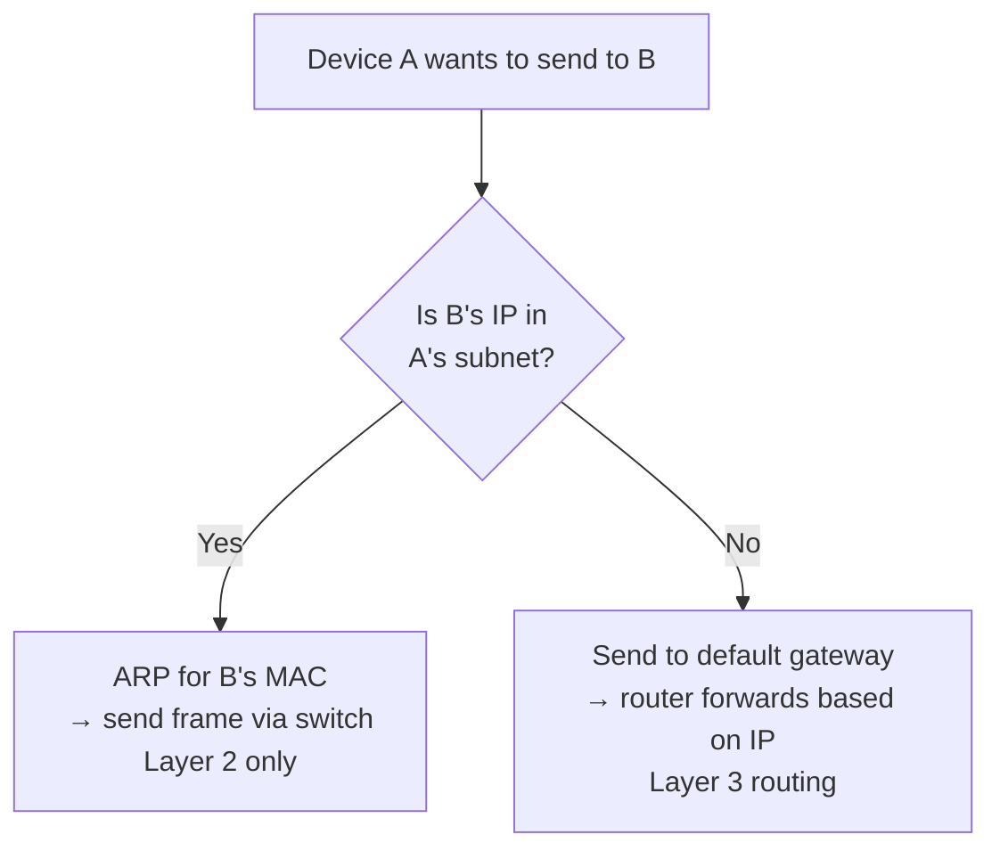

Notes from a Q&A session walking through the core ideas that tie together IP addresses, subnets, gateways, and routing.

## What is a subnet?

A **subnet** (subnetwork) is a logical subdivision of an IP network. It splits a larger network into smaller ones for better routing, security, and address management.

An IP address is divided into two parts by a **subnet mask**:

- **Network portion** — identifies the subnet
- **Host portion** — identifies a device within it

### Example: `192.168.1.0/24`

- `/24` means the first 24 bits are the network part → `192.168.1`
- Remaining 8 bits are for hosts → 256 addresses (254 usable)
- Host range: `192.168.1.1` to `192.168.1.254`
- Broadcast: `192.168.1.255`

### Why subnet?

- **Isolation** — separate traffic (e.g., servers vs. guests)
- **Security** — apply firewall rules between subnets
- **Efficiency** — reduce broadcast domain size
- **Routing** — routers forward between subnets

## IP = network + host

Every IP address is split into two parts by the subnet mask:

```
IP address = [Network portion] + [Host portion]
```

### `192.168.1.50/24`

```
IP:       192.168.1.50
Binary:   11000000.10101000.00000001.00110010
          └─────── network (24 bits) ──┘└host┘

Network portion: 192.168.1   → identifies the subnet
Host portion:    .50         → identifies this device
```

### `10.0.5.20/16`

`/16` = first 16 bits network, last 16 bits host.

- Network portion: `10.0`
- Host portion: `.5.20`

### Special host addresses

Within each subnet, two host values are reserved:

| Host bits | Meaning | Example (`/24`) |
|-----------|---------|-----------------|
| all 0s    | Network address (the subnet itself) | `192.168.1.0` |
| all 1s    | Broadcast address (all hosts)       | `192.168.1.255` |

So a `/24` has 256 total addresses but only **254 usable** for devices.

> 💡 The IP address alone doesn't tell you the split — **you need the subnet mask** to know where network ends and host begins. That's why IPs are usually written with a mask: `192.168.1.50/24`.

## Same subnet vs. different subnet

Whether two devices can talk directly depends on whether they share the same subnet.



### OSI layers in play

- **Layer 2 (Data Link)** — MAC addresses, switches, Ethernet frames.
- **Layer 3 (Network)** — IP addresses, routers, IP packets.

### Same subnet = direct Layer 2

1. Device A wants to send to `192.168.1.50`.
2. A checks: "Is that IP in my subnet?" → **Yes**.
3. A uses **ARP** to ask: "Who has `192.168.1.50`?"
4. B replies with its **MAC address**.
5. A sends the Ethernet frame directly to B's MAC via the switch.

No router involved. The switch just forwards frames based on MAC addresses.

### Different subnet = needs Layer 3

1. A checks: "Is B in my subnet?" → **No**.
2. A sends the packet to its **default gateway**.
3. The router looks at the destination IP and forwards it.
4. The packet may cross multiple routers before reaching B.

### Analogy

- **Same subnet (L2):** Talking to someone in the same room — just speak directly.
- **Different subnet (L3):** Sending mail to another city — hand it to the post office (router), which figures out the route.

## Router vs. gateway

Related but not identical. In most home/small networks they're the same physical device, but conceptually they're different.

| Term | What it is |
|------|------------|
| **Router** | A device that forwards packets between networks based on IP addresses. |
| **Gateway** | A role — the "exit point" from one network to another. "Default gateway" is the IP address your device sends packets to when the destination is outside its subnet. |

### How they relate

- A router **acts as** a gateway for the devices behind it.
- "Default gateway" is usually the **IP address of the router's interface** on your subnet.

**Example:**

- Your laptop: `192.168.1.100`
- Router's LAN interface: `192.168.1.1` ← this IP is your "default gateway"
- Router's WAN interface: connects to the ISP

When you ping `8.8.8.8`, your laptop sends it to `192.168.1.1`, and the router forwards it onward.

### Broader "gateway" usage

"Gateway" is a general term — it can also mean:

- **Protocol gateway** — translates between protocols (e.g., SMS ↔ email)
- **API gateway** — entry point for API requests
- **Application gateway** — Layer 7 proxy

A **router** specifically does Layer 3 IP forwarding. A **gateway** is any node that bridges two networks/systems.

> ✅ All routers can be gateways. Not all gateways are routers.

### Note on "network" terminology

"Network" is a flexible word. In routing contexts:

- **Strict sense:** a group of devices sharing an IP range (which is what a subnet is).
- **Casual sense:** "the internet," "the office network," "my home network."

A **subnet is a network** — specifically, one defined by a subnet mask. "Forwards between networks" and "forwards between subnets" mean essentially the same thing at the routing level.

## Does google.com have a single IP?

No. `google.com` resolves to **many different IPs** depending on your location, load balancing, and the time of query. Google uses **anycast** and globally distributed data centers.

### Checking yourself

```bash
# Linux / macOS
dig google.com +short
nslookup google.com
host google.com

# If dig isn't installed (common on minimal systems)
getent hosts google.com
```

A lookup from one machine returned:

```
$ getent hosts google.com
142.250.69.174  google.com
```

A different location or a later query will likely return a different IP. That's intentional — DNS returns the closest / least-loaded server.

### Why multiple IPs?

- **Load balancing** — distribute traffic across servers
- **Geographic routing** — send you to the nearest data center
- **Redundancy** — if one IP fails, others still work
- **IPv6** — Google also has IPv6 (`dig google.com AAAA +short`)

## Every IP belongs to some subnet

There's no such thing as an IP "outside" a subnet. A subnet is just "an IP range defined by a mask" — so every IP on the internet falls into some range.

### Categories

1. **Public, routable subnets** — owned by ISPs, companies, or organizations (assigned by regional registries like ARIN, RIPE, APNIC).
2. **Private subnets** — `10.0.0.0/8`, `172.16.0.0/12`, `192.168.0.0/16` (used inside LANs).
3. **Special-use subnets** — loopback (`127.0.0.0/8`), link-local (`169.254.0.0/16`), multicast (`224.0.0.0/4`), etc.

### Subnets nest

`142.250.69.174` is simultaneously a member of many subnets:

| Prefix | Size | Meaning |
|--------|------|---------|
| `142.250.69.174/32` | 1 | Just this one IP |
| `142.250.69.0/24` | 256 | A `/24` block |
| `142.250.0.0/16` | 65,536 | A `/16` block |
| `142.250.0.0/15` | ~131,000 | Google's allocation |
| `0.0.0.0/0` | all | The entire IPv4 internet |

Which subnet "counts" depends on context — routing tables, firewall rules, and ownership records each care about different levels of granularity.

## Takeaways

- An IP address is always `network + host`, and the **subnet mask** decides where the split happens.
- Two hosts talk **directly at Layer 2** only if they share a subnet; otherwise they go through a **gateway** at Layer 3.
- A **router** is a device; a **gateway** is a role. A home router plays the gateway role for your LAN.
- Domains like `google.com` don't map to a single IP — DNS + anycast return different answers by location and load.
- Every IP belongs to some subnet, at some level of the nesting hierarchy — right up to `0.0.0.0/0`, the whole internet.
