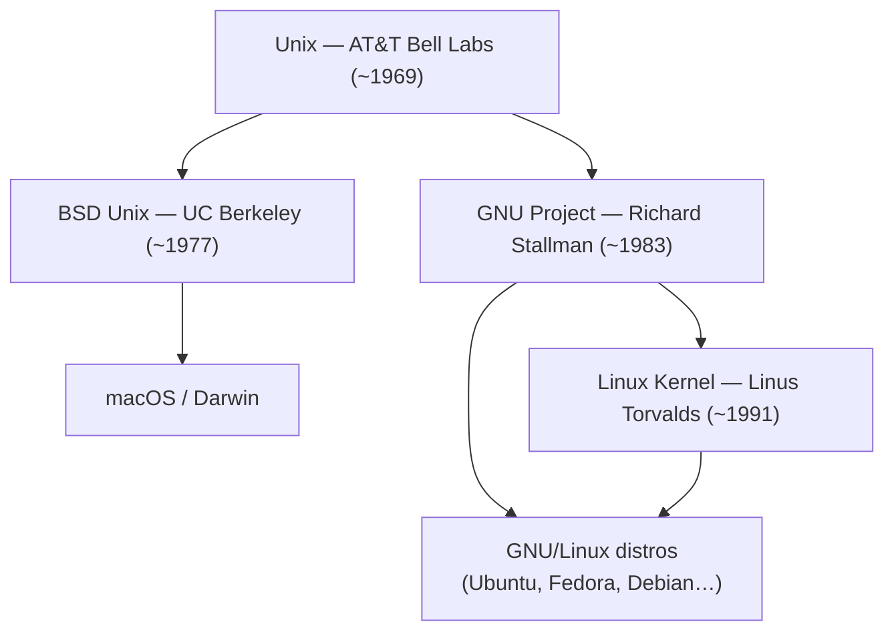

## The Origin: Unix (AT&T Bell Labs, ~1969)

The tools we use daily — `ls`, `cp`, `mv`, `bash`, `grep` — were all born in **Unix**, created at AT&T Bell Labs in the late 1960s and 1970s. Unix introduced the idea of a composable toolkit: small, focused programs that work together through pipes and the shell.

This is where the familiar command-line interface originates.

---

## Two Lineages from One Root

Unix's source code was licensed to universities and companies, spawning two major independent lineages:



### BSD → macOS

UC Berkeley took AT&T Unix source and extended it into the **BSD** (Berkeley Software Distribution). macOS is built on **Darwin**, which derives from FreeBSD/NextSTEP — the BSD line. This is why macOS ships `ls`, `cp`, `bash`, and other Unix tools: they are BSD reimplementations, not the original AT&T code and not GNU.

### GNU → Linux distros

Richard Stallman launched the **GNU Project** in 1983 to create a completely free Unix-like OS. He reimplemented every Unix tool from scratch to avoid AT&T copyright — `bash`, `ls`, `cp`, `grep`, `sed`, `awk`, and hundreds more. By the early 1990s GNU had all the userland tools but lacked a kernel. Linus Torvalds filled that gap with the **Linux kernel** in 1991, completing the GNU/Linux stack.

---

## Who Provides What in a Linux Distro

| Component | Provider |
|---|---|
| Kernel | Linux (Linus Torvalds + community) |
| Core utilities (`ls`, `cp`, `bash`, …) | GNU Project |
| Init system | Often `systemd` (separate project) |
| Package manager | Distro-specific (`apt`, `rpm`, `pacman`) |

**Notable exception:** Alpine Linux uses **BusyBox** instead of GNU coreutils — a single binary that implements many Unix tools in a minimal footprint. Android uses the Linux kernel but replaces GNU userland entirely.

---

## POSIX: The Standard That Unifies Them

In 1988, IEEE published **POSIX** (Portable Operating System Interface) — a formal standard based on what Unix already did. It standardized:

- **System calls**: `fork()`, `exec()`, `open()`, `read()`, `write()`
- **Shell behavior**: how `sh` must work
- **CLI tools**: what `ls`, `cp`, `grep` must do

Both GNU and BSD reimplemented their tools to be POSIX-compliant. The Linux kernel implements POSIX syscalls. This is why code written for Linux largely works on macOS and vice versa.

```
Unix invents APIs and tools (1970s)
    → POSIX standardizes them (1988)
        → GNU reimplements to be POSIX-compliant
        → BSD reimplements to be POSIX-compliant
        → Linux kernel implements POSIX syscalls
```

---

## Subtle Differences Between GNU and BSD Tools

Even though both are POSIX-compliant, GNU and BSD implementations differ in extensions:

- `sed -i` — on macOS (BSD) requires a backup suffix; on Linux (GNU) it doesn't
- `ls --color` — GNU extension; macOS uses `-G` instead
- `bash` — macOS was stuck at **version 3.2** for years because Apple didn't want to ship GPL v3 code; they switched the default shell to `zsh` in macOS Catalina (2019)

This is why many macOS developers install **GNU coreutils** via Homebrew to get consistent behavior with Linux servers.

---

## Windows: The Outlier

Windows is notably **not POSIX-compliant** by default — it descends from MS-DOS and NT, not Unix. This is why porting Unix software to Windows has historically been painful, and why tools like **WSL** (Windows Subsystem for Linux) exist: to run a real Linux environment inside Windows.

---

## Summary

| OS | Unix tool source | Kernel |
|---|---|---|
| Linux distros | GNU reimplementation | Linux |
| macOS | BSD reimplementation | XNU (Darwin) |
| Alpine Linux | BusyBox | Linux |
| Android | Custom (no GNU) | Linux |
| Windows | N/A (not Unix-derived) | NT |

The common thread is **Unix** — the original system that invented these tools and the model that POSIX later codified. Every major OS either descends from Unix or has had to build bridges to interoperate with it.
