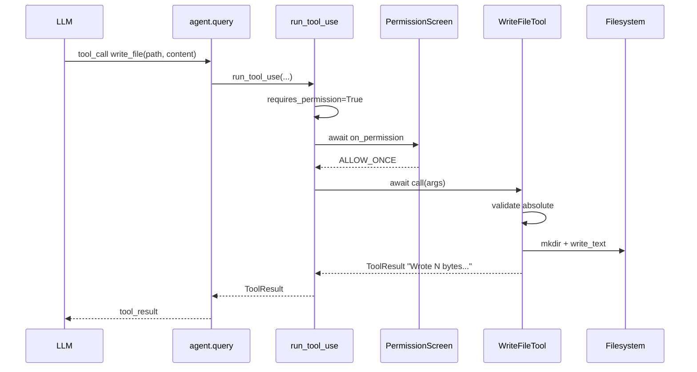

Once an AI agent has a permission gate, the next question is: which dangerous tool to build first? This post walks through the decision to start with `write_file` instead of `bash`, then the small design choices that shape the actual implementation.

## Why `write_file` before `bash`

Both tools have side effects. Both need the permission gate. But there are concrete reasons to start with the smaller one:

| Concern | `write_file` | `bash` |
|---|---|---|
| API surface | One syscall (`path.write_text`) | subprocess, timeout, stdout/stderr, cwd, exit code |
| Worst case | Overwrites one file | Anything (`rm -rf`, network, long-running) |
| Reasoning load | Low — the blast radius is scoped to the target path | High — arbitrary shell |
| Template value | Sets the scaffold for every future tool | Same scaffold, just more plumbing |

The pattern: **ship the simpler one first**, debug the scaffolding once, then repeat for `bash`. And `write_file` alone unlocks a lot — the agent can refactor files, create new modules, etc.

## Folder structure

One tool = one folder, following the existing `get_current_time` pattern:

```
src/vibe_flow/tools/
├── get_current_time/
│   ├── __init__.py
│   └── get_current_time.py
└── write_file/
    ├── __init__.py          # exports `tool`
    └── write_file.py        # WriteFileTool class
```

Register in `tools/__init__.py`:

```python
from vibe_flow.tools.write_file import tool as write_file_tool

ALL_TOOLS: list[Tool] = [
    get_current_time_tool,
    write_file_tool,
]
```

## The tool class

```python
class WriteFileTool(Tool):
    name = "write_file"
    description = (
        "Write text content to a file at an absolute path. "
        "Creates parent directories if missing. Overwrites the "
        "file if it already exists."
    )
    input_schema = {
        "type": "object",
        "properties": {
            "path": {
                "type": "string",
                "description": "Absolute filesystem path...",
            },
            "content": {
                "type": "string",
                "description": "Text content to write to the file.",
            },
        },
        "required": ["path", "content"],
    }
    requires_permission: bool = True

    async def call(self, args: dict[str, Any]) -> ToolResult:
        path_str: str = args["path"]
        content: str = args["content"]

        path: Path = Path(path_str)
        if not path.is_absolute():
            return ToolResult.of(
                f"Error: path must be absolute, got '{path_str}'."
            )

        path.parent.mkdir(parents=True, exist_ok=True)
        path.write_text(content)
        return ToolResult.of(
            f"Wrote {len(content)} bytes to {path}"
        )


tool: WriteFileTool = WriteFileTool()
```

Under 40 lines. Everything interesting is in the defaults the class encodes.

---

## Design decisions

The tool is mostly defaults. Each one is small; picking the right default is what makes the tool feel predictable.

### 🔒 Absolute paths only

```python
if not path.is_absolute():
    return ToolResult.of(f"Error: path must be absolute, got '{path_str}'.")
```

**Why:** the agent's working directory isn't well-defined (Textual app, possibly a worker thread, possibly a sub-agent). Relative paths could land anywhere. Forcing absolute paths means the prompt you see in the permission modal shows exactly where the write is going.

**Trade-off:** the LLM has to know absolute paths. In practice, the agent can always run `pwd`-equivalent via `get_current_time` or the system prompt — and for `write_file` the user intent almost always includes the full path anyway.

### 📁 Auto-create parent directories

```python
path.parent.mkdir(parents=True, exist_ok=True)
```

**Why:** a no-op if the directory exists; saves the agent from chaining `mkdir` before every write. Fewer tool calls, lower latency, simpler LLM output.

**Risk:** a typo in the path creates a bogus directory. The permission modal shows the full path, so the user sees this before it happens.

### 📝 Silent overwrite

If the file exists, it gets replaced. No backup, no flag to force, no confirmation.

**Why:** the permission prompt already gave the user veto power. Adding a second "are you sure?" for overwrites would be redundant friction. Silent overwrite is the default `open(path, "w")` behavior in Python — matching it keeps the mental model simple.

**Risk:** data loss if the user allows without noticing it's an overwrite. Mitigated by showing the target path in the modal; could be strengthened later by including "file exists" in the preview.

### 🚫 `requires_permission = True`

One-line opt-in to the permission gate:

```python
requires_permission: bool = True
```

Every unsafe tool sets this. `get_current_time` doesn't set it. Without this flag, the gate is a no-op.

---

## Flow



The permission modal is the single human-in-the-loop checkpoint. Everything after it assumes consent.

---

## What was deliberately left out

- **Encoding option.** `write_text` defaults to UTF-8. Binary writes would need a different tool.
- **Append mode.** The tool overwrites; if the LLM needs to append, it reads + rewrites. One mode, one behavior.
- **Atomic writes.** No tempfile + rename dance. If this becomes important (crash safety for big writes), add it later.
- **Size limits.** No cap on content length. Permission gate shows the full tool call; user can deny if suspicious.
- **Content preview truncation in the modal.** Long content strings make the modal noisy. Deferred until it's actually annoying in practice.

Each omission could be a future enhancement. Shipping small first means the scaffolding works before it gets weighed down.

---

## Summary

| Decision | Choice | Reason |
|---|---|---|
| First dangerous tool | `write_file` before `bash` | Smaller surface, bounded risk, sets template |
| Path handling | Absolute only | Avoids CWD ambiguity, explicit in permission modal |
| Missing parents | Auto-create | Fewer chained tool calls |
| Existing file | Silent overwrite | Permission gate is the sole confirmation |
| Encoding | UTF-8 (write_text default) | Text-only scope |
| Permission opt-in | `requires_permission = True` | Single line; gate does the rest |

The tool itself is tiny. The value is in picking the defaults that make it safe-by-default when combined with the permission gate.
