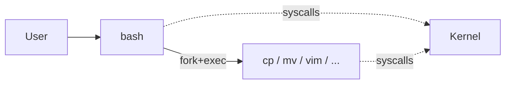

A bash tool is a common primitive in AI agent harnesses. To understand *why* it's designed the way it is, it helps to walk up from the bottom: what a shell is, how it relates to the kernel, what a command's result actually looks like, and only then what "bash tool" means as an agent-facing abstraction.

## 1. What a shell is

A **shell** is a program that sits between the user and the operating system kernel. You type commands, the shell interprets them and asks the kernel to do the actual work — run programs, open files, manage processes.

The name comes from the idea that it's the outer *shell* around the kernel.

Shell is a general OS concept, not Linux-specific:

| OS | Common command-line shells | Graphical shell |
|---|---|---|
| Linux/Unix | bash, zsh, sh, fish | GNOME, KDE, ... |
| macOS | zsh (default), bash | Finder |
| Windows | PowerShell, cmd.exe | Explorer |

Shells also support **scripting** — chaining commands into reusable programs.

## 2. Shells on a no-GUI Ubuntu system

On a server-style Ubuntu (no GUI), it's tempting to say "there is one shell: bash." Reality is more nuanced:

- **One login = one initial shell.** Logging in on a TTY starts one shell for that session (bash by default on Ubuntu).
- **Multiple sessions = multiple shells.** Each TTY (Ctrl+Alt+F1–F6), each SSH connection, each `tmux`/`screen` pane runs its own shell process.
- **Not always bash.** Bash is Ubuntu's default interactive shell, but `/bin/sh` is actually `dash` (used for scripts). You can install zsh, fish, etc., and switch with `chsh`.
- **Shells spawn shells.** Typing `bash` inside bash starts a child shell. Scripts run in their own shell too.

## 3. Built-ins vs external programs

A common misconception: "`cp`, `mv`, `vim` are all bash commands." Actually, only a small set of names are part of bash itself.

- **Bash built-ins** — implemented inside bash: `cd`, `echo`, `export`, `alias`, `pwd`.
- **External programs** — separate executables on disk that bash just *launches* via `$PATH`:
  - `cp` → `/bin/cp`
  - `mv` → `/bin/mv`
  - `grep` → `/bin/grep`
  - `vim` → `/usr/bin/vim`

Bash treats them identically: parse the name, find the file, run it. `vim` happens to be interactive and take over the terminal; `cp` finishes quickly and returns. You can inspect with `type`:

```bash
$ type cd
cd is a shell builtin
$ type cp
cp is /usr/bin/cp
$ type vim
vim is /usr/bin/vim
```

## 4. Who talks to the kernel when?

This is the key mental model. The shell is *not* always in the middle.



- Running `cp file1 file2`: bash parses the command, calls the kernel (via `execve`) to start `/bin/cp`. `cp` then makes its own syscalls to the kernel; bash waits.
- Running `vim`: bash launches vim; while vim is running, it talks to the kernel *directly* (`read`, `write`, `open`). Bash is not in the middle — it's suspended until vim exits.

So `vim` isn't "between shell and user" — it *replaces* the shell as the active foreground program.

## 5. What a command actually returns

Every command run in a shell produces three pieces of result data:

1. **stdout** — the normal output text.
2. **stderr** — error messages and diagnostics, kept separate so they can be redirected independently.
3. **exit code** — a small integer, 0–255. `0` means success; non-zero means failure. Specific codes vary (e.g., `grep` returns `1` when there's no match, `2` on error).

```bash
$ ls /nonexistent
ls: cannot access '/nonexistent': No such file or directory   # stderr
$ echo $?
2                                                              # exit code
```

Conceptually, a command's result is an object:

```json
{
  "stdout": "string — normal output",
  "stderr": "string — error/diagnostic output",
  "exit_code": "integer — 0 success, non-zero failure"
}
```

This contract is universal: any shell, any OS, any language's subprocess API exposes these same three things.

## 6. Bash tool for AI agents

**Definition.** A *bash tool* is a tool exposed to an AI agent that executes a shell command string in a bash (or bash-compatible) subprocess on the host system, and returns the command's output back to the agent.

### Minimal interface

- **Input**: a command string (e.g. `"ls -la /tmp"`), optionally a timeout and working directory.
- **Action**: the harness spawns a bash process, runs the command, captures output.
- **Output**: `stdout`, `stderr`, `exit_code`.

### Common extras

| Field | Purpose |
|---|---|
| `timed_out` | whether the command hit a timeout |
| `truncated` | whether output was cut for size |
| `duration_ms` | wall-clock execution time |

### Key properties

- **General-purpose** — any valid shell command works: pipes, redirects, chained commands, scripts.
- **Stateless between calls** (usually) — each call is a fresh subprocess; shell variables and `cd` don't persist unless the harness explicitly maintains a session.
- **Side-effectful** — can modify the filesystem, network, or processes — so it typically runs behind a permission or sandbox layer.

### When to design one

✅ **Include a bash tool when** the agent needs open-ended system access: running builds, tests, git, installing packages, arbitrary inspection.

❌ **Prefer narrower tools when** the operation is well-defined — reading a file, editing a file, searching code. Dedicated tools (`Read`, `Edit`, `Grep`, `Glob`) are safer, faster, and easier for the model to use correctly.

**Best practice: offer both.** Dedicated tools for common operations, bash as the escape hatch for everything else. This is the pattern Claude Code uses.

## Summary

A bash tool is the agent's equivalent of a human typing into a terminal. Its shape is dictated by what a shell command fundamentally *is*: a string that, when executed, produces `stdout`, `stderr`, and an `exit_code`. Everything above that — timeouts, sandboxing, working directories, streaming — is harness-level policy layered on top of that invariant.
