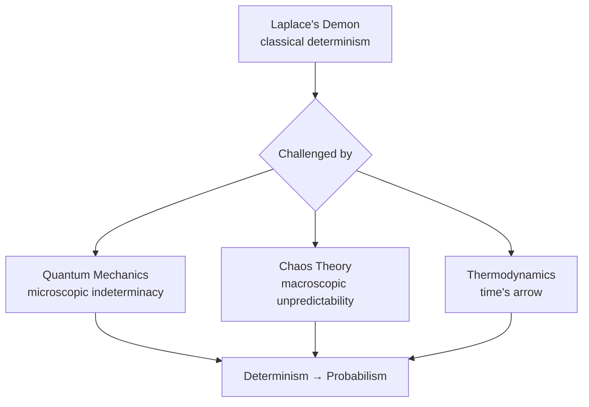
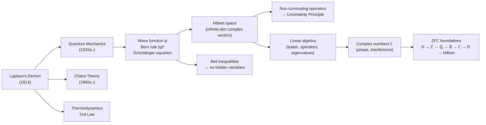

## The Demon That Haunted Physics 👁️

In 1814, Pierre-Simon Laplace published a thought experiment in the preface to *Essai philosophique sur les probabilités* that would define physics for a century:

> "We may regard the present state of the universe as the effect of its past and the cause of its future. An intellect which at a certain moment would know all forces that set nature in motion, and all positions of all items of which nature is composed — if this intellect were also vast enough to submit these data to analysis — it would embrace in a single formula the movements of the greatest bodies of the universe and those of the tiniest atom; for such an intellect nothing would be uncertain and the future just like the past would be present before its eyes."

This hypothetical intellect became known as **Laplace's Demon**. The argument rests on Newtonian mechanics:

- Every event is strictly caused by the state before it (**causality**)
- The equations of motion ($F = ma$) are deterministic: given all positions and momenta as initial conditions, the future trajectory is mathematically unique
- Therefore, perfect knowledge of the present state implies perfect knowledge of all future states

This is **classical determinism** at its peak — a clockwork universe with no room for surprise.

---

## The Three Pillars That Toppled the Demon ⚡

The collapse of Laplace's vision was not caused by a single discovery, but by three independent scientific revolutions in the 20th century.



### 1. Quantum Mechanics — The Death Blow 🔬

In 1927, Werner Heisenberg proved the **Uncertainty Principle**:

$$\Delta x \cdot \Delta p \geq \frac{\hbar}{2}$$

Position $x$ and momentum $p$ cannot both be precisely known simultaneously. Crucially, this is **not a limitation of measurement instruments** — it is an intrinsic property of nature. A particle does not *have* a definite position and momentum at the same time; those properties do not co-exist as simultaneous definite values.

Laplace's Demon needs precise initial conditions as its starting point. Quantum mechanics says those precise initial conditions **do not exist** at the microscopic level.

### 2. Chaos Theory — The Macroscopic Wall 🦋

Even setting aside quantum effects and staying in the classical world, 20th-century mathematics revealed that many systems are exquisitely sensitive to initial conditions. Edward Lorenz's work in the 1960s showed that in nonlinear systems (weather, three-body gravitational problems, etc.):

- An error of $0.00000001\%$ in the initial state grows exponentially until predictions become worthless
- Arbitrarily precise measurement is required for long-term prediction — but arbitrarily precise measurement is physically impossible

The Demon would need infinitely precise data; any finite precision leads to eventual total prediction failure.

### 3. Second Law of Thermodynamics — The Arrow of Time ⏩

Laplace's equations are time-symmetric: they can predict forward *and* reconstruct the past with equal fidelity. But the Second Law introduces **entropy** and a one-way arrow of time. As systems evolve, microscopic information disperses and becomes irretrievable. Even a hypothetical super-observer inside the universe cannot recover arbitrarily old information — the universe itself progressively erases its own ledger.

---

## Can God Still Predict? The Bell Inequality Verdict 🎲

One natural objection: perhaps the randomness in quantum mechanics is not truly intrinsic, but merely reflects **hidden variables** — information that exists but that we cannot access. Einstein championed this view: "God does not play dice."

This question was settled experimentally. In 1964, John Bell derived inequalities that any hidden-variable theory must satisfy. Experiments — culminating in work recognized by the 2022 Nobel Prize in Physics — showed that quantum mechanics **violates Bell's inequalities**. The conclusion:

> **No local hidden variables exist.** The randomness of the microscopic world is intrinsic, not a symptom of ignorance.

Even an omniscient being with access to all possible information could at best produce a **probability distribution** over future outcomes — not a single determined trajectory. The universe's script is written as it is performed.

There is also a self-reference problem: any entity *within* the universe that attempts to simulate the universe needs to store information about every particle — requiring more particles than the universe contains. Observing the universe changes it; the simulation can never fully close.

---

## Quantum Mechanics: Core Concepts 🌊

### Wave-Particle Duality

Classical physics drew a sharp line between particles (like billiard balls, with definite positions and trajectories) and waves (like water, spread across space). Quantum mechanics dissolves this distinction. An electron, before observation, is neither: it is described by a **wave function** spread across space. Upon measurement, it manifests at a definite point — as a particle.

- Unobserved: behaves like a wave (produces interference patterns in the double-slit experiment)
- Observed: localises to a definite point

### The Wave Function and Born Rule

The quantum state of a particle is encoded in a **wave function** $\psi(x, t)$, a complex-valued function of position and time. The wave function itself is not directly observable; what it gives us is probability.

**Born rule** (Max Born, 1926):

$$P(x, t) = |\psi(x, t)|^2$$

The probability density for finding the particle at position $x$ at time $t$ equals the squared modulus of the wave function. Since the particle must be *somewhere*, integrating over all space gives 1:

$$\int_{-\infty}^{+\infty} |\psi(x, t)|^2 \, dx = 1$$

This is the **normalisation condition**. Positions where $|\psi|^2$ is large are likely; positions where $|\psi|^2 = 0$ (nodes) are forbidden.

### The Schrödinger Equation

The wave function does not evolve randomly — its time evolution is governed by the **Schrödinger equation**, a deterministic partial differential equation:

$$i\hbar \frac{\partial}{\partial t}\psi(\mathbf{r}, t) = \hat{H}\psi(\mathbf{r}, t)$$

This is a remarkable split personality in quantum mechanics:

- The wave function **evolves deterministically** between measurements
- The **outcome** of any measurement is irreducibly probabilistic

### Superposition and Wave Function Collapse

Before measurement, a particle can exist in a **superposition** of states — a linear combination of multiple possibilities coexisting simultaneously. Formally, if $|A\rangle$ and $|B\rangle$ are valid states, so is $\alpha|A\rangle + \beta|B\rangle$.

Upon measurement, this superposition instantly resolves into one definite outcome — the **wave function collapses**. The probability of each outcome is given by the Born rule. The information in the other branches is lost; the pre-measurement superposition cannot be reconstructed.

---

## Hilbert Space: The Mathematical Stage 🌌

Classical mechanics needed only a finite-dimensional space (position + momentum coordinates) to describe a particle. Quantum mechanics needs something far larger.

### From Finite to Infinite Dimensions

A particle moving along a line can in principle be at any of infinitely many positions. Its wave function assigns a complex value to each point — it is a function over a continuous space, effectively a vector with **uncountably infinite** components.

The mathematical structure that accommodates this is **Hilbert space**: an infinite-dimensional, complex vector space equipped with an inner product.

The transition from university linear algebra:

| Linear algebra ($\mathbb{R}^n$) | Hilbert space (quantum mechanics) |
|---|---|
| Vectors $\vec{v} \in \mathbb{R}^n$ | State vectors $\|\psi\rangle \in \mathcal{H}$ |
| Finite number of components | Infinite-dimensional (functions over space) |
| Real-valued | Complex-valued |
| Norm: $\sqrt{\sum_i c_i^2} = 1$ | Norm: $\int\|\psi\|^2 dx = 1$ |

### States as Vectors; Superposition as Addition

Every physical state of a quantum system corresponds to a vector (written $|\psi\rangle$ in Dirac notation) in its Hilbert space. Superposition is literally vector addition:

$$|\psi\rangle = \alpha|\uparrow\rangle + \beta|\downarrow\rangle$$

An electron in an unknown spin state is the sum of the "spin-up" and "spin-down" basis vectors, weighted by complex coefficients.

### Physical Observables as Operators

In classical mechanics, an observable (like energy) is a number. In quantum mechanics, every observable corresponds to a **linear operator** (an infinite-dimensional Hermitian matrix) acting on Hilbert space.

When a measurement is performed, mathematically the operator $\hat{A}$ acts on the state vector $|\psi\rangle$. The possible measurement outcomes are the **eigenvalues** of $\hat{A}$; the state after measurement collapses to the corresponding **eigenvector**.

### Measurement as Projection

Measuring a quantity projects the state vector onto a coordinate axis. A vector pointing diagonally between two axes loses its off-axis components under projection — the projection is lossy. This geometric fact is the mathematical root of the uncertainty principle:

Position and momentum operators do not commute: $\hat{x}\hat{p} \neq \hat{p}\hat{x}$. The two operators correspond to incompatible axes in Hilbert space; projecting onto one destroys information about the other. **Non-commutativity of operators is the mathematical origin of Heisenberg's uncertainty principle.**

---

## The Mathematical Foundations 🔢

### Complex Numbers

The wave function $\psi(x, t)$ must be complex-valued. Complex numbers are essential because their **phase** enables interference — the mechanism by which waves can cancel or reinforce each other, explaining the double-slit pattern.

A complex number has the form:

$$z = a + bi, \quad a, b \in \mathbb{R}, \quad i^2 = -1$$

where $a$ is the real part and $b$ is the imaginary part. Geometrically, $z$ is a point (or arrow) in the **complex plane**: $a$ along the horizontal axis, $b$ along the vertical. Two key attributes:

- **Modulus** (length of the arrow): $|z| = \sqrt{a^2 + b^2}$
- **Phase** (angle with the real axis): $\theta = \arctan(b/a)$

The Born rule uses modulus squared: $|\psi|^2$ strips away the phase and leaves a real, non-negative probability.

### Why Complex Numbers Were Accepted

Complex numbers were not intuitive from the start. 16th-century Italian mathematicians (notably Cardano) encountered $\sqrt{-1}$ as an unavoidable intermediate step in solving cubic equations. Their attitude: treat it as a formal symbol, compute with it, and see if the answer comes out right. It did.

Over the following centuries the attitude shifted:
- **16–17th century**: reluctant tool; the term "imaginary" reflected skepticism
- **18–19th century** (Gauss, Argand): geometric vindication — complex numbers are points on a plane, and multiplication by $i$ is a 90° rotation
- **20th century** (quantum mechanics): physical necessity — the wave function *must* be complex; real-valued alternatives cannot reproduce quantum interference

The lesson: complex numbers were accepted not by direct intuition but by **pragmatic discovery** — try it, it works, eventually understand why.

### Why Negative × Negative = Positive

This result, counterintuitive to many, follows purely from the distributive law $a(b + c) = ab + ac$ and the fact that any number times zero equals zero.

**Proof sketch:**

1. $1 + (-1) = 0$, so $(-1) \times [1 + (-1)] = (-1) \times 0 = 0$
2. Expand by the distributive law: $[(-1) \times 1] + [(-1) \times (-1)] = 0$
3. Since $(-1) \times 1 = -1$: $-1 + [(-1) \times (-1)] = 0$
4. Therefore $(-1) \times (-1) = 1$ ✅

No appeal to intuition is needed; the result is forced by the algebraic axioms. This exemplifies a general pattern in mathematics: logic often *precedes* intuition, and we update our intuitions to match the proofs.

### Why Division by Zero Is Impossible

Unlike imaginary numbers — which extend the number system without breaking existing rules — defining $1 \div 0$ destroys the algebra. Assume it equals some value $z$, so $0 \times z = 1$.

Then:
1. $0 \times 1 = 0$ and $0 \times 2 = 0$, so $0 \times 1 = 0 \times 2$
2. Multiply both sides by $z$: $(z \times 0) \times 1 = (z \times 0) \times 2$
3. Since $z \times 0 = 1$: $1 \times 1 = 1 \times 2$, i.e. **$1 = 2$**

The entire arithmetic system collapses. Complex numbers are accepted because they *extend* the system without breaking existing rules; division by zero cannot be extended the same way.

### Why There Are No "3D Numbers"

Following the success of complex numbers on a 2D plane, William Rowan Hamilton spent ten years trying to construct a 3D analogue — numbers of the form $a + bi + cj$ that would describe rotations in 3D space. He failed.

The obstacle is algebraic: no consistent multiplication can be defined on a 3-component system that preserves all the desired properties. To describe 3D rotations, Hamilton discovered you need to jump past three dimensions to **four**: the **quaternions**,

$$q = a + bi + cj + dk, \quad i^2 = j^2 = k^2 = ijk = -1$$

The price is **non-commutativity**: $ij \neq ji$. In quaternions, the order of multiplication matters — and this turns out to be a feature, not a bug, since 3D rotations are themselves non-commutative.

The **Frobenius theorem** (derivable within ZFC) proves this is not accidental: the only finite-dimensional normed division algebras over $\mathbb{R}$ are $\mathbb{R}$ itself, $\mathbb{C}$, and $\mathbb{H}$ (quaternions). There is no consistent "3D number system" — not because no one has been clever enough, but because it is mathematically provably impossible.

### ZFC: The Foundation Under Everything

All of the above — real numbers, complex numbers, quaternions, Hilbert space — can be constructed rigorously from the axioms of **Zermelo-Fraenkel set theory with the Axiom of Choice (ZFC)**. None of it is freestanding or circular.

The construction chain:

```
ZFC axioms
  └─ ℕ (natural numbers via von Neumann ordinals: 0 = ∅, 1 = {∅}, ...)
       └─ ℤ (integers as equivalence classes of pairs (a, b) representing a − b)
            └─ ℚ (rationals as equivalence classes of pairs (a, b) representing a/b)
                 └─ ℝ (reals via Dedekind cuts or Cauchy sequences)
                      └─ ℂ (complex numbers as pairs (a, b) with defined multiplication)
                           └─ ℍ (quaternions as pairs of complex numbers)
                                └─ Hilbert space (infinite-dimensional ℂ-vector space with inner product)
```

The non-existence of 3D numbers is a **theorem** within this system, not an empirical observation.

---

## The Search for a First Principle 🧩

Throughout this conversation, a deeper question emerged: quantum mechanics defines everything in terms of something else, raising the spectre of circular definition. What is the *first* concept — the one that needs no further justification?

Modern physics has not settled on a single answer, but three strong candidates exist:

| Candidate | Core claim | Why it might be foundational |
|---|---|---|
| **Quantum state** | The universe's substance is *information*, not matter. A system is fully described by its state vector $\|\psi\rangle$. | Defines "existence" without reference to position or shape; all physical quantities are extracted from it |
| **Symmetry** | Physical laws exist *because* the universe is invariant under certain transformations. Forces are consequences of symmetry, not the other way around. | All known fundamental forces arise from gauge symmetries; many Nobel prizes have been won pursuing this path |
| **Quantum fields** | Space is filled with fundamental fields; particles are excitations (quantised vibrations) of those fields. | Unifies space and matter; the "vacuum" is not empty but a sea of zero-point fluctuations |

The uncomfortable truth is that science has always stopped somewhere, accepting certain primitives without reduction. What distinguishes modern physics from earlier eras is that those primitives are now formally characterised within ZFC — they are mathematically precise even if philosophically ungrounded.

---

## Summary



The arc from Laplace to modern quantum physics is the story of physics giving up the dream of a clockwork universe and embracing probability as fundamental — not as ignorance to be overcome, but as the deepest layer of reality. The mathematics that captures this reality is built, without gaps or hand-waving, from the axioms of set theory.
